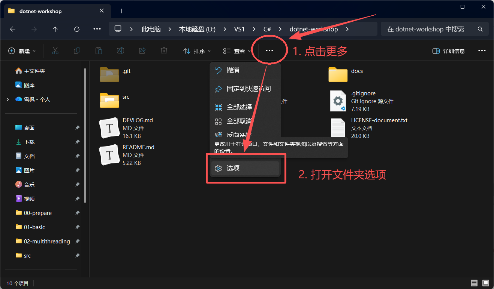
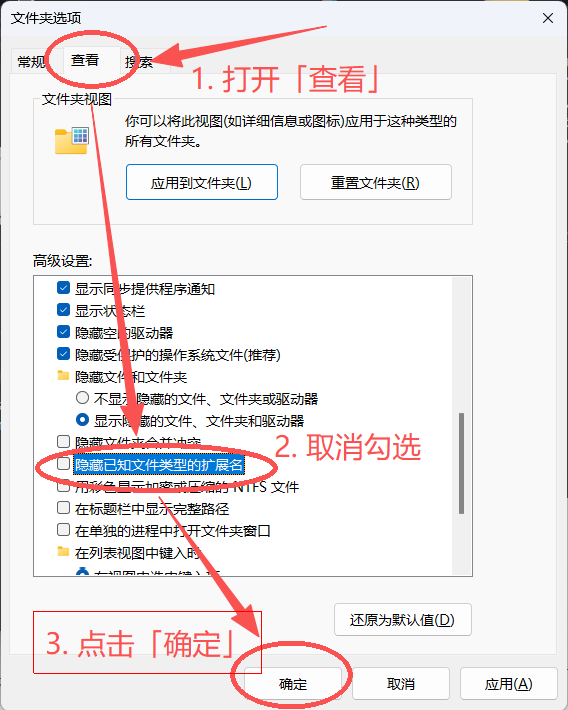
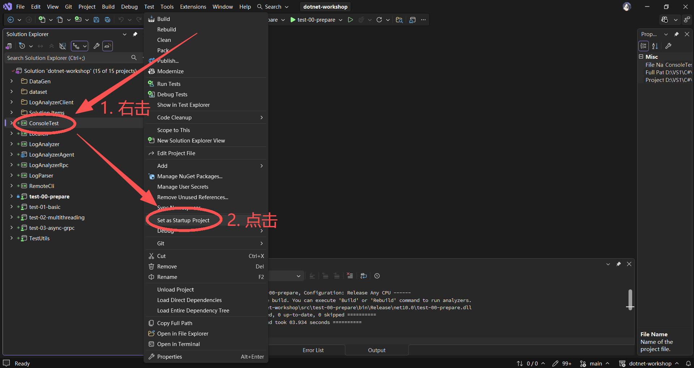
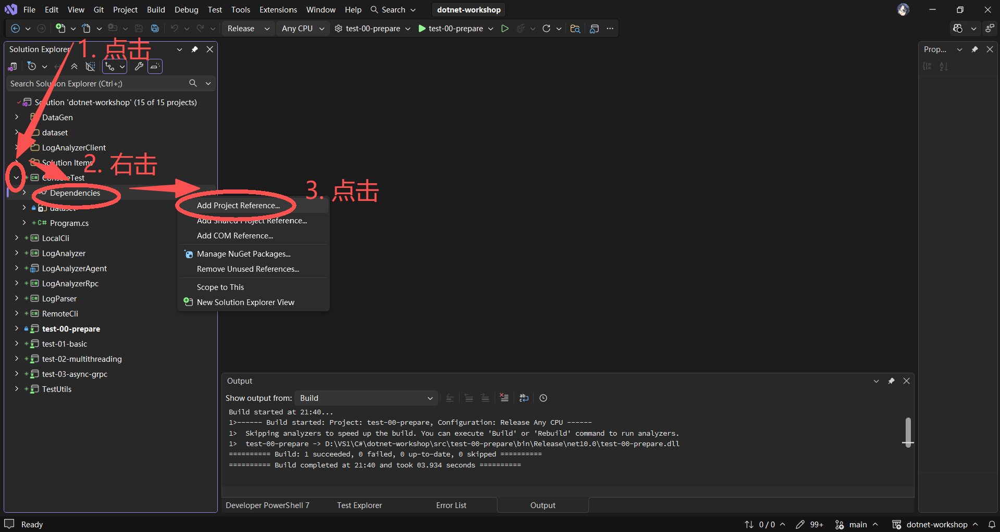
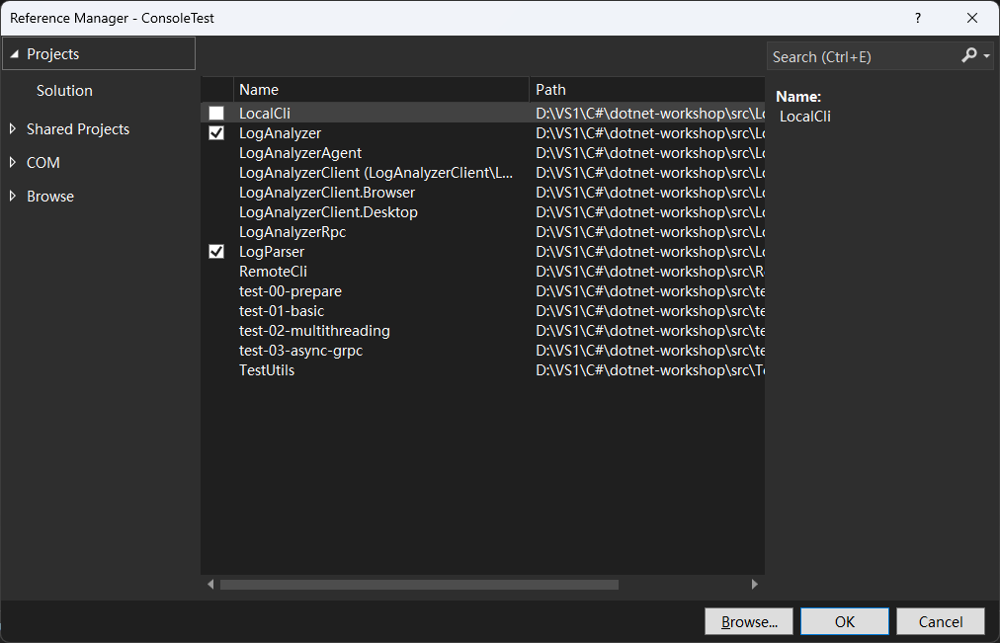
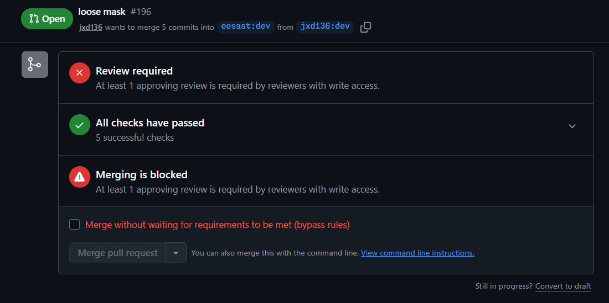

# Guidance for Preparation

## 训练目标

+ 了解工程的学习要求
+ 进行 .NET 环境的配置
+ 了解作业的提交要求和提交方式

## 工程介绍

### 章节划分

本工程以云服务日志解析为背景，目标是通过 .NET 技术栈，带领同学们掌握 .NET 开发所需的知识。本工程主要分为三个部分：

+ 准备工作：在准备工作中，我们将进行环境的配置，并了解作业的提交要求和提交方式
  + `00-prepare`
+ 基础功能：基础功能的主要训练目标是带领学生熟悉基本的语法和接口。本部分的难度较为简单，解答自由度不高，自由发挥的空间较少，主要工程目标在于让学生搭建起基本的工程底座
  + `01-basic`
  + `02-multithreading`
  + `03-async-grpc`
  + `04-avalonia`
+ 进阶任务：进阶任务的主要训练目标是锻炼同学们的自主探索和学习能力。本部分不会对同学进行过多题目上的要求，解答自由度较高，同学可以在本部分进行较为充分的自由发挥，主要工程目标在于让同学们定制化属于自己的多样化工程软件
  + `05-advanced`

### 符号约定

本工程使用「Xx.y(.z)(.w)」形式的符号。其中：

+ X：表示符号代表的含义。当 X 取值为：
  + T：表示 **任务（Task）** 或 **测试（Test）** ；
  + S：表示 **步骤（Step）** ；
  + Q：表示 **问答（Question）** ；
+ x.y(.z)(.w) 表示序号，阿拉伯数字（1，2，3，…）表示顺序关系，拉丁字母（a，b，c，…）表示并列关系：
  + x：为章节号
  + y：为章节内的编号
  + z 和 w：为章节内编号内的小编号（如有）

章节（Chapter）序号使用两位数字表示，如 `01`、`02`、……，等等。如遇到存在歧义的上下文，则使用 C 字母：`C01`、`C02`、……

## 环境配置

### Git 安装

在工程开始之前，你需要安装 [Git](https://git-scm.com/) 作为版本管理工具。

### 克隆工程

#### 复刻仓库（Fork this Repository）

本仓库隶属于 EESAST 组织，并关闭了直接提交的权限。要对代码进行修改，需要在你自己的个人账户中复刻这个仓库（本质是两个仓库，不同姓也可以不同名，但有天然的关联）：


#### 克隆仓库（Clone this Repository）

复刻后的仓库只储存在 Github 云端。为了更方便地修改、测试代码，需要克隆到本地电脑上（本质也是两个仓库，不要求同姓或同名，但有天然的关联）。

在克隆之前，请确保：

- 在电脑中找到/创建一个供存放仓库的文件夹，空间建议至少 2G，路径尽量不要有中文，**切勿选择清华云盘等网络位置！**
- 电脑上已安装 Git，并配置了用户名和邮箱。
- 如使用 SSH Clone（推荐），则要在 Github 官网上上传 RSA 公钥，并做适当的网络配置（详见暑培 Git 部分）。


在本地文件夹中，用任意终端（可右键打开）运行：

```shell
git clone <先前复制的仓库URI>
```

克隆会在数秒内完成，并在当前文件夹中创建一个名为 `dotnet-workshop` 的子文件夹（即本工程）。

若出现网络问题，请自行根据现象/报错搜索解决方案，也可在暑培群中反馈。

### 开发环境安装

本工程使用 .NET 10 及以上版本的 .NET 开发环境，开发工具首选支持为 Visual Studio（2026 及以上版本）。

#### Windows

##### .NET 开发环境安装

Windows 操作系统是本工程首要支持的操作系统，如果同学手中有一台 Windows 操作系统的电脑，请使用 Windows 操作系统。

访问 Visual Studio 官网：[https://visualstudio.microsoft.com/zh-hans/downloads/](https://visualstudio.microsoft.com/zh-hans/downloads/) 选择「Community」版本进行下载：


下载后打开下载得到的文件，即 Visual Studio Installer（如果你之前安装过 Visual Studio 2026 及以上，你可以在开始菜单栏搜索「Visual Studio Installer」打开，并点击「修改」即可）。你需要安装如下的组件。


第一，勾选顶部「工作负荷」选项卡中的 **「ASP.NET 和 Web 开发」** 以及 **「.NET 桌面开发」** 这两项：


第二，进入顶部的「单个组件」选项卡，确保 「.NET 10.0 运行时」 和 「.NET 10.0 WebAssembly Build Tools」 被勾选：


第三，在顶部「语言包」选项卡中勾选对你来说最舒适的语言：


第四，在顶部「安装位置」选项卡中设置你的 Visual Studio 的安装路径，例如：


**请确务必保请安装在一个比较充裕的磁盘中，并且尽量不要安装在系统盘。**系统盘通常是 C 盘，这个盘如果满了会很麻烦。如果不确定自己的系统盘，可以在 CMD 中输入：

```cmd
echo %SYSTEMDRIVE%
```

或在 PowerShell 中输入：

```powershell
echo $env:SYSTEMDRIVE
```

查看系统盘。


##### Avalonia 安装

Visual Studio 安装结束后，打开 Visual Studio，选择「继续但无需代码（Continue without code）」：


在顶部菜单栏中，选择「扩展（Extensions）」中的「管理扩展...（Manage Extensions...）」菜单项：


在打开的扩展管理窗口当中，在「浏览（Browse）」选项卡中搜索「Avalonia」，敲击回车等待搜索完成后，选择「Avalonia for Visual Studio」和「Avalonia Toolkit」进行安装：


随后，点击右上角的叉，关闭 Visual Studio：


关闭后，会弹出如下安装扩展的提示，点击 **「修改(M)」** ，然后一直等待到安装完成即可。


##### 显示文件扩展名

此外，Windows 操作系统的文件资源管理器是默认隐藏文件的扩展名的，这对软件开发来说是十分的不友好。因此，我们建议进行设置，显示文件的扩展名。

以 Windows 11 操作系统为例，我们先如下图所示，先点击三个点，再点击「选项」来打开文件夹选项（Windows 10 操作系统需要点击顶部的「文件」、「主页」、「共享」、「查看」这一栏中的「查看」标签页中最右侧的「选项」按钮来打开文件夹选项）。




打开后，如下图所示，在「查看」选项卡中找到「隐藏一纸文件类型的扩展名」这一项，然后 **取消勾选** ，随后点击底部的「应用」或「确定」即可：




#### Linux / macOS

Linux 和 macOS 操作系统（尤其是 macOS 操作系统）开发环境的安装尚未测试过，以下安装过程可能存在问题。

Linux 和 macOS 暂无推荐的集成开发环境或编辑器，同学可以按照自己的喜好使用 Visual Studio Code、Rider、Cursor、Vim、Emacs 等进行开发。

首先，进入 .NET 安装网站安装 .NET 10 SDK（注意，是 SDK 不是 Runtime）：[https://dotnet.microsoft.com/en-us/download/dotnet/10.0	](https://dotnet.microsoft.com/en-us/download/dotnet/10.0)。按提示安装后，打开终端，输入：

```shell
dotnet --list-sdks
```

如果包含 `10.0.x` 及以上，即表示安装成功。

Avalonia 扩展程序的安装在不同的代码编辑器或集成开发环境中均不同，请同学们参照自己所使用的集成开发环境或编辑器的扩展程序（Extensions）安装方式进行安装。

## 本节任务

本节目标是配置环境以及运行测试。

### 任务描述

在本节以及 **基础功能** 四个章节的前三个章节中，每一节均使用 [MSTest](https://learn.microsoft.com/zh-cn/dotnet/core/testing/unit-testing-mstest-intro) 编写了若干单元测试。在你完成你的代码实现后，你必须要运行测试，确保你的实现能够通过该节的全部测试。

### （S0.1）Step 1：运行测试项目

本工程的全部项目及测试项目均位于 `src` 目录中。该目录中包含四个测试，分别对应本节以及基础功能的前三个章节：

```shell
LogParser
+-test-00-prepare
+-test-01-basic
+-test-02-multithreading
+-test-03-async-grpc
```

本节任务是将测试 `test-00-prepare` 运行通过。

运行测试有使用图形化界面和使用命令行两种方式。首先介绍使用图形化界面的运行方式。

不同的集成开发环境或编辑器的图形化运行方式不同，本文档仅介绍 Visual Studio 的测试运行方式。

在 Visual Studio 的菜单栏，点击「视图（View）」中的「测试资源管理器（Test Explorer）」：


随后将会弹出测试资源管理器窗口。待加载完毕后，你可以选择你要运行的测试项目，鼠标右键点击项目唤出右键菜单，点击「运行（Run）」或者「调试（Run）」来运行测试。前者是直接运行测试，而后者是以调试方式运行（调试方式运行会停留在断点、捕获异常等等，便于 Debug）：


如果你要运行本工程具有的全部测试，可以点击左上角的「运行全部测试」按钮（在完成基础功能的前三节后需要按下此按钮来测试）：


如果要在 Release 配置下运行测试，需要将顶部的配置改为 Release：


但注意，在开发时需要记得将配置改回 Debug 以便于 Debug。


如果你想要使用命令行来进行测试，需要 `cd` 进入 `src` 目录当中，执行命令：

```shell
dotnet test <test-project>
```

其中，`test-project` 是测试项目的路径，如下图所示：


如果要以 Release 配置运行测试，需要执行命令：

```shell
dotnet test <test-project> -c Release
```


如果要运行全部测试，你只需要在 `src` 目录中执行命令：

```shell
dotnet test
dotnet test -c Release
```

即可。当你完成基础功能的前三节后，运行结果应当如下：


> [!IMPORTANT]
>
> **在本工程中，你需要让你的实现在 Release 配置下通过全部测试！！！**


在本节中，你需要运行 `test-00-prepare` 使其测试通过。

> [!NOTE]
>
> **任务 0.1（T0.1）**
>
> 在本节中，你无需修改任何代码。运行测试 `test-00-prepare`，你将会通过全部测试（即 `T0.1` 开头的全部测试）。
>

## 作业提交

本节为准备环节，你无须进行作业提交。但本节将会介绍以后的作业要求和提交方式。

### 作业要求

为了达到较好的训练效果，建议同学们独立完成作业，并借助必要的工具，如搜索引擎、AI 大模型等等，获取自己不了解的知识进行学习和探索，提升自己的开发能力。

每一节的作业分为代码作业的问答作业，具体的作业要求、难易度和得分将会在每一章的 `guidance.md` 和 `tasks.md` 中说明。

> [!IMPORTANT]
>
> **关于大模型的使用**
>
> 大模型的出现固然为我们提供了一个提高效率的重要渠道，学会合理使用大模型也是我们在未来的软件开发中一定要掌握的技能之一。但过于依赖大模型，也存在一些弊端。
>
> 对于代码作业，过于依赖大模型会让我们失去锻炼开发能力、熟悉 .NET 技术栈的机会，建议同学们先要有自己的思考，让大模型成为自己了解未知、让自己的想法更加完美的工具。同时，因为大模型生成的内容未必准确，因此对大模型生成的内容一定要有自己的辨别能力。
>
> 对于问答作业，尤其是最后的实验报告，不加思考地完全使用大模型生成的文本具有严重的 AI 味道，最大特点在于 **「假大空」、华而不实、无脑尬吹、文档可读性极差** 。这除了会造成失去锻炼的机会之外，得到作业展现效果也不会好，对批阅的讲师也是一种痛苦。因此， **对一眼看出是完全依赖大模型一股脑生成的劣质文档，将作为无效文档处理** 。当然，如果同学能依靠大模型让自己的文档变得更优质，自然是十分鼓励的。而且，对文档质量的鉴别与修改能力（无论是人写的还是大模型生成的），也是一种十分重要的技能。

此外，关于作业，还有一些其他的说明：

+ 对于代码作业，基础功能章节均以 `// TODO: Tx.y` 或 `throw new NotImplementedException("TODO: Tx.y")` 的形式标记出了你可能要增加代码的位置。

+ 代码中的 `.github/workflows` 目录中包含了用于运行自动化测试的 CI 配置，而 `src` 目录中以 `test` 和 `Test` 开头的项目是单元测试。这两类目录均 **禁止更改** 。

+ `.csproj` 文件为项目配置文件，建议同学们在没有掌握其语法的情况下尽量不要手动修改。

+ 为了方便同学进行 Debug，项目提供了 `Console Test` 控制台项目供同学做控制台输出来自由 Debug，对这个项目的任何更改都不会影响评分。如果同学想要设置在 Visual Studio 中运行这个项目，需要在解决方案资源管理器中（可以在菜单栏中的「视图（View）」中找到）右击这个项目，随后选择「设置为启动项目（Set as Startup Project）」，即可从该项目启动（设置后该项目名会变粗）：

  

  要通过该 `Console Test` 项目引用其他项目所定义的类、方法、变量等，需要设置项目引用。先点击解决方案资源管理器的 `ConsoleTest` 项目左侧的展开符号展开项目，右击「外部依赖项（Dependencies）」，点击「添加项目引用...（Add Project Reference...）」，并在弹出的窗口的「项目（Projects）-> 解决方案（Solution）」选项卡内勾选要引用的项目即可：

  

  

### 提交方式

本工程中，每一个章节对应一个单独的 Git 分支。分支如下：

+ `main`
+ `feat/01-basic`
+ `feat/02-multithreading`
+ `feat/03-async-grpc`
+ `feat/04-avalonia`

**EESAST 仓库的分支将在作业提交期间进行开放，其余时间不开放。**

每一讲的作业提交采用如下流程：

- 本地修改对应分支
- 提交修改到对应分支
- 向本仓库对应分支提交PR
- 关联 PR 到对应 issue
- 查看作业批改结果

#### i) 本地修改对应分支

Fork 本仓库所有分支后，在本地切换到对应分支进行修改：

```shell
git checkout "feat/01-basic"
```

如果发现分支不存在，则应当使用 `-b` 进行创建：

```shell
git checkout -b "feat/01-basic"
```

如果你想把其他分支的修改合并到当前分支，例如你在开发 `01-basic` 时修改了一些内容，想把修改更新到 `02-multithreading`，可以在进入 `feat/02-multithreading` 分支后执行命令：

```shell
git merge "feat/01-basic"
```

即可从 `feat/01-basic` 拉取更改合并到  `feat/02-multithreading` 分支。

#### ii) 提交修改到对应分支

完成代码编写与修改后，你需要使用 Git 将更改进行 commit，要求 commit message 使用 [规范化提交](https://www.conventionalcommits.org/zh-hans/)（一些编辑器的扩展程序例如 Visual Studio Code 的 [Conventional Commits 插件](https://marketplace.visualstudio.com/items?itemName=vivaxy.vscode-conventional-commits) 可以帮助您进行规范化提交）：

```shell
git add <files>
git commit -m "<commit-message>"
```

并 git commit 后，将改动提交到本地并推送到云端 fork 仓库：

```shell
git push origin "feat/01-basic"
```

#### iii) 向本仓库对应分支提交 PR

打开在 GitHub 上 fork 的仓库页面后，切换到刚刚推送的对应分支（如 `feat/01-basic`）

点击“Compare & Pull Request”按钮，并在 PR 创建页面填写相关信息

#### iv) 关联 PR 到对应 Issue

在 PR 模板填写界面，需手动关联 PR 到对应 issue。

你可以在 PR 正文中手动关联对应 issue，方法是添加 `#ISSUE-NUMBER` 到正文后。例如，需要链接的 issue 对应的 id 是 4，则添加一行 `#4`：


[示例 PR](https://github.com/eesast/web-workshop/pull/12)


关联完成后，提交 PR，则作业提交完毕。

#### v) 查看作业批改结果

当你提出 PR 后，GitHub Actions 会自动运行，检查你的提交是否符合要求，以及是否通过该章节的单元测试。你的 PR 只有在通过了全部检查后（显示 All checks have passed），讲师才会进行批改，如下图所示：




作业由讲师批改后，对应 PR 会被打上标签：

- accepted ✅：作业通过，PR 会被关闭。
- require revision 🔄：需要修改，PR 保持 open 状态。

若检查未通过或讲师要求修改，则需点击未通过的检查来查看出错位置，或按 PR 下方的评论区按照讲师的提示进行更改，然后重复 步骤 ii 提交更新。

## 测试数据

本工程的测试数据集均位于 `src/dataset` 中， **禁止更改** 。测试数据集如下：

```shell
dataset
|   basic.log           # 示例日志，共三条
|   basic-fail.log      # 错误日志，含有错误的日志格式
|   basic-multiple.log  # 多条日志，含有多条正确的日志
|
+-multiple-logs         # 多文件日志数据
    20260701.log
    20260702.log
    ...
    20260730.log
```

用于生成随机测试数据的源代码位于 `src/DataGen` 中， **禁止更改** 。生成测试数据的代码结构如下：

```shell
DataGen
|   .gitignore  # Git Ignore List
|   gen.py      # 生成日志
|   batch.py    # 批量生成日志
|
+-gen_logs      # 生成日志的一些文件和批量生成日志时的元数据目录
|
+-multiple_logs # 批量生成日志时的日志文件生成目录
```

## 其他

关于本工程的全部任务概览，参看 [tasks.md](./tasks.md)。

**衷心祝愿大家学习愉快，收获满满！**

## 拓展阅读

+ [测试：单元测试、测试驱动的开发（TDD）](https://docs.eesast.com/docs/tools/tdd)
+ [版本管理与 Git 基础](https://docs.eesast.com/docs/tools/git)
+ [计算机教育中缺失的一课](https://missing-semester-cn.github.io/)

## 前进 / 后退

+ 上一篇：[README](../../README.md)
+ 下一篇：[Tasks in Preparation](./tasks.md)

