# Guidance for Preparation

## 训练目标

+ 了解工程的学习要求
+ 进行 .NET 环境的配置
+ 了解作业的提交要求和提交方式

## 工程介绍

### 章节划分

本工程以云服务日志解析为背景，目标是通过 .NET 技术栈，带领同学们掌握 .NET 开发所需的知识。本工程主要分为三个部分：

+ 准备工作：在准备工作中，我们将进行环境的配置，并了解作业的提交要求和提交方式
  + `00-prepare`
+ 基础功能：基础功能的主要训练目标是带领学生熟悉基本的语法和接口。本部分的难度较为简单，解答自由度不高，自由发挥的空间较少，主要工程目标在于让学生搭建起基本的工程底座
  + `01-basic`
  + `02-multithreading`
  + `03-async-grpc`
  + `04-avalonia`
+ 进阶任务：进阶任务的主要训练目标是锻炼同学们的自主探索和学习能力。本部分不会对同学进行过多题目上的要求，解答自由度较高，同学可以在本部分进行较为充分的自由发挥，主要工程目标在于让同学们定制化属于自己的多样化工程软件
  + `05-advanced`

### 符号约定

本工程使用「Xx.y(.z)」形式的符号。其中：

+ X：表示符号代表的含义。当 X 取值为：
  + T：表示 **任务（Task）** 或 **测试（Test）** ；
  + S：表示 **步骤（Step）** ；
  + Q：表示 **问答（Question）** ；
+ x.y(.z) 表示序号，阿拉伯数字（1，2，3，…）表示顺序关系，拉丁字母（a，b，c，…）表示并列关系：
  + x：为章节号
  + y：为章节内的编号
  + z：为章节内编号内的小编号（如有）

## 环境配置

### Git 安装

在工程开始之前，你需要安装 [Git](https://git-scm.com/) 作为版本管理工具。

### 克隆工程

#### 复刻仓库（Fork this Repository）

本仓库隶属于 EESAST 组织，并关闭了直接提交的权限。要对代码进行修改，需要在你自己的个人账户中复刻这个仓库（本质是两个仓库，不同姓也可以不同名，但有天然的关联）：

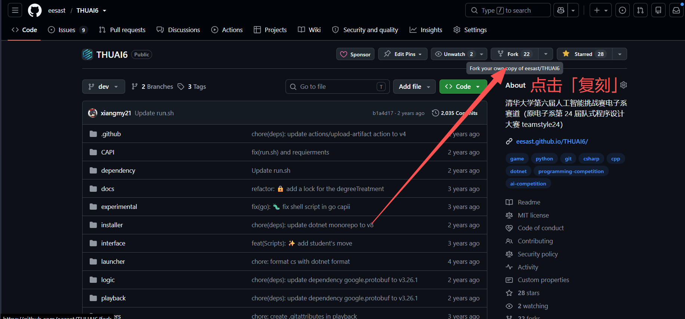

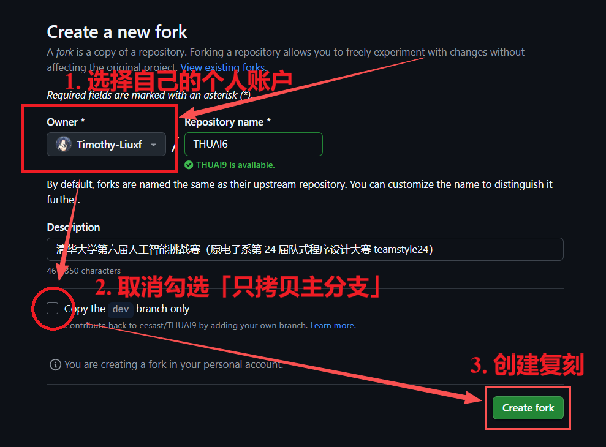

#### 克隆仓库（Clone this Repository）

复刻后的仓库只储存在 Github 云端。为了更方便地修改、测试代码，需要克隆到本地电脑上（本质也是两个仓库，不要求同姓或同名，但有天然的关联）。

在克隆之前，请确保：

- 在电脑中找到/创建一个供存放仓库的文件夹，空间建议至少 2G，路径尽量不要有中文，**切勿选择清华云盘等网络位置！**
- 电脑上已安装 Git，并配置了用户名和邮箱。
- 如使用 SSH Clone（推荐），则要在 Github 官网上上传 RSA 公钥，并做适当的网络配置（详见暑培 Git 部分）。

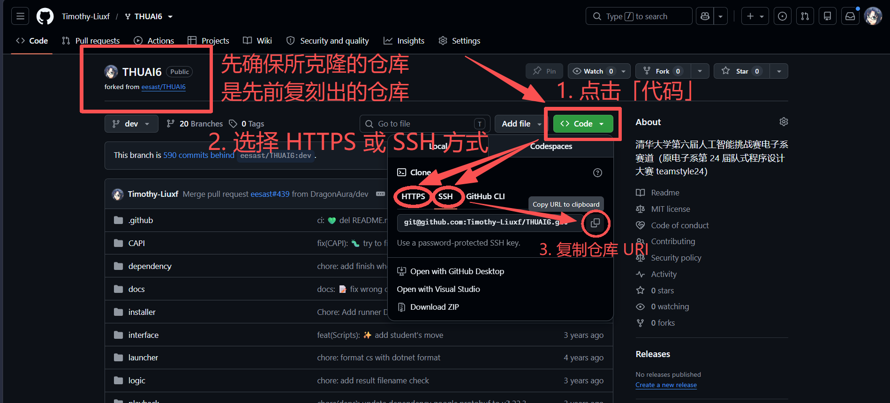

在本地文件夹中，用任意终端（可右键打开）运行：

```shell
git clone <先前复制的仓库URI>
```

克隆会在数秒内完成，并在当前文件夹中创建一个名为 `dotnet-workshop` 的子文件夹（即本工程）。

若出现网络问题，请自行根据现象/报错搜索解决方案，也可在暑培群中反馈。

### 开发环境安装

本工程使用 .NET 10 及以上版本的 .NET 开发环境，开发工具首选支持为 Visual Studio（2026 及以上版本）。

#### Windows

##### .NET 开发环境安装

Windows 操作系统是本工程首要支持的操作系统，如果同学手中有一台 Windows 操作系统的电脑，请使用 Windows 操作系统。

访问 Visual Studio 官网：[https://visualstudio.microsoft.com/zh-hans/downloads/](https://visualstudio.microsoft.com/zh-hans/downloads/) 选择「Community」版本进行下载：

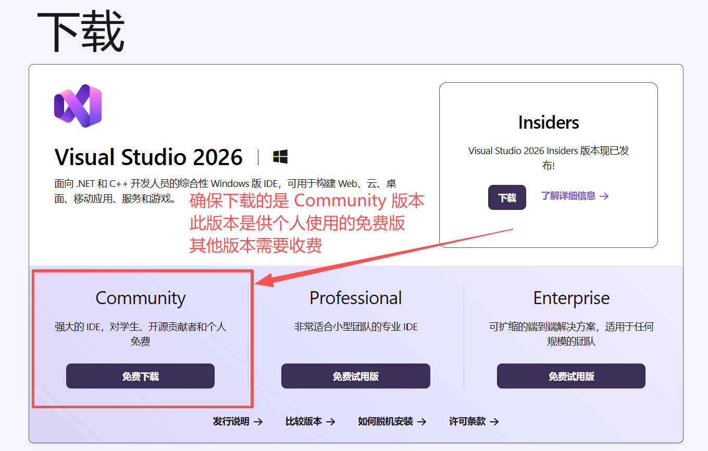

下载后打开下载得到的文件，即 Visual Studio Installer（如果你之前安装过 Visual Studio 2026 及以上，你可以在开始菜单栏搜索「Visual Studio Installer」打开，并点击「修改」即可）。你需要安装如下的组件。


第一，勾选顶部「工作负荷」选项卡中的 **「ASP.NET 和 Web 开发」** 以及 **「.NET 桌面开发」** 这两项：

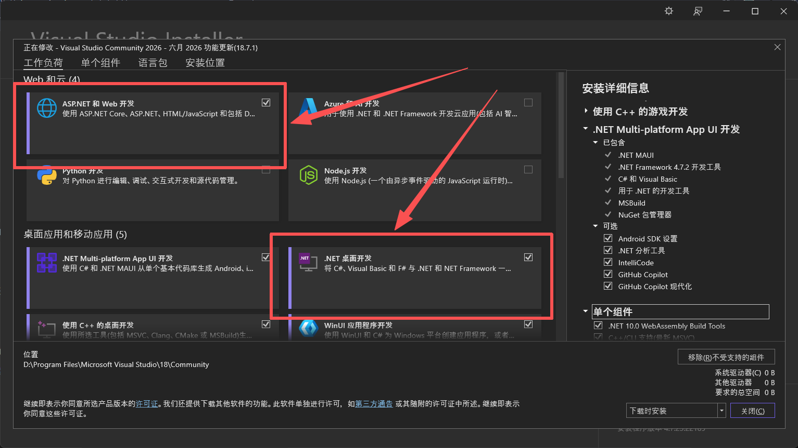


第二，进入顶部的「单个组件」选项卡，确保 「.NET 10.0 运行时」 和 「.NET 10.0 WebAssembly Build Tools」 被勾选：

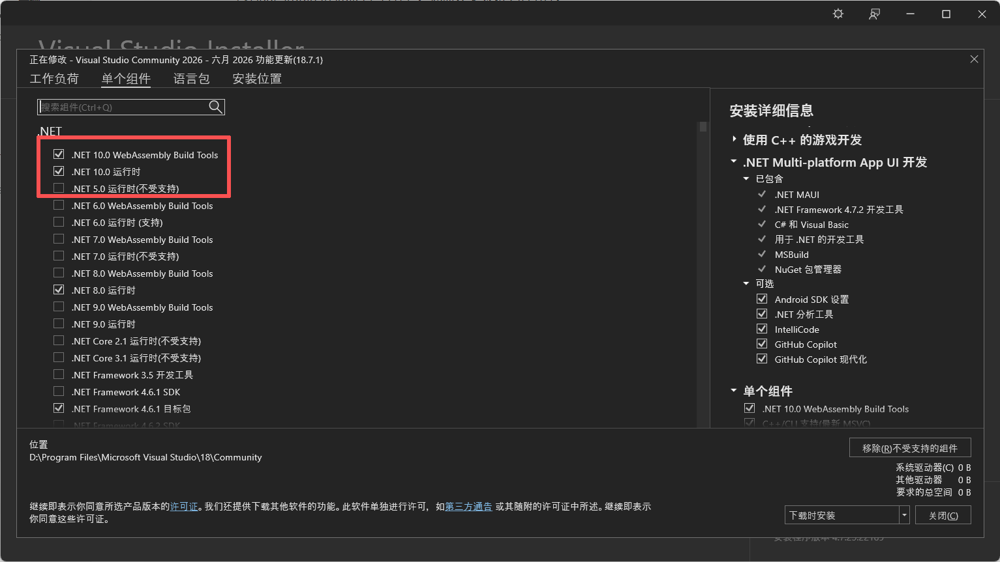


第三，在顶部「语言包」选项卡中勾选对你来说最舒适的语言：

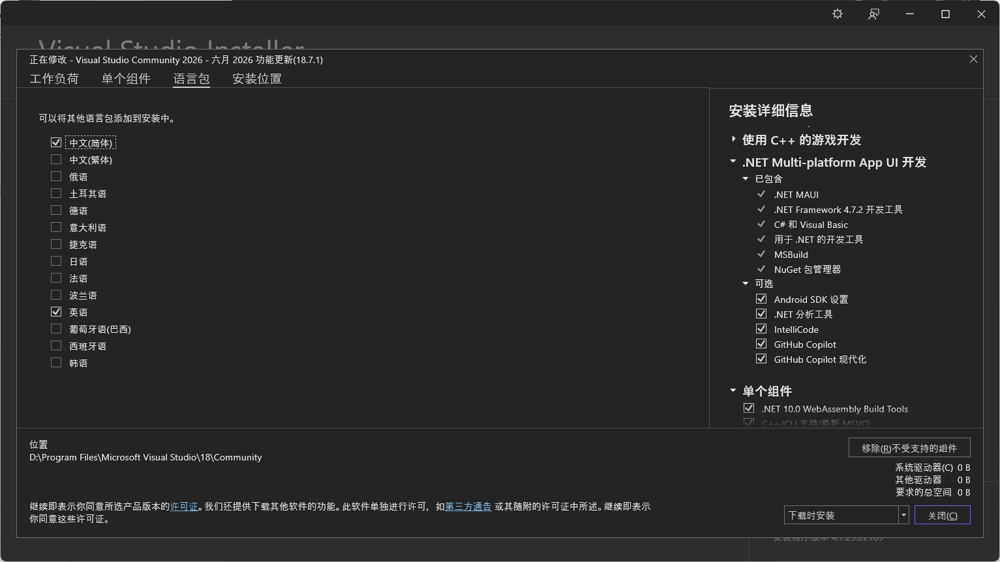


第四，在顶部「安装位置」选项卡中设置你的 Visual Studio 的安装路径，例如：

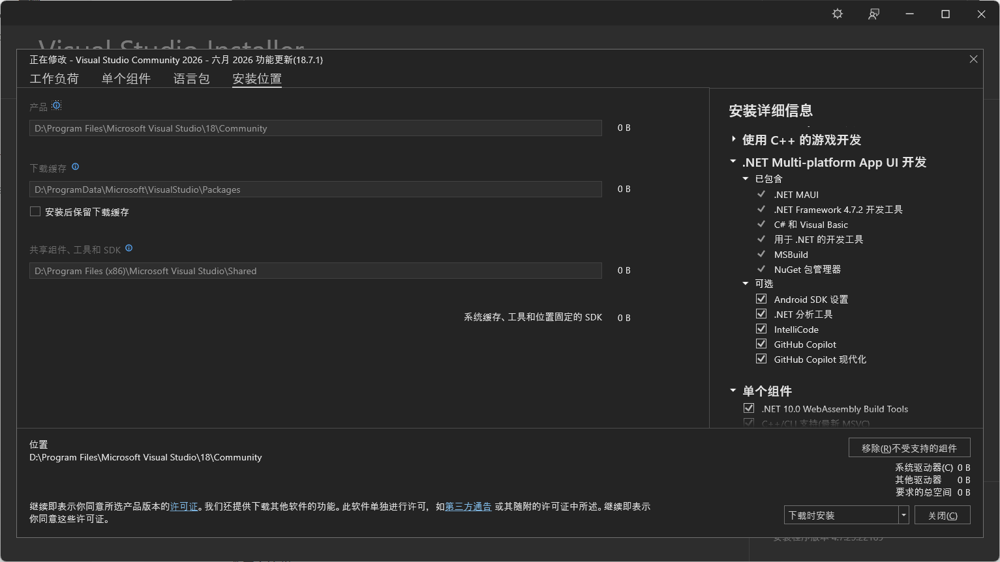

**请确务必保请安装在一个比较充裕的磁盘中，并且尽量不要安装在系统盘。**系统盘通常是 C 盘，这个盘如果满了会很麻烦。如果不确定自己的系统盘，可以在 CMD 中输入：

```cmd
echo %SYSTEMDRIVE%
```

或在 PowerShell 中输入：

```powershell
echo $env:SYSTEMDRIVE
```

查看系统盘。


##### Avalonia 安装

Visual Studio 安装结束后，打开 Visual Studio，选择「继续但无需代码（Continue without code）」：

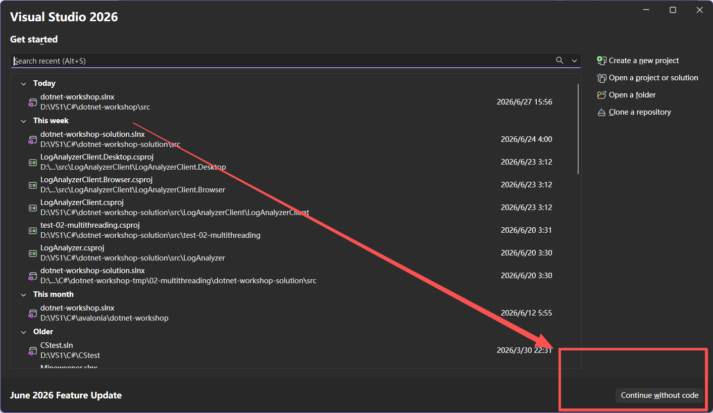


在顶部菜单栏中，选择「扩展（Extensions）」中的「管理扩展...（Manage Extensions...）」菜单项：

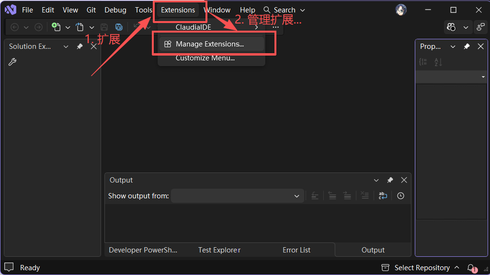


在打开的扩展管理窗口当中，在「浏览（Browse）」选项卡中搜索「Avalonia」，敲击回车等待搜索完成后，选择「Avalonia for Visual Studio」和「Avalonia Toolkit」进行安装：

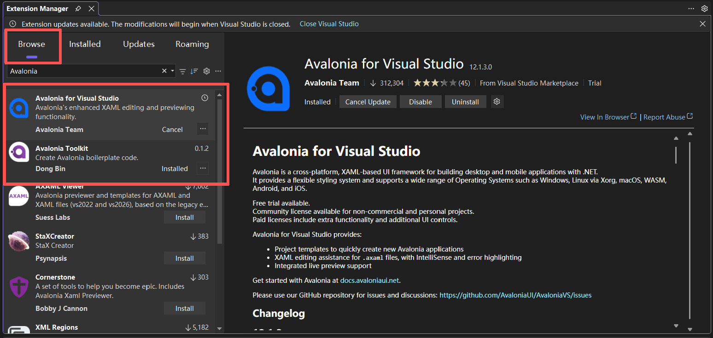


随后，点击右上角的叉，关闭 Visual Studio：

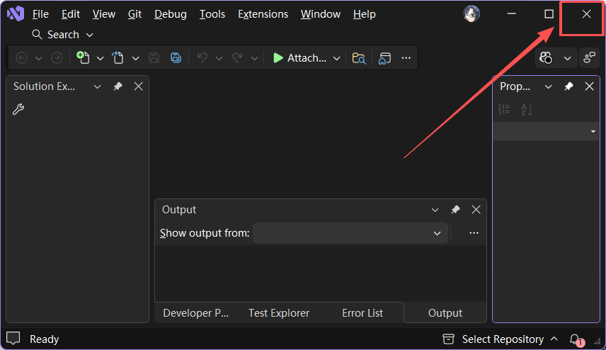


关闭后，会弹出如下安装扩展的提示，点击 **「修改(M)」** ，然后一直等待到安装完成即可。

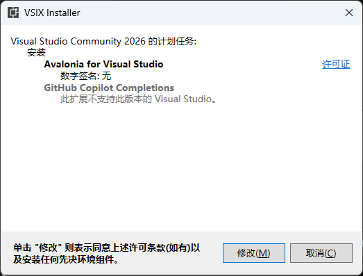


#### Linux / macOS

Linux 和 macOS 操作系统（尤其是 macOS 操作系统）开发环境的安装尚未测试过，以下安装过程可能存在问题。

Linux 和 macOS 暂无推荐的集成开发环境或编辑器，同学可以按照自己的喜好使用 Visual Studio Code、Rider、Cursor、Vim、Emacs 等进行开发。

首先，进入 .NET 安装网站安装 .NET 10 SDK（注意，是 SDK 不是 Runtime）：[https://dotnet.microsoft.com/en-us/download/dotnet/10.0	](https://dotnet.microsoft.com/en-us/download/dotnet/10.0)。按提示安装后，打开终端，输入：

```shell
dotnet --list-sdks
```

如果包含 `10.0.x` 及以上，即表示安装成功。

Avalonia 扩展程序的安装在不同的代码编辑器或集成开发环境中均不同，请同学们参照自己所使用的集成开发环境或编辑器的扩展程序（Extensions）安装方式进行安装。

## 本节任务

本节目标是配置环境以及运行测试。

### 任务描述

在本节以及 **基础功能** 四个章节的前三个章节中，每一节均使用 [MSTest](https://learn.microsoft.com/zh-cn/dotnet/core/testing/unit-testing-mstest-intro) 编写了若干单元测试。在你完成你的代码实现后，你必须要运行测试，确保你的实现能够通过该节的全部测试。

### （S0.1）Step 1：运行测试项目

本工程的全部项目及测试项目均位于 `src` 目录中。该目录中包含四个测试，分别对应本节以及基础功能的前三个章节：

```shell
LogParser
+-test-00-prepare
+-test-01-basic
+-test-02-multithreading
+-test-03-async-grpc
```

本节任务是将测试 `test-00-prepare` 运行通过。

运行测试有使用图形化界面和使用命令行两种方式。首先介绍使用图形化界面的运行方式。

不同的集成开发环境或编辑器的图形化运行方式不同，本文档仅介绍 Visual Studio 的测试运行方式。

在 Visual Studio 的菜单栏，点击「视图（View）」中的「测试资源管理器（Test Explorer）」：

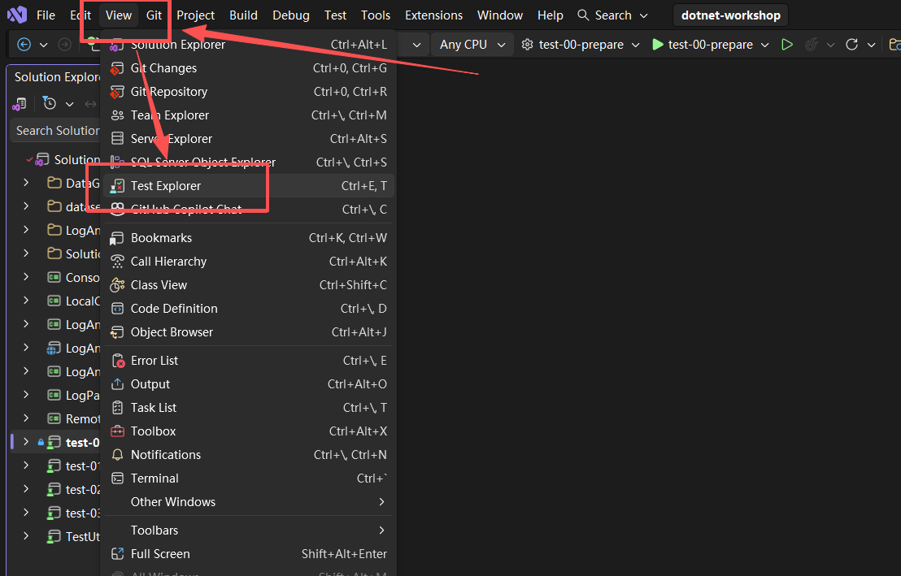


随后将会弹出测试资源管理器窗口。待加载完毕后，你可以选择你要运行的测试项目，鼠标右键点击项目唤出右键菜单，点击「运行（Run）」或者「调试（Run）」来运行测试。前者是直接运行测试，而后者是以调试方式运行（调试方式运行会停留在断点、捕获异常等等，便于 Debug）：

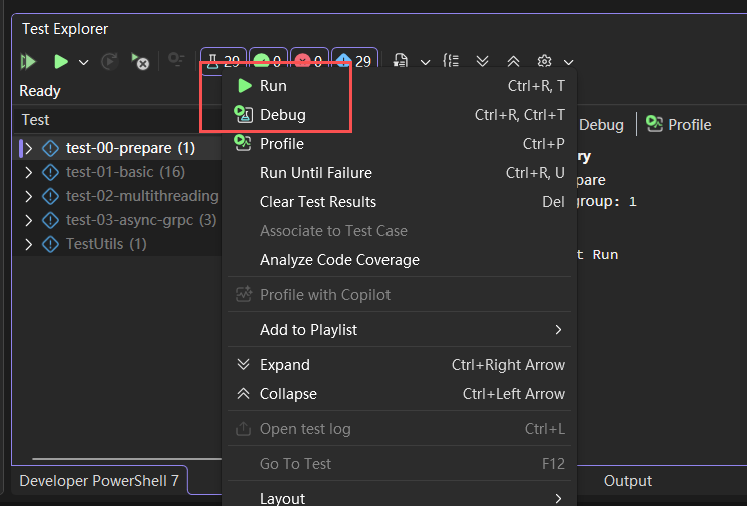


如果你要运行本工程具有的全部测试，可以点击左上角的「运行全部测试」按钮（在完成基础功能的前三节后需要按下此按钮来测试）：

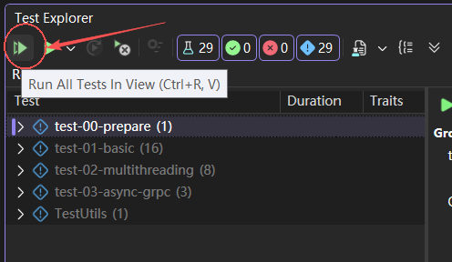


如果要在 Release 配置下运行测试，需要将顶部的配置改为 Release：

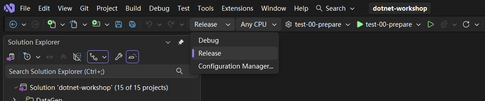


但注意，在开发时需要记得将配置改回 Debug 以便于 Debug。


如果你想要使用命令行来进行测试，需要 `cd` 进入 `src` 目录当中，执行命令：

```shell
dotnet test <test-project>
```

其中，`test-project` 是测试项目的路径，如下图所示：

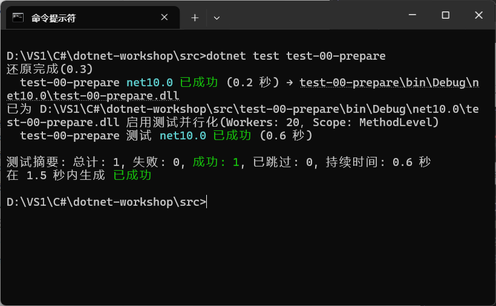


如果要以 Release 配置运行测试，需要执行命令：

```shell
dotnet test <test-project> -c Release
```

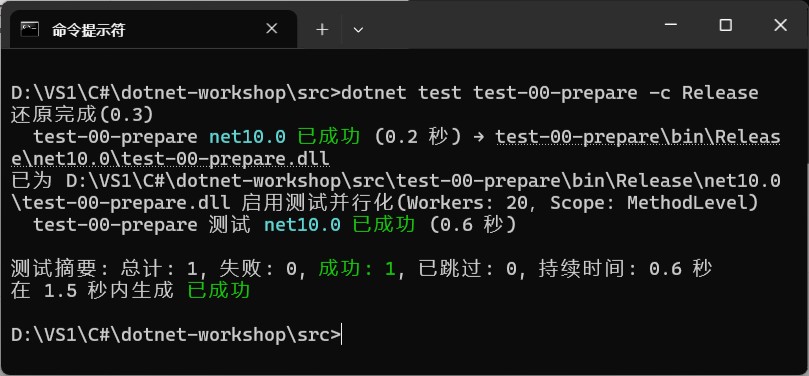


如果要运行全部测试，你只需要在 `src` 目录中执行命令：

```shell
dotnet test
dotnet test -c Release
```

即可。当你完成基础功能的前三节后，运行结果应当如下：

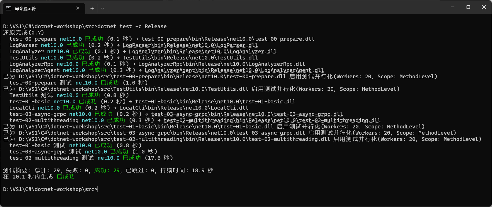


> [!IMPORTANT]
>
> **在本工程中，你需要让你的实现在 Release 配置下通过全部测试！！！**


在本节中，你需要运行 `test-00-prepare` 使其测试通过。

> [!NOTE]
>
> **任务 0.1（T0.1）**
>
> 在本节中，你无需修改任何代码。运行测试 `test-00-prepare`，你将会通过全部测试（即 `T0.1` 开头的全部测试）。
>

## 作业提交

本节为准备环节，你无须进行作业提交。但本节将会介绍以后的作业提交方式。

本工程中，每一个章节对应一个单独的 Git 分支。分支如下：

+ `main`
+ `feat/01-basic`
+ `feat/02-multithreading`
+ `feat/03-async-grpc`
+ `feat/04-avalonia`

**EESAST 仓库的分支将在作业提交期间进行开放，其余时间不开放。**

每一讲的作业提交采用如下流程：

- 本地修改对应分支
- 提交修改到对应分支
- 向本仓库对应分支提交PR
- 关联 PR 到对应 issue
- 查看作业批改结果

### i) 本地修改对应分支

Fork 本仓库所有分支后，在本地切换到对应分支进行修改：

```shell
git checkout “feat/01-basic”
```

如果发现分支不存在，则应当使用 `-b` 进行创建：

```shell
git checkout -b “feat/01-basic”
```

### ii) 提交修改到对应分支

完成修改并 git commit 后，将改动提交到本地并推送到云端 fork 仓库：

```shell
git push origin "feat/01-basic"
```

### iii) 向本仓库对应分支提交 PR

打开在 GitHub 上 fork 的仓库页面后，切换到刚刚推送的对应分支（如 `feat/01-basic`）

点击“Compare & Pull Request”按钮，并在 PR 创建页面填写相关信息

### iv) 关联 PR 到对应 Issue

在 PR 模板填写界面，需手动关联 PR 到对应 issue。

你可以在 PR 正文中手动关联对应 issue，方法是添加 `#ISSUE-NUMBER` 到正文后。例如，需要链接的 issue 对应的 id 是 4，则添加一行 `#4`：

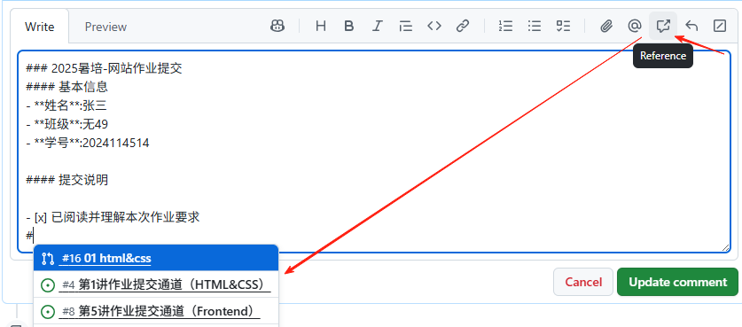


[示例 PR](https://github.com/eesast/web-workshop/pull/12)


关联完成后，提交 PR，则作业提交完毕。

### 查看作业批改结果

作业由讲师批改后，对应 PR 会被打上标签：

- accepted ✅：作业通过，PR 会被关闭。
- require revision 🔄：需要修改，PR 保持 open 状态。

若需修改，按 PR 下方的评论提示进行更改，然后重复 步骤 ii 提交更新。