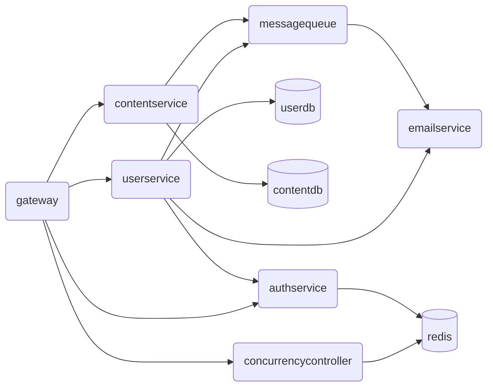
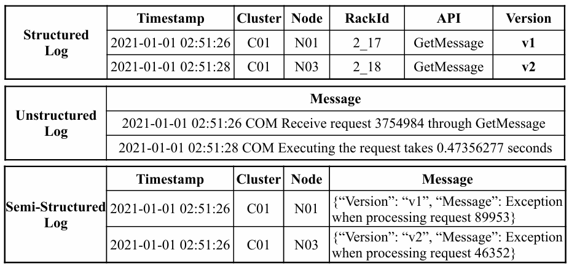
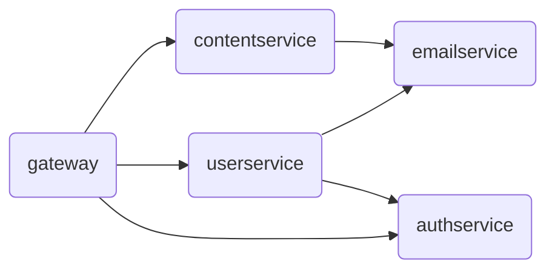

# Guidance for Basic Functions

## 训练目标

+ 了解云服务日志解析的背景
+ 了解本项目的主题
+ 熟悉 C\# 语言的基础语法
+ 体会面向对象的程序设计思想 

## 背景介绍

### 云服务一瞥

**注：本节可能略微涉及到暑培网站部分内容，但对本 workshop 来说仅作为背景，读者可以不必理解，不理解处跳过即可。**

「云（cloud）」包含了现代互联网的绝大多数的内容，我们在生活中几乎随处可以见到「云」，例如我们耳熟能详的云盘，或是近年来流行起来的云游戏， ~~以及随处可见的云玩家喷子，又或者我们云了一个游戏~~ ，苹果用户在使用一台新的苹果设备时还会见到「云上贵州」，等等。似乎「云」已经成为现代生活中必不可少的一部分。我们日常使用的互联网服务，几乎都是部署在云上的。无论是我们浏览网页，还是使用各种联网的 APP 客户端，都是在访问云上部署的互联网服务，以下我们简称为 **云服务（cloud service）**。

微服务（microservice）架构是云服务的一种常见架构。在这种架构中，云服务的每个功能都被做成单独的服务，各自独立地部署和运行。例如，一个简化的网站后端微服务架构如下：



其中，`gateway` 是总网关，`userservice` 用于用户的管理，`contentsevice` 用于网站的内容管理，`emailservice` 用于电子邮件的管理，`authservice` 用于权限认证，`concurrencycontroller` 用于并发控制，等等。

一般来讲，为了负载均衡、故障容错与恢复等等因素，每个服务都要同时运行多个副本，而每个副本都运行在一个单独的容器中（可以理解为，每个副本都是一个单独的进程）。

### 云服务日志

我们在日常写程序 debug 的时候，通常会打印一些语句帮助我们追踪程序的运行，例如：

```c
#include <stdio.h>
#include <stdlib.h>

double calc_avg(int scores[], int n) {
    if (n == 0) {
        printf("[ERROR] 数组长度为零！\n");
        exit(EXIT_FAILURE);
    }
    int sum = 0;
    printf("[DEBUG] 开始计算总分...\n");
    for (int i = 0; i < n; i++) {
        sum += scores[i];
        printf("[DEBUG] 第 %d 个成绩=%d, 当前总分=%d\n", i + 1, scores[i], sum);
    }
    printf("[DEBUG] 总分=%d, 人数=%d\n", sum, n);
    return (double)sum / n;
}

int main() {
    int scores[5] = {86, 90, 78, 92, 88};
    printf("[DEBUG] 程序开始运行\n");
    double avg = calc_avg(scores, 5);
    printf("平均分是：%.2f\n", avg);
    return 0;
}
```

里面我们用 `printf` 输出了很多我们的程序功能本身无关的信息（在上面的样例代码中以 `[DEBUG]`、`[ERROR]` 等开头），来帮助我们追踪程序的运行、打印错误信息等。而这类输出信息，我们称之为程序的 **日志（log）** 。例如上面的代码运行之后，程序的 **日志** 为：

```shell
[DEBUG] 程序开始运行
[DEBUG] 开始计算总分...
[DEBUG] 第 1 个成绩=86, 当前总分=86
[DEBUG] 第 2 个成绩=90, 当前总分=176
[DEBUG] 第 3 个成绩=78, 当前总分=254
[DEBUG] 第 4 个成绩=92, 当前总分=346
[DEBUG] 第 5 个成绩=88, 当前总分=434
[DEBUG] 总分=434, 人数=5
```

以上就是最简单的日志。

那么，日志有什么值得研究的呢？通常来讲，云服务的日志并不是那么的随意。为了方便在程序运行过程中对日志进行批量处理和分析，以能够快速定位到应用程序出现的故障或异常，通常云服务所产生的日志要提供足够的信息，并遵循固定的格式。根据日志格式的自由度，日志可以分为 **结构化日志（structured logs）** 、 **半结构化日志（semi-structured logs）** 和 **非结构化日志（unstructured logs）** 。下图可以清晰地展示三种日志的对比[^1]：



可以看到，结构化日志是高度格式化的，所有要输出的信息构成了一张整齐的表格，易于直接存入数据库落盘存储；半结构化日志也存在一部分规定好的表项，但也存在一些附加的、应用程序自身的信息（Message 字段）；而非结构化日志则最为自由，应用程序凭借自己的喜好来输出内容。由于结构化日志的高度机器友好型以及非结构化日志的高度不可预测性，本 workshop 只聚焦半结构化日志。

收集和分析云服务日志是网络领域一项重要的研究内容，其有利于云服务的故障诊断、异常检测，等等。尤其是在当今大语言模型（LLM）火热的今天，利用 LLM 来基于日志进行异常检测更是一个新的热门研究课题。

本 workshop 的最终目标便是实现一个简易的云服务日志分析系统，对云服务日志进行分析。大家不要被以上的内容吓到，我们处理的是极度简化的、小白友好的版本。

## 知识速递

我们在这里先介绍一下本节任务用到的一些需要补充的知识。

### 简单工厂模式

工厂模式（Factory Pattern）是面向对象程序设计中最常用的设计模式之一。它提供了一种创建对象的方式，使得创建对象的过程与使用对象的过程分离。其中，简单工厂模式是工厂模式中最简单的一类。

简单工厂模式包含如下三个角色：

+ Factory：工厂，负责实现创建所有实例的内部逻辑
+ Product：抽象产品，是需要创建的所有对象的基类，负责描述所有要创建的对象的公共接口
+ ConcreteProduct：具体产品，所有创建的对象都是某个具体产品类的实例

例如有两个具体产品：

```csharp
abstract class Product {}
class ConcreteProductA : Product {}
class ConcreteProductB : Product {}
```

在简单工厂模式下，一个典型的 `Factory` 样例如下：

```csharp
class Factory {
    public static Product CreateProduct(string type) {
        if (type == "A") {
            return new ConcreteProductA();
        } else if (type == "B") {
            return new ConcreteProductB();
        } else {
            // ...
        }
    }
}
```

### 访问者模式

访问者模式（Visitor Pattern）也是一种常用的设计模式。这种设计模式可以让外部对具有相同基类的不同派生类采取不同的行为，而无需对这些类的实现进行修改，实现了数据结构与在该数据结构上执行的操作分离。在这种设计模式中，要操作的对象通过多态机制提供了统一的访问者接口，而当外部需要对数据结构添加新的操作时，只需要去实现给定的访问者接口即可。

我们仍用之前介绍简单工厂模式时提供的案例为例：

```csharp
abstract class Product {}
class ConcreteProductA : Product {}
class ConcreteProductB : Product {}
```

当我们持有了对指定对象的基类引用 `Product` 时，我们希望对产品 A 和 B 分别执行不同的操作。若直接使用多态、虚方法等去做，我们通常需要这样写：

```csharp
abstract class Product {
    abstract void Print();
}

class ConcreteProductA : Product {
    abstract void Print() { Print("ConcreteProductA"); }
}

class ConcreteProductB : Product {
    abstract void Print() { Print("ConcreteProductB"); }
}

var product = Factory.CreateProduct(type);
product.Print();
```

但这样写存在诸多不便。例如，如果我们需要在外部使用这些对象，可能会对这些对象施加多种行为。如果这样的话，我们需要为每一种行为均在 `Product` 中添加一个虚方法，导致数据的存储以及对数据的操作行为混杂在一起。而访问者模式就是来解决这一问题的。

在访问者模式中，我们把多态机制暴露为一个统一的 `IVisitor` 接口，接口内定义对不同对象的访问方法的方法签名：

```csharp
interface IVisitor {
    void Visit(ConcreteProductA product);
    void Visit(ConcreteProductB product);
    // 如果你使用的语言不支持函数重载，你也可以把方法名定义为 VisitA、VisitB 等
}
```

随后，我们要利用多态机制，让 `IVisitor` 对不同的对象调用不同的访问方法，我们称之为 `Accept` 方法：

```csharp
abstract class Product {
    abstract void Accept(IVisitor visitor);
}

class ConcreteProductA : Product {
    abstract void Accept(IVisitor visitor) {
        visitor.Visit(this);  // 调用 IVisitor.Visit(ConcreteProductA product)
    }
}

class ConcreteProductB : Product {
    abstract void Accept(IVisitor visitor) {
        visitor.Visit(this);  // 调用 IVisitor.Visit(ConcreteProductB product)
    }
}
```

这样，我们就成功编写了访问者模式中对外提供的访问者接口。如果我要实现之前的功能，我只需要去编写一个全新的访问者类，继承 `IVisitor` 接口即可：

```csharp
class PrintVisitor : IVisitor {
    void Visit(ConcreteProductA product) { Print("ConcreteProductA"); }
    void Visit(ConcreteProductB product) { Print("ConcreteProductB"); }
}
```

访问者模式的实际应用极其广泛。例如，编译器的语义分析阶段就普遍应用了访问者模式（或其优化后的变体）。[OpenJDK](https://github.com/openjdk) 就教科书式地使用了访问者模式来对语法树进行语义分析——[`Tree` 中定义了一个 `accept` 函数](https://github.com/openjdk/jdk/blob/a39a1f10f75c15b93a709eca7bfae2d808cf7b91/src/jdk.compiler/share/classes/com/sun/source/tree/Tree.java#L749)，而 [`TreeVisitor` 则定义了访问者接口](https://github.com/openjdk/jdk/blob/a39a1f10f75c15b93a709eca7bfae2d808cf7b91/src/jdk.compiler/share/classes/com/sun/source/tree/TreeVisitor.java#L59)。

> 有趣的是，THUAI（清华大学人工智能挑战赛暨电子系队式程序设计大赛）的选手接口也曾使用访问者模式，参见 [THUAI6 Issue 17](https://github.com/eesast/THUAI6/issues/17)。在 THUAI6 中，选手需要同时为人类阵营和魔物阵营编写 AI 代码，存在 `IHumanAPI`、`IButcherAPI` 两套不同的逻辑用于供给选手来调用。因此，选手编写 AI 代码的类 `AI` 就成为了访问者。因此，在 `IGameTimer` 接口中提供了 `StartGame` 方法作为 `Accept` 方法；而 `IAI` 接口作为访问者接口，提供了 `play` 方法作为 `Visit` 方法。


## 本节任务

本节目标是实现对云服务日志的读取和分析。

### 任务描述

本 workshop 假定云服务的架构如下：



其只包含 `gateway`、`userservice`、`contentservice`、`emailservice` 和 `authservice` 五个服务（服务是什么以及拓扑结构是什么其实并不重要，也用不上，在本 workshop 中你把它们当成 `a`、`b`、`c`、`d`、`e` 就可以了），且各服务生成的日志格式完全相同，并且根据 `event` 的不同， **有且仅有三类** 。一个包含三类日志的典型的日志文件内容如下图所示：

```shell
0,2026-06-05T16:00:29.045Z,userservice-0,"{""severity"": ""INFO"", ""event"": ""call"", ""request-id"": ""3a013a08-6853-49fc-8f06-50daeb5c1e51"", ""target-service"": ""authservice"", ""duration-ms"": 18}"
1,2026-06-05T16:00:31.086Z,userservice-1,"{""severity"": ""INFO"", ""event"": ""request"", ""request-id"": ""1177c344-115e-4f85-b8ec-c9164d132b79"", ""method"": ""GET"", ""path"": ""/api/user/john"", ""status-code"": 404}"
2,2026-06-05T16:05:45.322Z,gateway-0,"{""severity"": ""ERROR"", ""event"": ""internal"", ""exception"": ""System.InvalidOperationException: Failed to load gateway routing configuration.""}"
```

可以看到，日志以一个 CSV 格式（逗号分隔格式）储存，CSV 的每一行内容分别为：

```csv
lineno,timestamp,pod-name,message
```

+ `lineno`：该行日志在文件内的行号

+ `timestamp`：产生这条日志时的时间戳

+ `pod-name`：产生这条日志的容器名。可以看到，容器名的构成为 `service-n`，由两部分组成：

  + `service`：即产生这条日志的服务名
  + `n`：由于每一个服务会同时运行多个副本，因此用 `n` 代表副本的序号

  因此，诸如 `userservice-0`、`userservice-1`、`userservice-2`、`gateway-0`、`gateway-1`、`emailservice-0` 等都是合法的 `pod-name`。

+ `message` 日志的具体信息，以 JSON 格式组织，且本项目中的三类日志的不同体现在 `message` 中的不同。

  + `severity`：日志等级。一条日志通常包含「等级」，如 `TRACE`、`DEBUG`、`INFO`、`WARNING`、`ERROR`、`FATAL` 等等。本项目 **包含且仅包含三种等级** ：`INFO`（表示这是一条普通信息）、`WARNING`（表示这是一条警告信息）和 `ERROR`（表示这是一条错误信息）
  + `event`：本条日志发生的事件，标识了本条日志的类别。 **之前所属的日志分为三类即是三种不同的 `event`** 。 **`event` 的取值有且仅有以下三种** ：
    + `call`：表示本服务向其他服务发出了一次请求。此类日志的 `message` 包含以下字段：`request-id`、`target-service`、`duration-ms`
    + `request`：表示本服务收到了一次请求。此类日志的 `message` 包含以下字段：`request-id`、`method`、`path`、`status-code`
    + `internal`：表示本服务发生了一次内部故障。此类日志的 `message` 仅包含 `exception` 字段，代表服务抛出的异常，且字段值固定为 `ExceptionName: exception message` 格式（异常名称和异常信息之间用冒号后紧跟一个空格来分隔）。

本节拟对以上描述的日志进行解析。

### （S1.1）Step 1：日志解析基础功能实现

要对日志进行解析，需要对存储日志的 CSV 文件逐行读取文件内容，并获取 CSV 每行记录的各个字段的值。尤其对于 JSON 格式的 Message 字段，还需要进一步使用 JSON 解析器进行解析，以得到内部各个字段的值。

本步骤的代码位于 `LogParser` 目录中，代码结构如下：

```shell
LogParser
|
+-Models
|   LogEntries.cs
|
+-Parser
    LineParser.cs
    LogFileParser.cs
```

你的任务是要仔细阅读我们所给的基础代码框架，并将功能补充完整。

> [!NOTE]
>
> **任务 1.1（T1.1）**
>
> 请根据下面的代码说明，来仔细阅读代码框架。

在我们所给的代码框架中，`Parser/LogFileParser.cs` 内的 `LogFileParser` 类是我们对外提供的日志文件解析接口。其接口被规定为：

```csharp
public class LogFileParser {
    public IEnumerable<LogEntry> Parse(TextReader logFile);
}
```

我们通过 `logFile` 这个参数以流的形式为该接口输入日志文件的内容，同时也流式地返回每一行所解析的结果 `LogEntry`，由此我们可以很方便地获取解析结果：

```csharp
var parser = new LogFileParser();
using var reader = new StreamReader('path/to/logfile');
foreach (var logEntry in parser.Parse(reader)) {
    // ...
}
```

`LogEntry` 是一个用于记录日志解析结果的类（C\# 语言中，我们可以使用 `record` 类型来专门处理这种职能的类），其定义在 `Models/LogEntries.cs` 中。

为了能够更加清晰地体现对三种不同类型日志的数据结果的存储，并便于后续对三种日志数据结果进行分别处理，我们将记录三类日志解析结果的类分别定义为 `CallLogEntry`、`RequestLogEntry` 和 `InternalLogEntry` 类（均为 `record` 类型），且它们均继承自 `LogEntry`。`LogEntry` 中存在三类日志的共有的字段，而三个子类中存在三类日志的独有字段。这些数据结构以及其他必要的数据结构均位于 `Models/LogEntries.cs` 中。

我们的代码框架已经给出了 `LogFileParser` 的基本实现。在我们给出的实现中，`LogFileParser` 逐行读取给定的日志文件，并使用逗号分隔开，将逗号分隔后的结果交给 `LineParser` 做进一步解析。

`LineParser` 采用 **简单工厂模式** ，其 `ParseLine` 方法是 `LineParser` 的公共接口：

```csharp
class LineParser {
    public static LogEntry ParseLine(LogRecord logRecord);
}
```

每给定一行日志 `logRecord`，`LineParser` 在内部将会解析并识别日志类型，并根据日志类型创建相应的对象，来保存解析结果，统一以 `LogEntry` 基类返回。

> [!NOTE]
>
> **任务 1.2（T1.2）**
>
> 我们已经给出了 Call 类型日志的完整实现。运行测试 `test-01-basic`，`TestLogFileParserBasic` 中的 `TestParseCallLogEntry` 将会通过。
>
> 请参考 Call 类型日志的完整实现，以及本文档末尾给出的「可能用到的知识或接口」一节，自己动手实现对 request 和 internal 类型日志的解析。当你完成你的实现后，运行测试 `test-01-basic`，你将会通过 `Test_1_2_LogFileParserBasic` 中的全部测试（即 `T1.2` 开头的全部测试）。

**可能用到的接口：**

+ 可能用到的 C\# 字符串操作：
  + 查找子串：`String.IndexOf()`

    ```csharp
    var str = "abcdefg";
    var index1 = str.IndexOf("cd") // 2
    var index2 = str.IndexOf("hi") // -1
    ```

    更多请参照：[String.IndexOf 方法 (System) | Microsoft Learn](https://learn.microsoft.com/zh-cn/dotnet/api/system.string.indexof?view=net-10.0)

  + 获取子串：`String.Substring`

    ```csharp
    var str = "01234567";
    var str1 = str.Substring(1, 3); // "12"
    var str1 = str.Substring(5); // "567"
    ```

    更多请参照：[String.Substring 方法 (System) | Microsoft Learn](https://learn.microsoft.com/zh-cn/dotnet/api/system.string.substring?view=net-10.0)


### （S1.2）Step 2：获取解析结果

现在，我们可以通过 `Parse` 方法来获取储存日志解析结果的对象。但此时，我们得到的是一系列 `LogEntry` 这个抽象类的引用，我们如何从这个抽象类的引用中获取到实际对象内部存储的内容呢？

在本步骤，我们约定采用键值对的形式来获取解析结果，接口为在 `Visitors\KeyValueVisitor.cs` 中的 `KeyValueVisitor` 类的 `Dump` 方法：

```csharp
class KeyValueVisitor {
    Dictionary<string, string> Dump(LogEntry entry);
}
```

该接口的输入是每一条日志的解析结果对象的引用 `LogEntry`，返回一个由键值对组成的字典 `Dictionary<string, string>`。对每种日志，其键分别为：

+ Call 类型日志：

  ```csharp
  Dictionary<string, string> {
      ["LineNo"],
      ["Timestamp"],
      ["PodName"],
      ["Severity"],   // "Info" / "Warning" / "Error"
      ["EventType"],  // "Call" / "Request" / "Internal"
      ["RequestId"],
      ["TargetService"],
      ["DurationMs"],
  };
  ```

+ Request 类型日志：

  ```csharp
  Dictionary<string, string> {
      ["LineNo"],
      ["Timestamp"],
      ["PodName"],
      ["Severity"],   // "Info" / "Warning" / "Error"
      ["EventType"],  // "Call" / "Request" / "Internal"
      ["RequestId"],
      ["Method"],
      ["Path"],
      ["StatusCode"],
  };
  ```

+ Internal 类型日志：

  ```csharp
  Dictionary<string, string> {
      ["LineNo"],
      ["Timestamp"],
      ["PodName"],
      ["Severity"],   // "Info" / "Warning" / "Error"
      ["EventType"],  // "Call" / "Request" / "Internal"
      ["ExceptionName"],
      ["ExceptionMessage"],
  };
  ```

我们将使用 **访问者模式** 来进行这项操作。

本步骤的代码依然位于 `LogParser` 目录中，代码结构如下：

```shell
LogParser
|
+-Models
|   ILogEntryVisitor.cs
|   LogEntries.cs
|
+-Parser
|   LineParser.cs
|   LogFileParser.cs
+-Visitors
    KeyValueVisitor.cs
```

我们在 `Models/ILogEntryVisitor.cs` 中提供了访问者接口：

```csharp
public interface ILogEntryVisitor<TResult>
{
    TResult Visit(CallLogEntry entry);
    TResult Visit(RequestLogEntry entry);
    TResult Visit(InternalLogEntry entry);
}
```

抽象类 `LogEntry` 定义了抽象方法 `Accept`：

```csharp
public abstract record LogEntry {
    public abstract TResult Accept<TResult>(ILogEntryVisitor<TResult> visitor);
}
```

> [!NOTE]
>
> **任务 1.3（T1.3）**
>
> 你需要为三种具体的 `LogEntry` 提供 `Accept` 的实现，并完成 `KeyValueVisitor` 的实现，包括实现 `Dump` 方法和 `Visit` 方法。
>
> 其中，我们已经给出了 `KeyValueVisitor` 中 Call 类型的 `Visit` 方法作为参考。当你完成你的实现后，运行测试 `test-01-basic`，你将会通过全部测试。

## 问答题

问答题的提交方式是在 `docs/01-basic` 目录中新建一个名为 `report.md` 的文本文件，在其中进行你对问题的解答。

### (Q1.1)

在给出的代码框架 `Parser` 中：

+ 哪条语句或哪几条语句将日志按逗号进行分割？代码中，我们是如何指定每一行的第几个字段代表何种意义的？
+ 在对日志中 JSON 格式的 `message` 字段进行读取时，我们是在哪个方法内用哪几条语句判断这一行日志的种类（Call / Request / Internal）的？
+ 在确定了日志种类后，我们是调用了哪个库方法对 JSON 进行解析的？
  + 进一步，我们的框架代码是如何防止日志中有字段缺失的？（例如所给的 Call 日志的 `message` 中缺失 `request_id` 字段）
  + 更进一步，日志中的 JSON 的键是 `abc-def` 命名法（称为烤串命名法），而我们的解析结果却是放在 `AbcDef` 命名法（称为大驼峰命名法）的属性里，我们的框架代码中是如何告诉 JSON 解析器完成这一命名法转换的？

### (Q1.2)

以一个 Call 事件的解析结果为例，当调用 `KeyValueVisitor` 的 `Dump` 方法后，都有哪些方法被调用？请补充完整如下的方法调用链（.NET 内置库）：

+ `Dictionary<string, string> KeyValueVisitor.Dump(LogEntry entry)`
+ ……

> **函数（或方法）调用链样例**
>
> 对于如下程序：
>
> ```c
> void f1(int x) {
>     printf("%d\n", x);
> }
> 
> void f2(int x) {
>     f1(x);
> }
> 
> int main(int argc, char* argv[]) {
>     f2(argc);
> }
> ```
>
> 函数调用链表示为：
>
> + `int main(int argc, char* argv[])`
> + `void f2(int x)`
> + `void f1(int x)`

### (Q1.3)

本次作业中，你是否使用了 AI？根据你的使用情况，在以下 (Q1.3.a) (Q1.3.b) 两个问题中选择一题作答：

#### (Q1.3.a)

如果没有使用 AI，你花了大约多长时间通过全部测试？你认为本次作业相比于你曾经上过的程序设计课程的作业难度如何？你认为你自己的作答是否足够标准？如果不，你觉得你的作答有哪里不够完美？

#### (Q1.3.b)

如果使用了 AI，你给予 AI 的提示词是什么？你认为 AI 给出的解答、你完全凭借传统搜索引擎以及自己的能力能够写出的解答之间，AI 的解答比你好在哪？AI 又有哪些解答是存在问题的，或者至少是不如你自己的解答的？给出你的理由。

## 其他

关于本节的任务分值等信息，参看 [tasks.md](./tasks.md)。

## 拓展阅读

未完待续……

## 前进 / 后退

+ 上一篇：[Tasks in Preparation](../00-prepare/tasks.md)
+ 下一篇：[Tasks in Basic Functions](./tasks.md)

## 参考文献

[^1]: He S, Zhang X, He P, et al. An empirical study of log analysis at Microsoft[C]//Proceedings of the 30th ACM Joint European Software Engineering Conference and Symposium on the Foundations of Software Engineering. 2022: 1465-1476.

