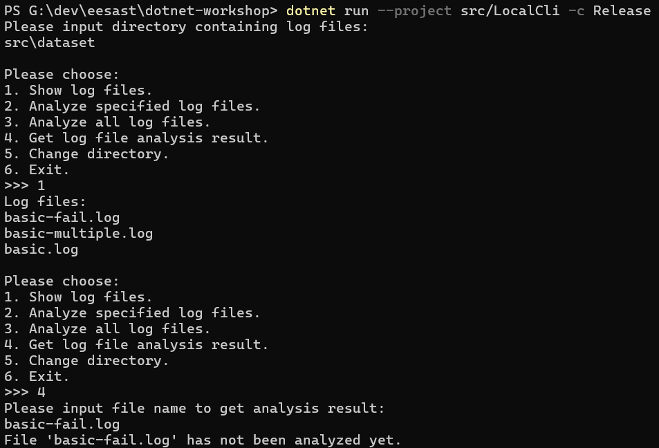
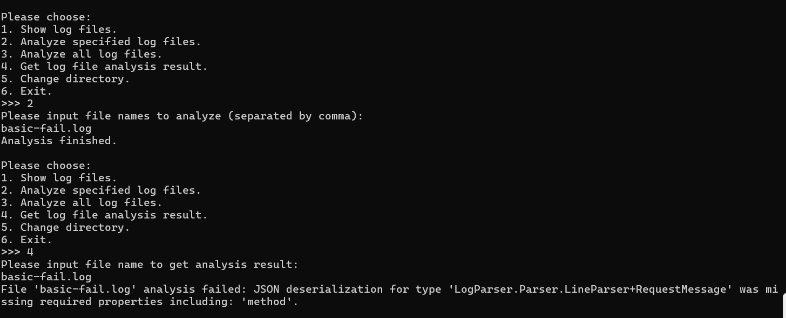
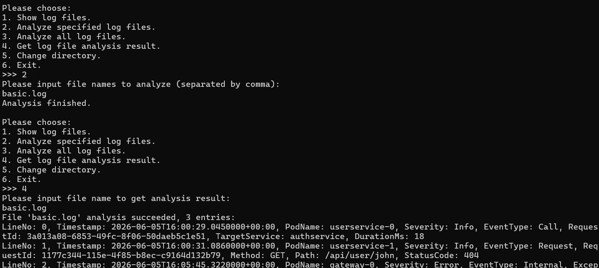
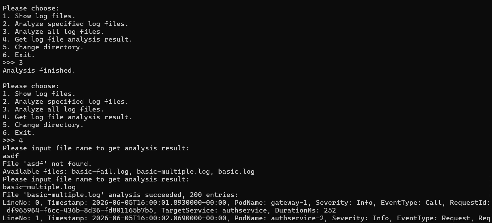
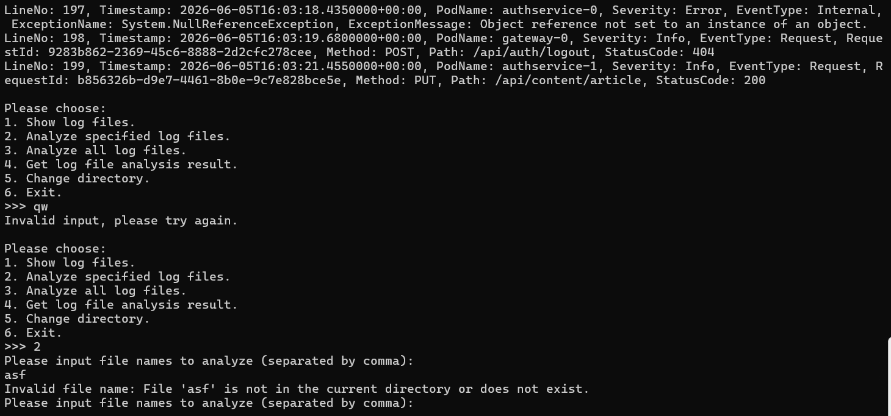

# C02 Multithreading 作业报告

## 功能实现介绍

本节在 C01 日志解析的基础上，实现了目录级并行日志分析系统，包含三个组成部分。

### 1. 线程安全队列 `WorkQueue<T>`

基于线程不安全的 `Queue<T>` 实现了一个无限容量的线程安全队列，模拟“生产者—消费者”模型：

- `Enqueue`：加锁后入队，并用 `Monitor.Pulse` 唤醒一个正在等待的消费者；
- `CompleteAdding`：置完成标记并用 `Monitor.PulseAll` 唤醒所有等待中的消费者，让它们在队列清空后退出；
- `TryDequeue`：队列非空则立即取出；队列为空且未结束时 `Monitor.Wait` 让出锁等待；队列为空且已结束时返回 `false`。

队列与完成标记这两个共享变量用同一把锁（`_items` 对象）保护。等待条件使用 `while` 循环而不是 `if`，以应对虚假唤醒以及“被唤醒时元素已被其他线程取走”的情况。

### 2. 并行分析器 `LogFileAnalyzer`

- 目录管理：`ChangeDirectory` 扫描指定目录顶层的全部 `.log` 文件，为每个文件预置一个 `NotAnalyzed` 的结果槽位；
- 任务编排：`AnalyzeAll` / `AnalyzeFiles` 校验参数与并发状态（`_isAnalyzing`），过滤掉已经分析过的文件，再把剩余任务放入 `WorkQueue`；
- 并行执行：`RunWorkers` 创建至多 `degreeOfParallelism` 个工作线程，以 `WorkerMain` 为入口，从队列取文件解析；主线程 `Join` 等待全部结束；
- 结果管理：成功时保存 `Succeeded` 状态与解析出的日志条目，解析失败时保存 `Failed` 状态与错误信息；对结果字典的写操作统一在 `_syncRoot` 锁内进行。

### 3. 控制台交互界面 `LocalCli`

提供菜单式交互，支持输入/切换日志目录、查看日志文件列表、分析指定文件、分析全部文件、查看单个文件分析结果。输入解析与所有可能抛出的异常（目录不存在、文件名不存在、非数字菜单项、正在分析等）均被捕获并提示用户重新输入，程序不会因非法输入而崩溃。

## 运行截图

以下截图按时间顺序排列，覆盖功能演示与各种非法输入处理：











## Q2.1

### 1. `WorkQueue<T>` 中的共享变量与保护方式

共享变量有两个：

- `_items`：`Queue<T>` 队列本体，存放元素；
- `_isCompleted`：是否已经结束放入的布尔标记。

两者都通过同一把锁保护：`lock (_items)`（用队列对象自身作为互斥量）。所有 `Enqueue`、`TryDequeue`、`CompleteAdding` 以及 `IsCompleted` 的读取都在这把锁内进行。共用一个锁而不是两把锁，是因为“队列是否为空”和“是否已结束放入”共同决定消费者的行为。

### 2. `LogFileAnalyzer` 中的共享变量与保护方式

共享变量有：

- `_currentDirectory`：当前日志目录；
- `_logFiles`：文件名到 `FileInfo` 的字典；
- `_analysisResults`：文件名到 `AnalysisResult` 的字典（工作线程也会写入）；
- `_isAnalyzing`：是否正在分析。

它们统一通过 `lock (_syncRoot)`保护。

### 3. 条件变量使用 `if` 而非 `while` 的后果

`Monitor.Wait` 可能在无人调用 `signal` / `broadcast` 的情况下被虚假唤醒（例如类 UNIX 系统中由信号引起）。如果等待结束后用 `if` 直接继续而不是 `while` 重新检查条件，消费者会在“条件仍然不成立”时错误地进入临界区取数据。

结合本节的无限容量生产者—消费者问题：消费者因仓库为空而 `Wait`，若被虚假唤醒且只检查一次，便会继续执行取出操作，此时仓库仍为空，导致取出一个并不存在的元素（`Queue<T>` 对空队列 `Dequeue` 会抛异常）。使用 `while` 后，被唤醒的线程会重新检查“仓库是否为空/是否已结束”，条件不满足就继续等待，从而避免该问题。

## Q2.2

扫描给定目录中全部 `.log` 文件的代码位于 `LogFileAnalyzer.ChangeDirectory` 方法内：

```csharp
var logFiles = Directory.EnumerateFiles(directoryPath, "*.log", SearchOption.TopDirectoryOnly)
    .Select(filePath => Path.GetFileName(filePath))
    .OrderBy(fileName => fileName);
```

若需求改为递归扫描所有子目录、子子目录……中的日志文件，只需将 `SearchOption.TopDirectoryOnly` 改为 `SearchOption.AllDirectories`，并处理可能出现的重复文件名、访问受限子目录等边界情况。

## Q2.3.b

本次作业使用了 AI 辅助完成，回答 (Q2.3.b)。

 先让AI给出已有代码框架和一些关键的变量，我据此大致构思怎么实现所需功能，讨论几轮确认方案后由AI编写代码，后续出现问题时我手动修改。

 AI有时会出现自认为完成了某项任务实际上没有的情况，比如我在测试时发现获取分析结果时若文件未分析不会提示“未分析”，而是直接返回空结果。

 在较多依赖AI辅助的条件下我认为难度比较简单，因为AI比较大的减少了我的工作量，我基本只需负责最终微调修改。同时我自己手动的部分常常也有不完善、不清晰的情况，AI可以进行查错和补充（本md文档中部分代码细节是AI填充的）。
