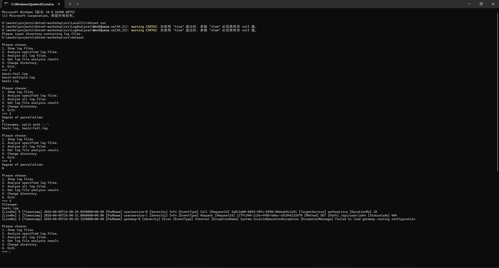
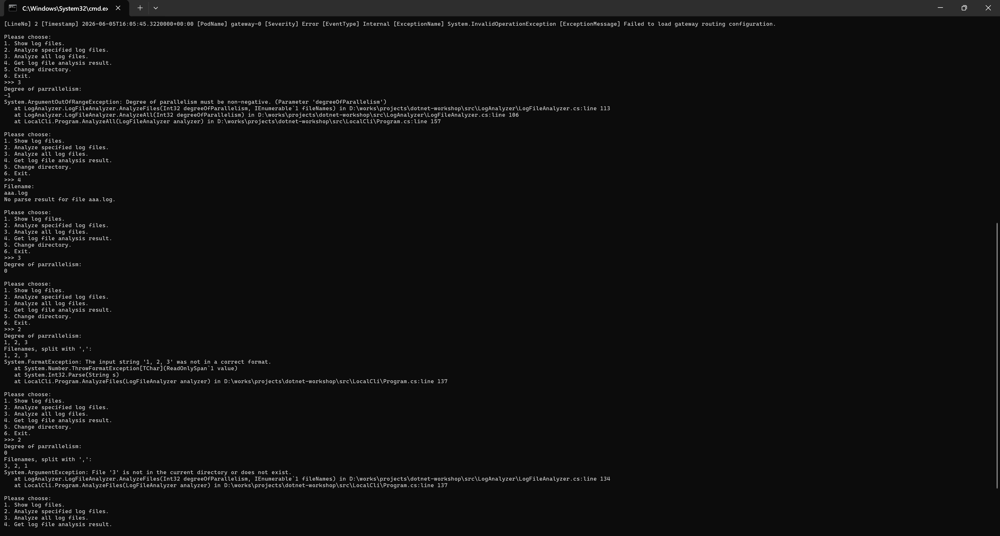

功能截图：


鲁棒性测试：


### (Q2.1)

本问题考察关于临界区的理解。

我们把访问临界资源的程序片段称作临界区。在我们的多线程程序当中，临界资源即为不同线程的共享变量。请问：

+ `WorkQueue<T>` 类中的共享变量有哪些？是通过什么保护其免于数据竞争（data race）呢？
1. _items和_isCompleted
2. 通过lock(_items)
+ `LogFileAnalyzer` 类中的共享变量有哪些？是通过什么保护其免于数据竞争呢？
1. _currentDirectory, _isAnalyzing, _logFiles, _analysisResults
2. lock(_syncRoot)
+ 如果条件变量的判断条件使用了 `if` 判断而非 `while` 判断，当出现了虚假唤醒现象时（在类 UNIX 系统中，由于 UNIX 信号等机制，即使没有人调用过 `signal` 或 `broadcast`，处于 `wait` 当中的条件变量也可能被唤醒），会出现什么后果？结合无限仓库容量的生产者消费者问题简单叙述一下。

此时被唤醒的线程会误以为等待条件已经达成继续执行下面的代码。对于无限仓库容量的生产者消费者模型来说，消费者线程的等待条件通常是队列为空。当被虚假唤醒，消费者线程会尝试从队列中取出数据，但是实际上队列还是空的，所以可能直接抛出异常或者取出无效数据。

### (Q2.2)

在给出的代码框架 `LogFileAnalyzer` 中：

+ 那一段代码扫描了给定的目录中的全部 `.log` 后缀的日志文件？假使给定的需求是不但要扫描给定目录中的日志文件，还要递归地获取给定的目录的全部子目录、子子目录……内的日志文件，应当如何做（简要回答即可）？

1. 
```
var logFiles = Directory.EnumerateFiles(directoryPath, "*.log", SearchOption.TopDirectoryOnly)
```

2. 
```
var logFiles = Directory.EnumerateFiles(directoryPath, "*.log", SearchOption.AllDirectories)
```
### (Q2.3)

本次作业中，你是否使用了 AI？根据你的使用情况，在以下 (Q2.3.a) (Q2.3.b) 两个问题中选择一题作答：

#### (Q2.3.a)

如果没有使用 AI，你花了大约多长时间通过全部测试？你认为本次作业相比于你曾经上过的程序设计课程的作业难度如何？你是否借助了传统搜索引擎来完成本节？你认为本节的难度是偏低、适中，还是偏高？

1. 未使用AI。
2. 总共花费2.5小时完成。
3. 相比程序设计课作业难度更高，主要在线程安全相关考虑上。
4. 使用了搜索引擎，主要搜索一些内置API的使用方法。
5. 难度适中。