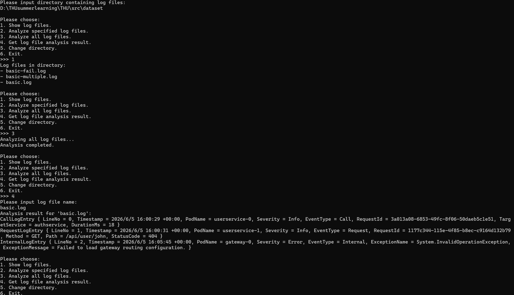
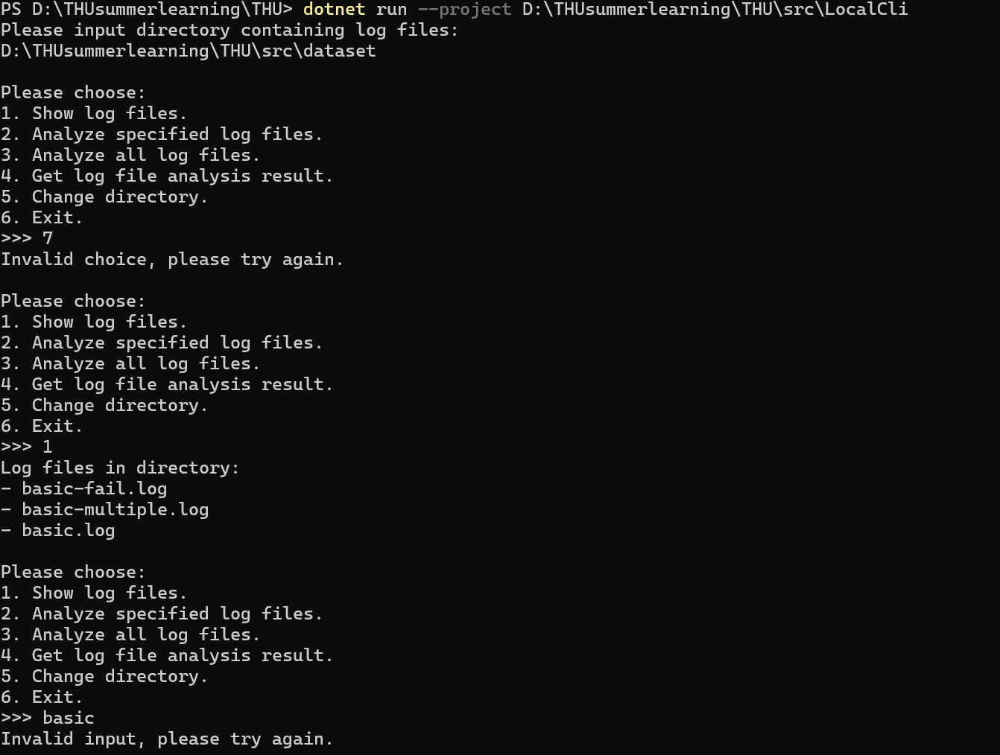

# 实验报告

## 1. 功能演示

### 1.1 功能实现介绍
启动 `LocalCli` 后，选择日志所在目录，选择需要解析的日志文件，点击“开始解析”按钮，系统将自动并发解析日志文件并显示结果。

* **功能说明**：主线程将目录下的 `.log` 文件投入 `WorkQueue<FileInfo>`，由 4 个 Worker 线程并发拉取并解析，结果安全写入共享字典。

### 1.2 鲁棒性展示
当用户输入不存在的日志路径或文件名时，系统发现错误，给出提示，要求重新输入：

* **功能说明**：系统在 `LogFileAnalyzer` 中校验路径有效性，并在 Worker 线程遇到异常时将其状态标记为 `AnalysisState.Failed`，记录错误信息而不会导致主程序崩溃。
## 2. 问题解答

### Q2.1

#### 1. 
* **共享变量**：
  * `Queue<T> _items`（存储工作项的队列）
  * `bool _isCompleted`（标记队列是否已完成添加的标志位）
* **保护机制**：
  * 使用 **`lock (_items)`**（即 `Monitor.Enter` / `Monitor.Exit` ）将对 `_items` 队列的所有读写操作（`Enqueue`、`TryDequeue`、`CompleteAdding`、`IsCompleted`）以及线程间的等待与唤醒（`Monitor.Wait`、`Monitor.Pulse`、`Monitor.PulseAll`）统一放在以 `_items` 作为锁对象的临界区中，确保互斥。

#### 2. 
* **共享变量**：
  * `_currentDirectory`（当前加载的日志目录路径）
  * `_isAnalyzing`（是否处于正在分析状态的标志）
  * `_logFiles`（存储文件名与对应 `FileInfo` 的字典）
  * `_analysisResults`（存储文件名与解析结果 `AnalysisResult` 的字典）
* **保护机制**：
  * 专门声明了一个私有只读的互斥锁对象：`private readonly object _syncRoot = new();`。
  * 在状态读写（`IsAnalyzing`）、目录切换（`ChangeDirectory`）、获取文件列表、查询结果以及 Worker 线程更新解析结果（`WorkerMain` 中的字典赋值）等所有涉及共享状态读取或修改的代码块中，均使用了 **`lock (_syncRoot)`** 进行临界区保护。

#### 3. 
* 1.虚假唤醒：消费者线程在队列仍然为空（_items.Count == 0）时可能被系统信号唤醒。由于使用的是 if，线程被唤醒后不再重新校验队列数量，直接向下执行 _items.Dequeue()，从而抛出 InvalidOperationException（对空队列执行 Dequeue 异常） 导致程序崩溃。

* 2.竞争抢锁失效：当生产者放入 1 个元素并调用 PulseAll 唤醒多个阻塞在 Wait 上的消费者时，所有唤醒的消费者会重新竞争锁。假设线程 A 抢到锁并弹出该元素，锁被释放后线程 B 接着拿到锁。如果使用 if，线程 B 会直接执行 Dequeue() 试图弹出元素，但此时队列已经被线程 A 消费空了，同样导致崩溃。

### Q2.1

#### 1.
    var logFiles = Directory.EnumerateFiles(directoryPath, "*.log", SearchOption.TopDirectoryOnly)
    .Select(filePath => Path.GetFileName(filePath))
    .OrderBy(fileName => fileName);
    
#### 2.
    
将 Directory.EnumerateFiles 中的第三个参数从 SearchOption.TopDirectoryOnly 修改为 SearchOption.AllDirectories 可实现递归扫描。

### Q2.3b
* 给AI的提示词一般是报错的诊断，将报错提供，要求分析问题。AI产生的错误在于不能理解多个代码文件的统一性，它针对报错给出的修改与和其余文件中的代码不匹配，需要我自己查找修改。适中。