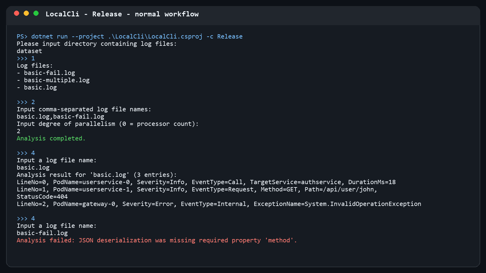

# 02-multithreading 实验报告

姓名：李易臻  
班级：秀钟31  
学号：2023013461

## 功能实现

本节完成了以下内容：

- 使用 `lock`、`Monitor.Wait`、`Monitor.Pulse` 和 `Monitor.PulseAll` 实现线程安全的 `WorkQueue<T>`；
- 使用工作队列分配日志文件，按指定并行度创建工作线程并等待全部线程结束；
- 分别记录解析成功和失败的结果，并跳过已经分析过的文件；
- 完成本地命令行界面，可列出文件、分析指定文件或全部文件、查看结果和切换目录；
- 对不存在的目录、非法并行度、未知文件和空文件名等输入给出提示，避免程序直接退出。

Release 配置下运行 `test-02-multithreading`，8 项测试全部通过。

## 运行截图

正常功能：



非法文件名与非法并行度输入：


## Q2.1

1. `WorkQueue<T>` 中的共享变量是 `_items` 和 `_isCompleted`。所有读取与修改都在 `lock (_items)` 的临界区中完成；队列为空且生产尚未结束时，消费者通过 `Monitor.Wait` 等待，入队时用 `Monitor.Pulse` 唤醒一个消费者，结束入队时用 `Monitor.PulseAll` 唤醒全部消费者。
2. `LogFileAnalyzer` 中会被多个线程访问的变量包括 `_currentDirectory`、`_isAnalyzing`、`_logFiles` 和 `_analysisResults`，它们通过 `_syncRoot` 互斥访问。工作线程只在锁外解析各自的文件，写回共享结果字典时再加锁，因此既防止数据竞争，也避免把耗时解析放在临界区内。
3. 如果用 `if` 检查队列为空，消费者发生虚假唤醒后会直接越过等待逻辑，即使队列仍为空也继续执行 `Dequeue`，可能抛出异常。使用 `while` 会在每次唤醒后重新检查“队列非空或生产已经结束”的条件，只有条件真正满足才继续。

## Q2.2

`ChangeDirectory` 中的以下代码扫描当前目录顶层的 `.log` 文件：

```csharp
Directory.EnumerateFiles(directoryPath, "*.log", SearchOption.TopDirectoryOnly)
```

如果需要递归扫描子目录，可将 `SearchOption.TopDirectoryOnly` 改为 `SearchOption.AllDirectories`。同时，若不同子目录可能有同名文件，字典键不应只使用 `Path.GetFileName`，而应使用相对于根目录的路径以避免冲突。

## Q2.3.b

本次作业使用了 AI。主要提示是要求 AI 阅读课程说明和测试，完成 `02-multithreading` 中的 TODO，并实际运行 Release 测试验证。我让 AI 协助梳理代码框架、实现线程同步和 CLI，并根据编译器与测试结果修正实现。第一次测试没有进入代码阶段，问题来自共享 NuGet 缓存目录权限，而不是多线程代码；切换到本任务独立缓存后，8 项测试通过。这个任务需要同时处理条件变量、临界区和线程生命周期，我认为难度适中偏高。
