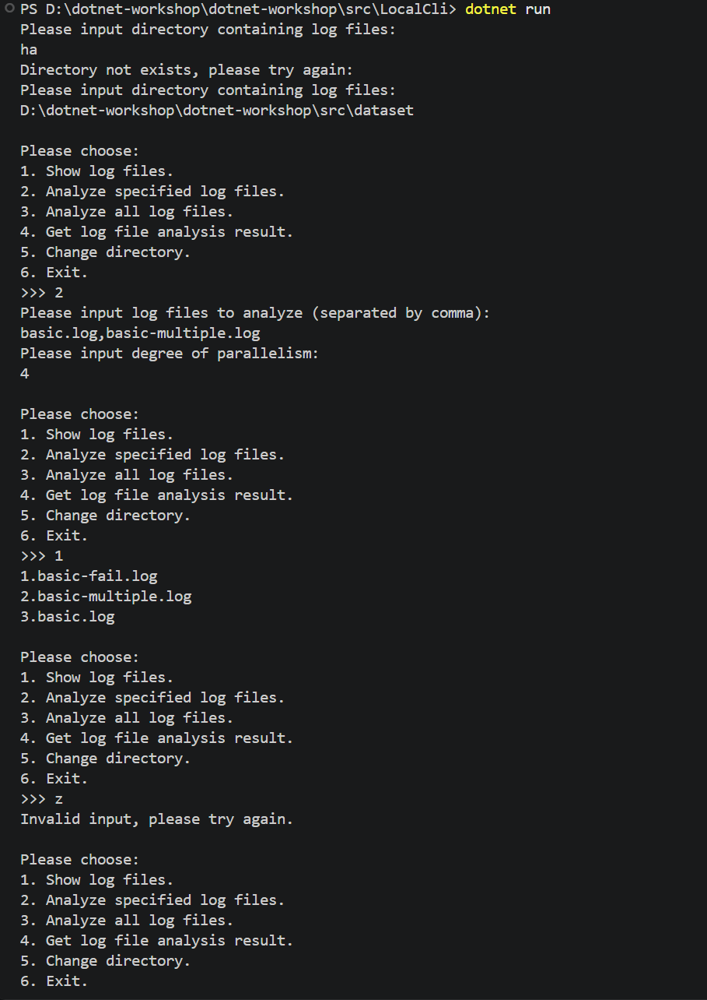
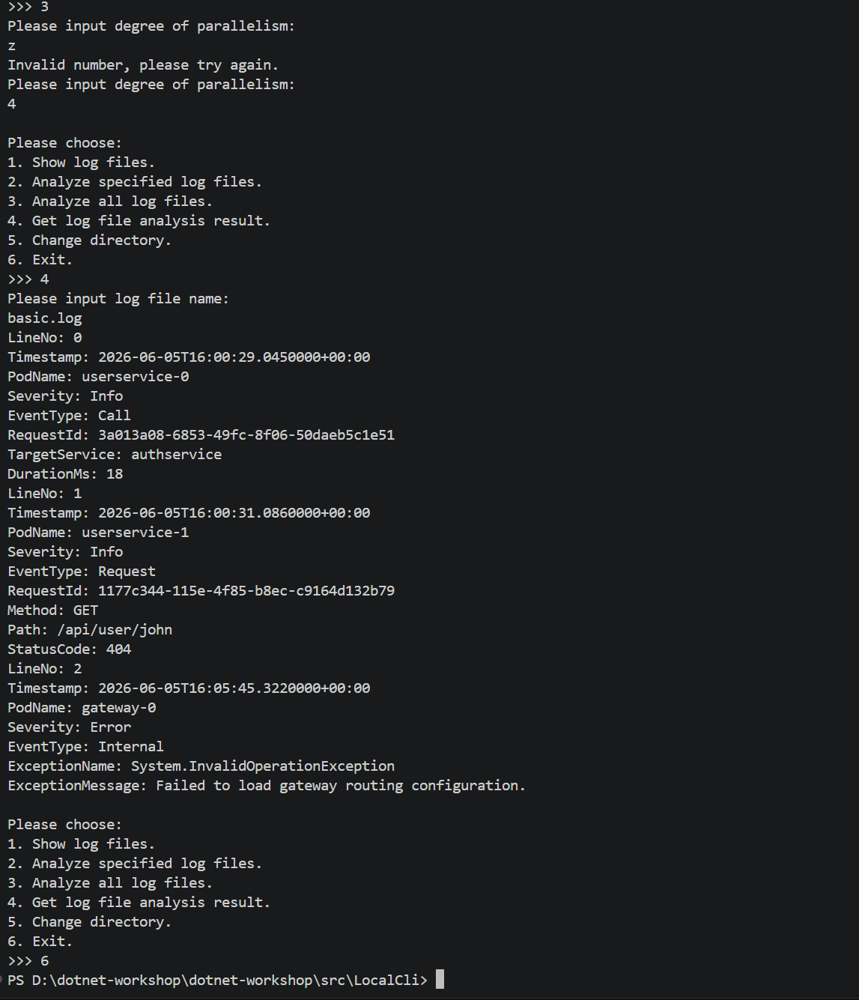

## 任务 2.3：实现前端交互逻辑 (Console UI)

### 1. 功能介绍
本任务在 `Program.cs` 中实现了控制台交互界面，主要完成了以下三个功能：

* **指定文件分析 (AnalyzeFiles)**：
  接收用户输入的以逗号分隔的文件名，自动去除多余空格和空项。通过安全的方式读取用户输入的线程数，如果遇到输入格式错误或者后台任务冲突，会通过循环把用户留在当前步骤要求重新输入，防止程序崩溃。
* **全目录分析 (AnalyzeAll)**：
  只需读取用户输入的线程数，在校验输入合法后，直接交给后台并发分析整个文件夹里的所有日志。
* **查询结果 (GetAnalysisResult)**：
  获取用户输入的文件名，调用后台查询。如果文件还没有分析，提示未分析；如果分析失败，打印具体的报错信息；如果分析成功，则调用 `KeyValueVisitor.Dump` 方法，把底层的日志数据转换成键值对字典，并逐行清晰地打印到屏幕上。

### 2. 运行效果截图

### 3. 问答题

#### (Q2.1) 临界区与数据竞争理解

*   **`WorkQueue<T>` 类中的共享变量有哪些？是通过什么保护其免于数据竞争（data race）呢？**
    > 答：_items和_isCompleted；运用lock（）形成互斥锁
    > 
    > 

*   **`LogFileAnalyzer` 类中的共享变量有哪些？是通过什么保护其免于数据竞争呢？**
    > 答：_currentDirectory，_isAnalyzing，_logFiles，_analysisResults；定义 _syncRoot作为互斥锁对象来保护
    > 
    > 
    > 

*   **如果条件变量的判断条件使用了 `if` 判断而非 `while` 判断，当出现了虚假唤醒现象时（在类 UNIX 系统中，由于 UNIX 信号等机制，即使没有人调用过 `signal` 或 `broadcast`，处于 `wait` 当中的条件变量也可能被唤醒），会出现什么后果？结合无限仓库容量的生产者消费者问题简单叙述一下。**
    > 答：这样的话会导致消费者在被异常唤醒时跳过if检查直接强行尝试从空仓库中取商品，，进而导致程序发生崩溃。
    > 
    > 
    > 

#### (Q2.2) 目录扫描逻辑

*   **在给出的代码框架 `LogFileAnalyzer` 中，那一段代码扫描了给定的目录中的全部 `.log` 后缀的日志文件？假使给定的需求是不但要扫描给定目录中的日志文件，还要递归地获取给定的目录的全部子目录、子子目录……内的日志文件，应当如何做（简要回答即可）？**[cite: 6]
    > 答：ChangeDirectory 方法中Directory.EnumerateFiles(directoryPath, "*.log", SearchOption.TopDirectoryOnly)；
    > SearchOption.TopDirectoryOnly 修改为 SearchOption.AllDirectories
    > 
    > 

#### (Q2.3) AI 使用情况调查

*本次作业中，你是否使用了 AI？根据你的使用情况，在以下 (Q2.3.a) (Q2.3.b) 两个问题中选择一题作答即可：*

*   **(Q2.3.b) 如果使用了 AI，你给予 AI 的提示词是什么？你对 AI 的使用是询问 AI 一些接口的用法或是在某处的写法，还是让 AI 帮你写一部分作业代码，又或是让 AI 给你讲解代码框架？AI 的解答是否出现过错误（如果有，是哪些）？你认为本节的难度是偏低、适中，还是偏高？**
    > 答：我给予ai提示词更多是搜索性质与提示讲解性质，并没有让ai直接给出过代码。因为本节难度我认为对于之前从未接触过c#的人来说难度比较高，c#的一堆内置函数单凭自己很难看懂，更何况有时候会一下子牵扯到多个代码文件，没有ai的辅助梳理很容易忘记要干什么。
    > 
    > 
    >