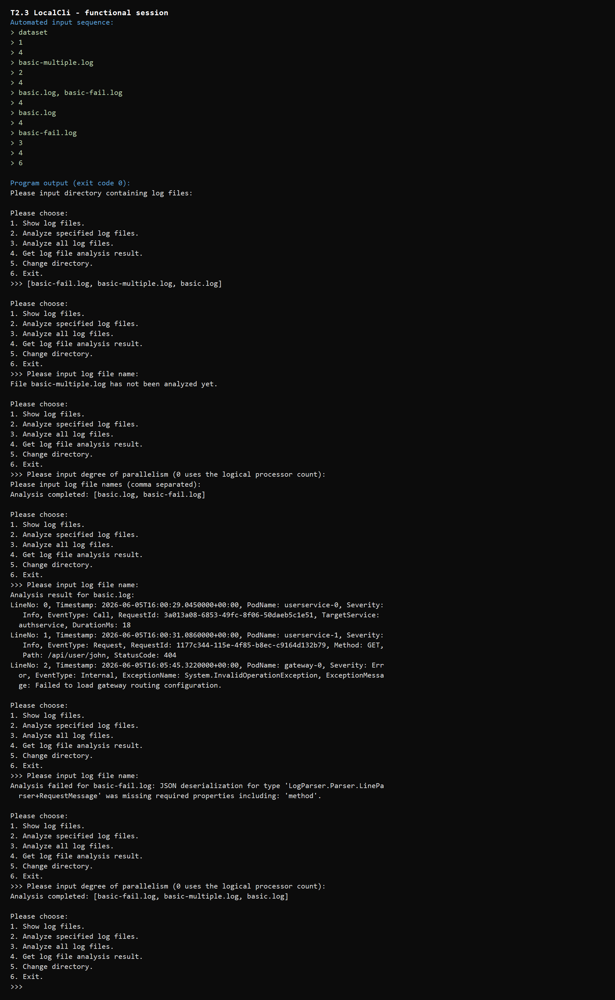
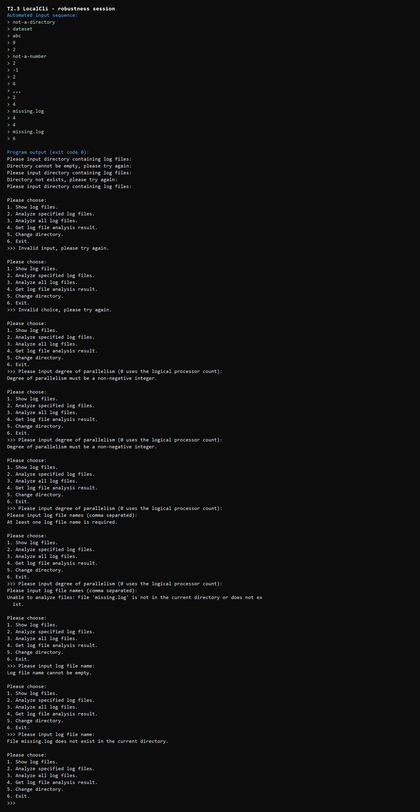

# 02-multithreading 实现报告

## T2.3 功能说明

本节实现了一个目录级多线程日志分析器及其控制台交互界面，主要功能包括：

1. 输入或切换日志目录，并扫描目录第一层中的全部 `.log` 文件。
2. 显示当前目录中的日志文件名。
3. 根据指定并行度分析一组逗号分隔的日志文件，或者分析全部日志文件；并行度为 `0` 时使用逻辑处理器数量。
4. 查询文件的分析结果。未分析文件会显示提示；分析成功时使用 `KeyValueVisitor.Dump` 输出每条日志；分析失败时显示异常信息。
5. 检查空目录、不存在目录、非法菜单选项、非整数或负数并行度、空文件名以及不存在的日志文件，发生输入错误后返回交互流程，不会导致程序崩溃。

完整功能的自动化控制台会话如下。该会话覆盖文件列表、未分析状态、指定文件分析、成功结果、失败结果和全部文件分析，程序最终以退出码 `0` 结束。



鲁棒性测试会话如下。输入序列包含空目录、不存在目录、非数字菜单、越界菜单、非数字和负数并行度、空文件列表、未知文件、空查询文件名等情况，程序均给出提示并继续运行。



## Q2.1

`WorkQueue<T>` 中需要在线程间共享的状态是 `_items` 队列中的内容和 `_isCompleted` 完成标志。它们都使用 `_items` 对象作为同一把管程锁，通过 `lock (_items)` 保护。消费者发现队列为空且尚未完成添加时调用 `Monitor.Wait(_items)`，等待期间会释放锁；生产者入队后调用 `Monitor.Pulse(_items)` 唤醒一个消费者；完成添加后调用 `Monitor.PulseAll(_items)` 唤醒全部消费者，使其在队列排空后退出。

`LogFileAnalyzer` 中的共享状态包括 `_currentDirectory`、`_isAnalyzing`、`_logFiles` 和 `_analysisResults`。目录切换、分析状态检查和修改、文件列表快照、结果查询以及工作线程写回结果等操作主要通过 `lock (_syncRoot)` 互斥。`AnalysisResult` 使用不可变记录表示，构造后不再修改，而是整体替换字典中的结果。需要注意，当前框架的 `CurrentDirectory` 和 `HasDirectory` 属性直接读取 `_currentDirectory`，没有获得 `_syncRoot`；现有 CLI 使用方式不会在切换目录时并发读取它们，但如果要求任意公开接口都支持并发调用，这两个 getter 也应加锁。

如果等待条件只使用 `if`，线程从 `Monitor.Wait` 返回后就会继续执行，不会重新检查队列是否仍为空。发生虚假唤醒，或者另一个消费者先取走了刚加入的元素时，当前消费者可能对空队列执行 `Dequeue` 并抛出异常。对应无限容量生产者消费者问题，就是消费者在仓库仍为空时错误地取走不存在的产品，可能使产品计数变为负数。因此必须使用 `while`，每次醒来并重新取得锁后再次检查“队列为空且添加未完成”这一条件。

## Q2.2

`LogFileAnalyzer.ChangeDirectory` 中以下调用负责扫描给定目录第一层的 `.log` 文件：

```csharp
Directory.EnumerateFiles(directoryPath, "*.log", SearchOption.TopDirectoryOnly)
```

如果需要递归扫描全部子目录，可以把 `SearchOption.TopDirectoryOnly` 改为 `SearchOption.AllDirectories`。递归后不同子目录可能存在同名文件，因此不能继续只用 `Path.GetFileName` 作为字典键；可以改用相对于根目录的路径或完整路径来区分文件。

## Q2.3.b

本次作业使用了 AI。主要提示词包括：

> 请阅读我更新的内容，确定第二节要完成的多线程的任务

> 请你帮我完善这个文件，并告诉我每个地方为什么这样做。我已经在 visual studio 2026 里打开了这个文件

> 请继续完善这个文件中的代码

> 现在请你继续阅读 guidance.md 完成 S2.3 和 T2.3，文件已在 visual studio 2026 中打开

我既让AI帮我解释代码，又让AI在我无法完善代码的情况下帮我完善代码，并给我解释为什么要这样做。

AI 首先解释了代码框架中类、对象、方法和共享变量的作用，随后帮助实现了 `LogFileAnalyzer`、`WorkQueue<T>` 和 `LocalCli` 的代码，并运行 `test-02-multithreading` 以及控制台正常/非法输入会话进行验证。使用方式不仅是查询接口，还包括让 AI 编写部分作业代码、解释同步设计，并根据测试结果修正实现。

AI 的第一版 `WorkQueue<T>` 能通过功能测试，但对 `Dequeue` 的赋值触发了 `CS8762` 可空性警告；随后通过与 `[NotNullWhen(true)]` 返回约定一致的空宽容标注消除了警告。`LogFileAnalyzer` 首次运行 T2.2 测试时也因为当时尚未实现 T2.1 的 `WorkQueue.Enqueue` 而全部停止，这不是 T2.2 本身的测试结论，因此完成队列后重新运行了完整测试。最终 `test-02-multithreading` 的 8 项测试全部通过。

我认为本节整体难度偏高。单个 `lock`、`Monitor.Wait` 或 `Thread.Join` 接口并不复杂，主要难点是同时维护队列状态和完成状态、使用 `while` 应对虚假唤醒、保证异常时恢复 `_isAnalyzing`，以及区分某个测试失败究竟来自队列还是日志分析器。
