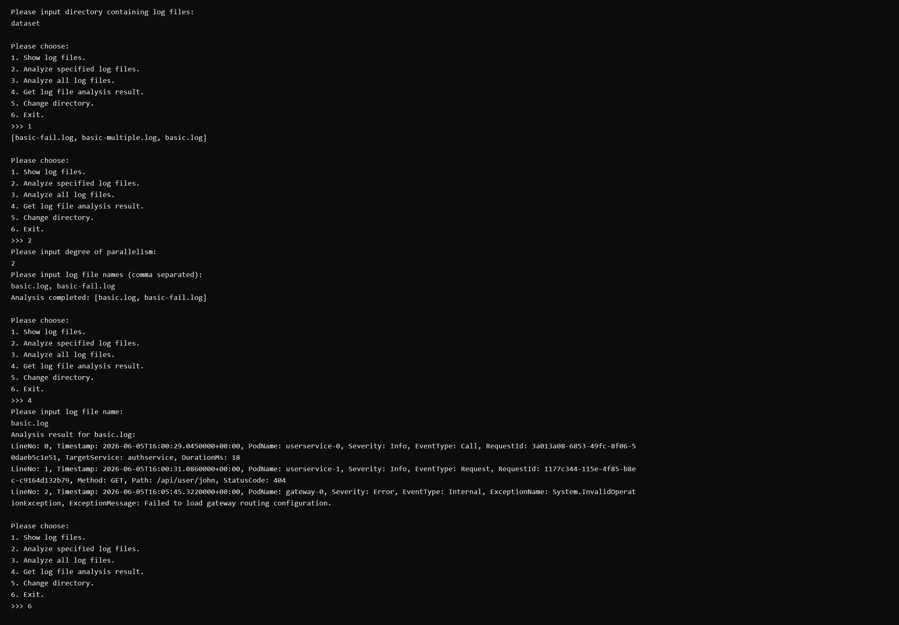

# T2.3 LocalCli 实现报告

## 实现功能

- 输入日志目录并创建分析器，也可以在运行期间切换目录。
- 查看当前目录中的全部日志文件。
- 设置并行度，分析指定的一个或多个日志文件。
- 设置并行度，分析当前目录中的全部日志文件。
- 查询日志文件的分析状态，并区分未分析、分析成功、分析失败和文件不存在四种情况。
- 使用 `KeyValueVisitor.Dump` 输出成功解析的完整日志内容，并显示解析失败时的错误信息。
- 校验目录、并行度和文件名等输入，捕获分析过程中产生的异常，避免程序因非法输入退出。



## 鲁棒性测试截图


## Q2.1

1. 共享变量是队列 `_items` 和完成标志 `_isCompleted`；统一用 `lock (_items)` 保护，配合 `Wait/Pulse/PulseAll` 协调生产和消费。

2. `LogFileAnalyzer` 的目录、分析状态及两个字典由 `_syncRoot` 加锁保护；工作线程在锁外解析文件，完成后再加锁写入 `_analysisResults`。

3. 使用 `if` 遇到虚假唤醒会在空队列取值，导致异常或消费者提前退出；使用 `while` 可在每次唤醒后重新检查条件，确保队列非空或生产已结束。

## Q2.2

扫描代码是 `Directory.EnumerateFiles(directoryPath, "*.log", SearchOption.TopDirectoryOnly)`；递归时改用 `AllDirectories`，并以相对路径或完整路径作键，避免子目录同名文件冲突。

## Q2.3

使用AI，给AI的提示词之一为：

```

public bool TryDequeue([NotNullWhen(true)] out T? item){
    lock (_items){
    while (_items.Count == 0 && !_isCompleted){
    Monitor.Wait(_items);
            }
    if (_items.Count > 0){
    item = _items.Dequeue();
    return true;
        }
    }

    item = default;
    return false;
}
我现在这样写可能有什么问题？

```

我询问AI一些接口的用法，帮忙排查错误。目前未发现AI的解答有错误。我认为本节难度偏高
