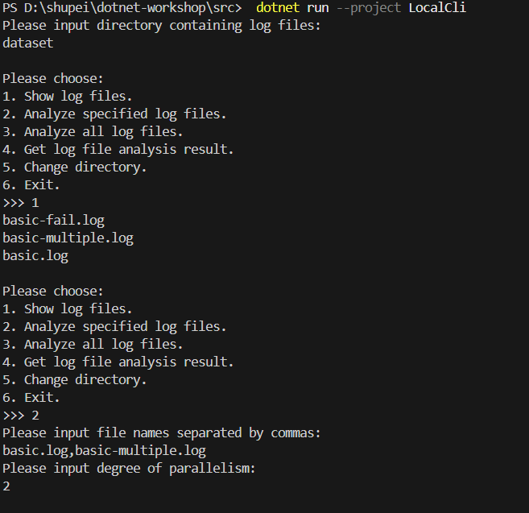
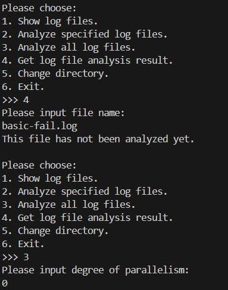
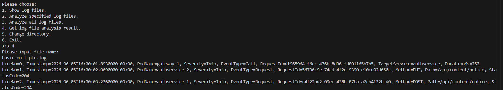
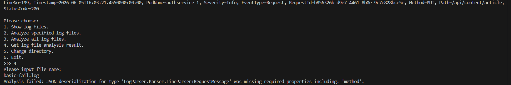
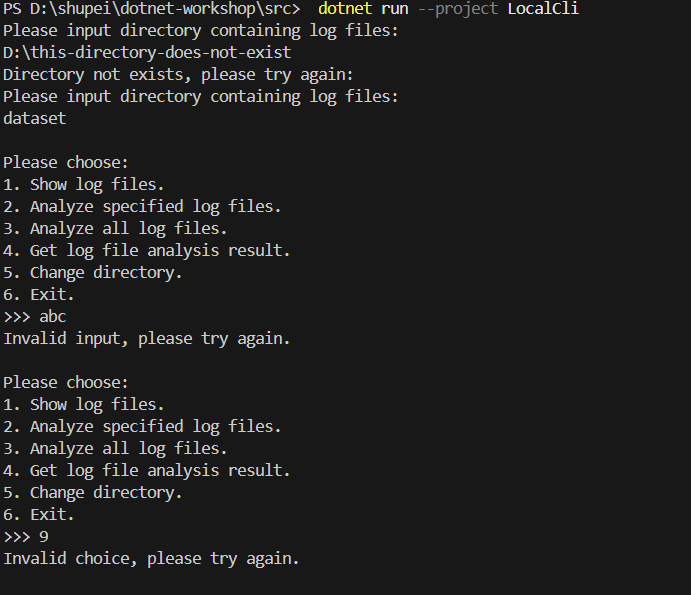
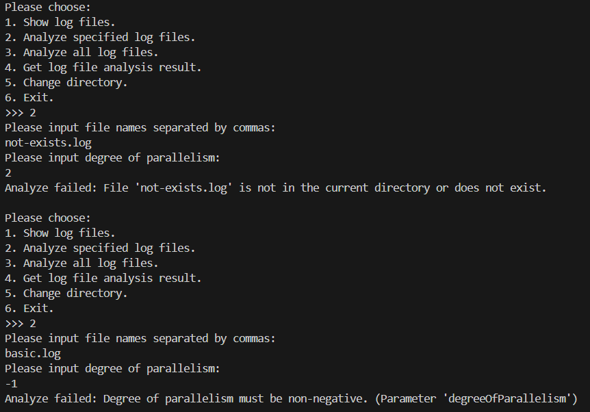
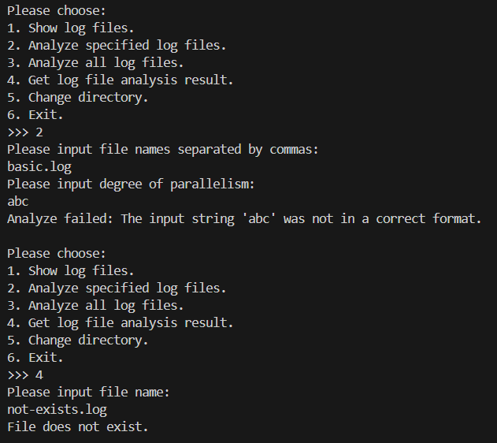
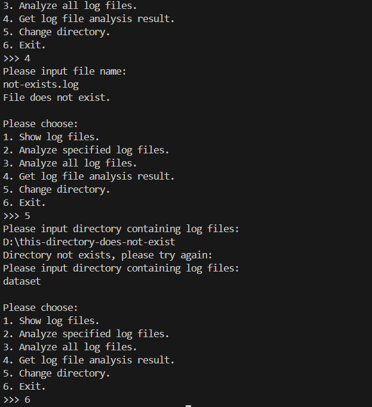

# 02-multithreading 作业报告

## 已实现的功能

我实现了 `WorkQueue<T>` 的多消费者安全队列；`LogFileAnalyzer` 的目录扫描、多线程并行解析、解析结果缓存和失败记录；以及 `LocalCli` 的目录切换、文件列表、指定/全部解析和结果查看功能。

### 正常功能截图






截图中演示了输入目录、显示日志文件、分析指定文件、分析全部文件、查看成功结果等所有常规功能。

### 鲁棒性测试截图






截图中演示了不存在或非法目录、非数字菜单输入、无效菜单选项、空文件名、当前目录不存在的文件名、负数并发度或非数字并发度等输入的报错处理。程序均给出提示并继续运行，没有崩溃。

## Q2.1：我们把访问临界资源的程序片段称作临界区。在我们的多线程程序当中，临界资源即为不同线程的共享变量。请问：WorkQueue<T> 类中的共享变量有哪些？是通过什么保护其免于数据竞争（data race）呢？LogFileAnalyzer 类中的共享变量有哪些？是通过什么保护其免于数据竞争呢？如果条件变量的判断条件使用了 if 判断而非 while 判断，当出现了虚假唤醒现象时（在类 UNIX 系统中，由于 UNIX 信号等机制，即使没有人调用过 signal 或 broadcast，处于 wait 当中的条件变量也可能被唤醒），会出现什么后果？结合无限仓库容量的生产者消费者问题简单叙述一下。

(1)`WorkQueue<T>` 的共享变量是 `_items`（内部 `Queue<T>`）和 `_isCompleted`（是否已结束加入）。
(2)它们都在 `lock (_items)` 的临界区内读取或修改，因此同一时刻只有一个线程能访问这两项状态。消费者没有元素且尚未完成时使用 `Monitor.Wait(_items)` 暂时释放锁；生产者 `Enqueue` 后 `Monitor.Pulse(_items)` 唤醒一个等待者；`CompleteAdding` 修改完成标记后使用 `Monitor.PulseAll(_items)` 唤醒全部等待者。

(3)`LogFileAnalyzer` 的共享变量包括 `_currentDirectory`、`_isAnalyzing`、`_logFiles` 和 `_analysisResults`。
(4)它们由同一把 `_syncRoot` 锁保护。特别地，`AnalyzeFiles` 在锁内检查并设置 `_isAnalyzing`，防止两个调用同时开始分析；工作线程解析完文件后，也在 `lock (_syncRoot)` 中写入 `_analysisResults`。`finally` 中同样在锁内把 `_isAnalyzing` 复位为 `false`。

(5)条件变量可能发生虚假唤醒，所以被唤醒并不保证“队列中已经有元素”。如果消费者只使用 `if (buffer == 0)` 调用 `Wait`，被虚假唤醒后会直接执行 `Dequeue`；在无限仓库容量的生产者消费者问题中，这会在仓库仍为空时尝试取出不存在的商品，导致异常或错误状态。使用 `while` 可以在每次唤醒后重新检查“队列是否为空、是否已经结束”这两个真实条件，因此正确处理虚假唤醒和多个消费者竞争。

## Q2.2：在给出的代码框架 LogFileAnalyzer 中：哪一段代码扫描了给定的目录中的全部 .log 后缀的日志文件？假使给定的需求是不但要扫描给定目录中的日志文件，还要递归地获取给定的目录的全部子目录、子子目录……内的日志文件，应当如何做（简要回答即可）？

(1)框架在 `ChangeDirectory` 中通过下列代码扫描当前目录的 `.log` 文件：

```csharp
Directory.EnumerateFiles(directoryPath, "*.log", SearchOption.TopDirectoryOnly)
```

它随后使用 `Select(Path.GetFileName)` 获取文件名、`OrderBy` 排序，并写入 `_logFiles` 与 `_analysisResults`。

(2)若需要递归扫描当前目录及所有子目录，应将 `SearchOption.TopDirectoryOnly` 改为 `SearchOption.AllDirectories`。如果存在不同子目录下同名日志文件，还必须相应修改当前“以文件名为字典键”的设计，例如使用相对路径或完整路径作为键，以避免同名冲突。

## Q2.3
### Q2.3.b：如果使用了 AI，你给予 AI 的提示词是什么？你对 AI 的使用是询问 AI 一些接口的用法或是在某处的写法，还是让 AI 帮你写一部分作业代码，又或是让 AI 给你讲解代码框架？AI 的解答是否出现过错误（如果有，是哪些）？你认为本节的难度是偏低、适中，还是偏高？

我使用了 AI。提示词大意为“请为我提供一版在原代码基础上通过注释标明用到的讲义中知识点和用途，并讲解几个todo部分代码的编写思路（如用到的类或语法等）”。我用它来查询接口、理解框架和理清思路，没有把未验证的回答直接当作结果。它曾出现的错误有破坏原框架等。本节难度为偏高。