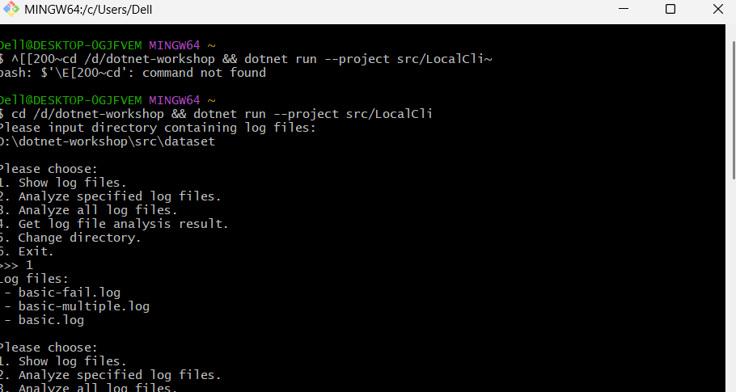
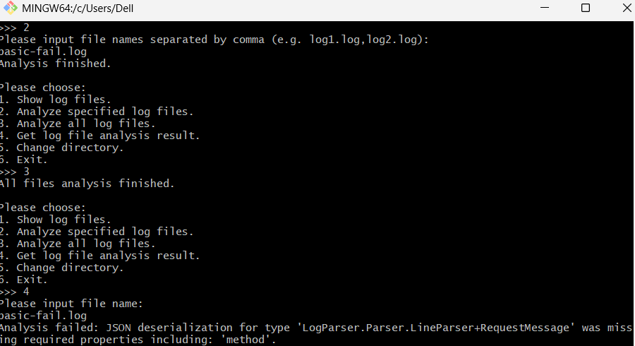

# 多线程实验报告

## 1. 功能介绍
本项目实现了一个多线程日志解析器和简易交互界面：
- **InputDirectory**: 输入目录路径，加载日志文件。
- **ShowLogFiles**: 查看当前目录下所有 .log 文件。
- **AnalyzeFiles**: 使用多线程并行分析指定的日志文件。
- **AnalyzeAll**: 一键分析目录下的所有文件。
- **GetAnalysisResult**: 查看特定文件的分析结果，支持状态分类显示。
- **异常处理**: 程序实现了完善的 try-catch 机制，即使输入非法路径或文件名，程序依然稳定运行。

## 2. 运行截图

## 3. 问答题

### Q2.1 临界区理解
**① 共享变量及保护：**
- WorkQueue: _items (Queue) 和 _isCompleted (bool)，通过 `lock(_items)` 保护。
- LogFileAnalyzer: _currentDirectory, _isAnalyzing, _logFiles, _analysisResults，通过 `lock(_syncRoot)` 保护。

**② 为什么用 while 而不是 if：**
因为“虚假唤醒”和“多线程竞争”。被唤醒后，可能货物已经被其他线程抢走。使用 while 循环可以确保线程在醒来后再次检查仓库是否真的有货，从而避免从空仓库取货引发崩溃。

### Q2.2 代码框架
**① 如何扫描文件：**
在 `ChangeDirectory` 方法中使用 `Directory.EnumerateFiles` 扫描。

**② 如何递归扫描：**
将 `SearchOption.TopDirectoryOnly` 修改为 `SearchOption.AllDirectories` 即可。

### Q2.3 AI 使用情况
我使用了 AI 辅助编程。AI 主要帮助我理解了多线程中 `Monitor.Wait` 和 `Pulse` 的协同工作逻辑，并协助我修复了 NuGet 包还原和 C# 语法兼容性问题。

---