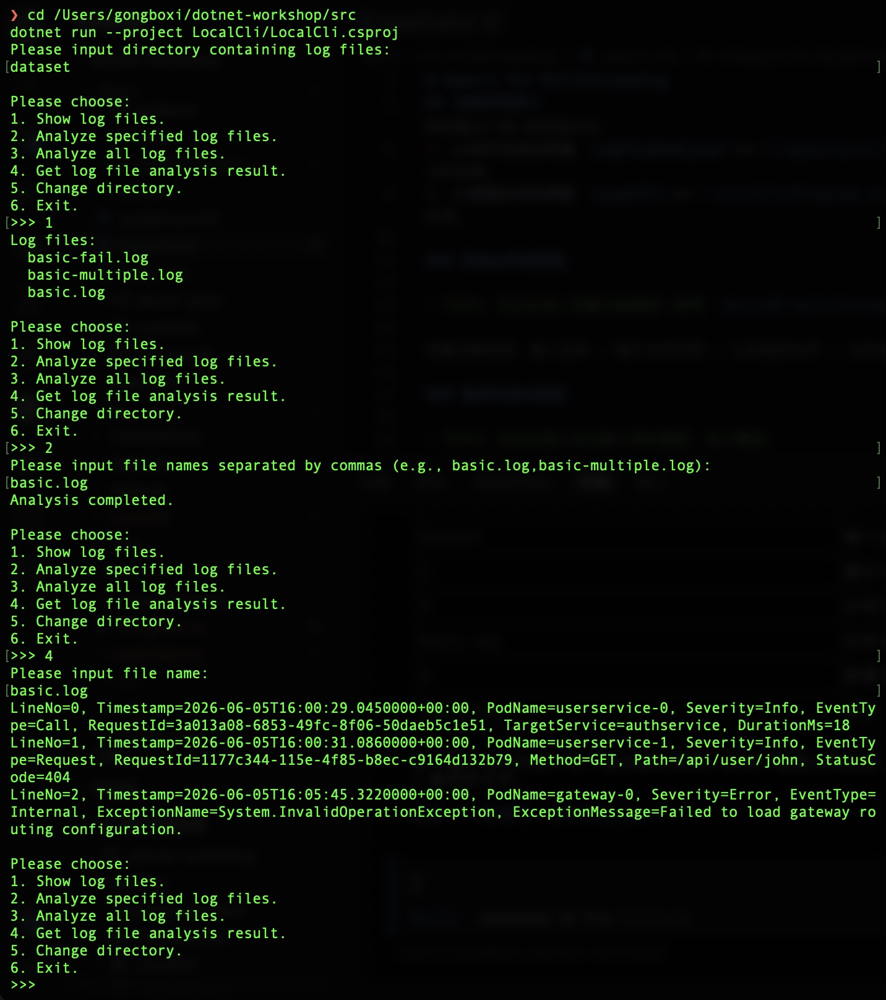
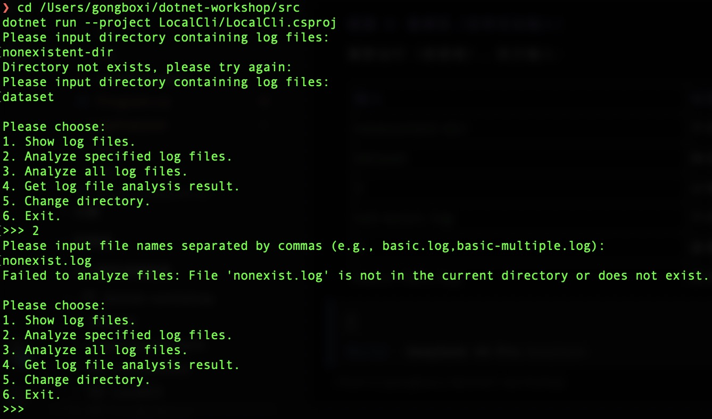

# Report for Multithreading

## 功能实现简介

本节在 `01-basic` 的基础上，实现了目录级别的并行日志分析器，共完成三个部分：

1. **线程安全队列 `WorkQueue<T>`**（`LogAnalyzer/WorkQueue.cs`）：基于 `Queue<T>` + `lock` + `Monitor`（条件变量）实现的、支持"结束放入"操作的无限容量生产者-消费者队列。
2. **并行日志分析器 `LogFileAnalyzer`**（`LogAnalyzer/LogFileAnalyzer.cs`）：扫描指定目录下所有 `.log` 文件，开多个工作线程并行解析，并缓存每个文件的分析结果。
3. **控制台交互界面 `LocalCli`**（`LocalCli/Program.cs`）：提供展示文件、分析指定文件、分析全部文件、查看分析结果、切换目录等菜单，并对非法输入做了鲁棒性处理。

### 控制台界面截图

完整功能包括：输入目录 → 展示文件列表 → 分析指定文件 → 分析全部文件 → 查看单个文件的解析结果。



### 鲁棒性测试截图

覆盖以下非法输入场景：不存在的目录、不存在的文件名、分析不存在的文件（抛出 `ArgumentException` 被捕获）、菜单选项输入非数字、以及查看尚未分析过的文件。



---

## Q2.1

### `WorkQueue<T>` 中的共享变量及其保护

`WorkQueue<T>` 中有两个共享变量：

+ `_items`（`Queue<T>`）：队列内部存储；
+ `_isCompleted`（`bool`）：标记是否已结束放入元素。

这两个变量均通过 `lock (_items)` 保护，即以 `_items` 对象本身作为互斥量。`Enqueue`、`TryDequeue`、`CompleteAdding` 以及 `IsCompleted` 属性中所有对这两个共享变量的读写都在 `lock (_items)` 临界区内完成，从而避免数据竞争。

### `LogFileAnalyzer` 中的共享变量及其保护

`LogFileAnalyzer` 中的共享变量有：

+ `_currentDirectory`（`string?`）：当前日志目录；
+ `_isAnalyzing`（`bool`）：是否正在分析；
+ `_logFiles`（`Dictionary<string, FileInfo>`）：目录中的日志文件映射；
+ `_analysisResults`（`Dictionary<string, AnalysisResult>`）：各文件的解析结果。

这些变量统一通过一个专用的互斥对象 `_syncRoot` 的 `lock (_syncRoot)` 保护。所有方法（`ChangeDirectory`、`GetLogFiles`、`TryGetAnalysisResult`、`AnalyzeFiles`、`RunWorkers`、`WorkerMain` 等）在访问这些共享变量时都先进入 `lock (_syncRoot)` 临界区。尤其是 `_isAnalyzing` 的读写、`_analysisResults` 的读写（由多个工作线程同时写入），都必须加锁。

### 条件变量使用 `if` 而非 `while` 的后果

若将判断条件写成 `if`，当出现虚假唤醒（spurious wakeup）时：线程在没有人调用 `signal`/`broadcast` 的情况下从 `Monitor.Wait` 中醒来，但此时仓库（队列）可能仍然是空的。若用 `if`，线程醒来后不会再检查条件，而是直接越过等待、去执行取元素操作，这会导致：

+ 从空队列中执行 `Dequeue()`，抛出 `InvalidOperationException`（或读到非法数据）；
+ 对应到无限容量生产者-消费者问题，就是消费者在 `buffer == 0` 时依然执行 `buffer -= 1`，造成"负库存"的逻辑错误。

因此必须用 `while`，让线程每次被唤醒后都重新检查"是否有元素"以及"是否已结束放入"，只有在条件真正满足时才继续执行，从而保证正确性。

---

## Q2.2

扫描目录中全部 `.log` 后缀日志文件的代码位于 `LogFileAnalyzer.ChangeDirectory` 方法中：

```csharp
var logFiles = Directory.EnumerateFiles(directoryPath, "*.log", SearchOption.TopDirectoryOnly)
    .Select(filePath => Path.GetFileName(filePath))
    .OrderBy(fileName => fileName);
```

它使用 `Directory.EnumerateFiles` 配合通配符 `"*.log"` 和 `SearchOption.TopDirectoryOnly` 枚举当前目录下的日志文件，再用 `Select` 取文件名、`OrderBy` 排序。

若要递归获取给定目录的全部子目录（及子子目录……）内的日志文件，只需把搜索选项 `SearchOption.TopDirectoryOnly` 改为 `SearchOption.AllDirectories` 即可（可配合 `Directory.EnumerateFiles(directoryPath, "*.log", SearchOption.AllDirectories)`）。

---

## Q2.3

### Q2.3.b

本次作业我使用了 AI 辅助完成。我给予 AI 的提示词大致是："切换到 02-multithreading 分支，阅读 guidance 文档后完成 WorkQueue、LogFileAnalyzer、LocalCli 的实现"。

我对 AI 的使用主要是：让 AI 帮我梳理 `WorkQueue` 的条件变量写法（`Monitor.Wait`/`Pulse`/`PulseAll` 与 `while` 循环配合）、`LogFileAnalyzer` 中 `RunWorkers` 的线程生命周期管理（入队 → 开启线程 → `Join`），以及 `LocalCli` 的异常捕获结构。

AI 的解答基本正确，但存在一些需要人工修正的细节：例如 `WorkQueue.TryDequeue` 中 `item = _items.Dequeue()` 会触发可空性警告 CS8762，需要用空值宽容运算符 `!` 修正；又如 `RunWorkers` 中"结束放入"（`CompleteAdding`）必须在开启工作线程之前（或之后立刻）执行，并唤醒所有消费者，否则消费者会永久阻塞在 `TryDequeue` 上。这些都是需要人工理解并发语义后自行确认的点。

我认为本节的难度为适中。
