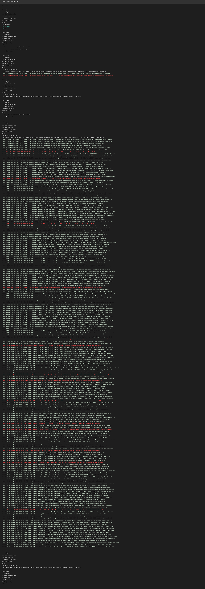
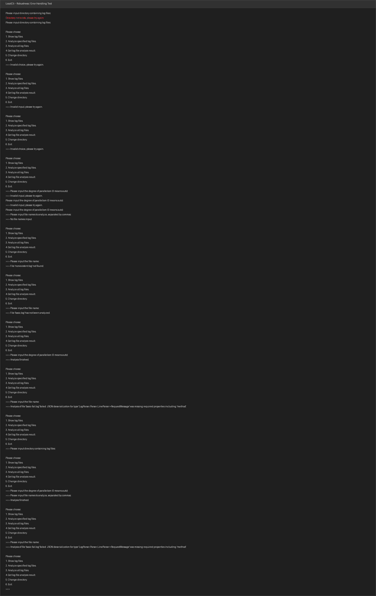

# Report: LocalCli Console Interface (T2.3)

## 实现功能

根据 [guidance.md](./guidance.md) 中 Task 2.3 (S2.3) 的要求，完成了 `LocalCli/Program.cs` 中的控制台交互界面，包含以下功能：

### 1. `InputDirectory` — 输入日志目录

提示用户输入日志文件所在目录，调用 `LogFileAnalyzer` 构造器扫描 `.log` 文件：

- 目录不存在时调用 `analyzer.ChangeDirectory()` 返回 `false`，提示 "Directory not exists" 并要求重试
- 目录路径非法（如空字符串）时捕获 `ArgumentException`，提示 "Directory illegal" 并要求重试
- 用户输入 `Ctrl+C` / `Ctrl+Z`（`Console.ReadLine()` 返回 `null`）时安全退出

### 2. `ShowLogFiles` — 显示日志文件列表

调用 `analyzer.GetLogFiles()` 获取目录中所有 `.log` 文件，逐行打印文件名。

### 3. `AnalyzeFiles` — 分析指定日志文件

- 调用 `ReadDegreeOfParallelism()` 读取并行度（0 = 自动 / 逻辑处理器数），非数字或负数会提示重新输入
- 调用 `ReadFileNames()` 读取逗号分隔的文件名列表（自动 `Trim` 并去除空项）
- 调用 `analyzer.AnalyzeFiles(degreeOfParallelism, fileNames)` 进行分析
- 异常被捕获并以 "分析失败" 提示，程序不会崩溃

### 4. `AnalyzeAll` — 分析全部日志文件

- 读取并行度后调用 `analyzer.AnalyzeAll(degreeOfParallelism)`
- 同样做了异常捕获以保证鲁棒性

### 5. `GetAnalysisResult` — 获取分析结果

输入文件名，调用 `analyzer.TryGetAnalysisResult()`，分四种情况处理：

| 情况 | 行为 |
|------|------|
| 文件不存在 | 提示 "File 'xxx' not found." |
| 尚未分析 (`NotAnalyzed`) | 提示 "File 'xxx' has not been analyzed." |
| 分析成功 (`Succeeded`) | 调用 `KeyValueVisitor.Dump` 逐行输出键值对 |
| 分析失败 (`Failed`) | 输出 `result.ErrorMessage` |

### 6. 鲁棒性设计

对所有异常输入均有处理，程序不会崩溃：

- 非法目录 → 提示重试
- 非法菜单选项（非数字、超出范围）→ 提示 "Invalid choice/input"
- 非法并行度（负数、非数字）→ 提示重试
- 空文件名列表 → 提示 "No file names input." 并返回主菜单
- 不存在 / 未分析的文件查结果 → 给出明确提示
- 切换目录后重新分析 → 结果正常重置

---

## 功能测试截图

### 完整功能演示

以上截图展示了完整的功能流程：
1. 输入目录 `dataset`
2. 显示日志文件列表（选项 1）
3. 分析指定文件 `basic.log, basic-fail.log`，并行度 2（选项 2）
4. 查看 `basic.log` 解析成功的 3 条记录（选项 4）
5. 查看 `basic-fail.log` 解析失败的错误信息（选项 4）
6. 分析全部文件（选项 3，并行度 0 = auto）
7. 查看 `basic-multiple.log` 200 条解析结果（选项 4）

### 鲁棒性测试

以上截图展示了各种非法输入的处理：
1. 输入不存在的目录 → 提示 "Directory not exists" 并重试
2. 非法菜单选项 `0`, `abc`, `7` → 提示 "Invalid"
3. 非法并行度 `abc`, `-1` → 提示 "Invalid input"
4. 空文件名 → 提示 "No file names input."
5. 查不存在的文件的结果 → "File 'nonexistent.log' not found."
6. 查未分析文件的结果 → "has not been analyzed."
7. 分析全部 → 查看 `basic-fail.log` 的失败信息
8. 切换目录后结果重置 → `basic-fail.log` 变回 "not been analyzed"
9. 重新分析后再次查看失败文件 → 正确输出错误信息

Q2.1：
