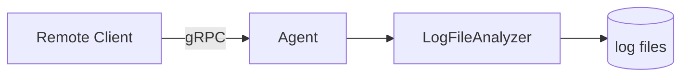
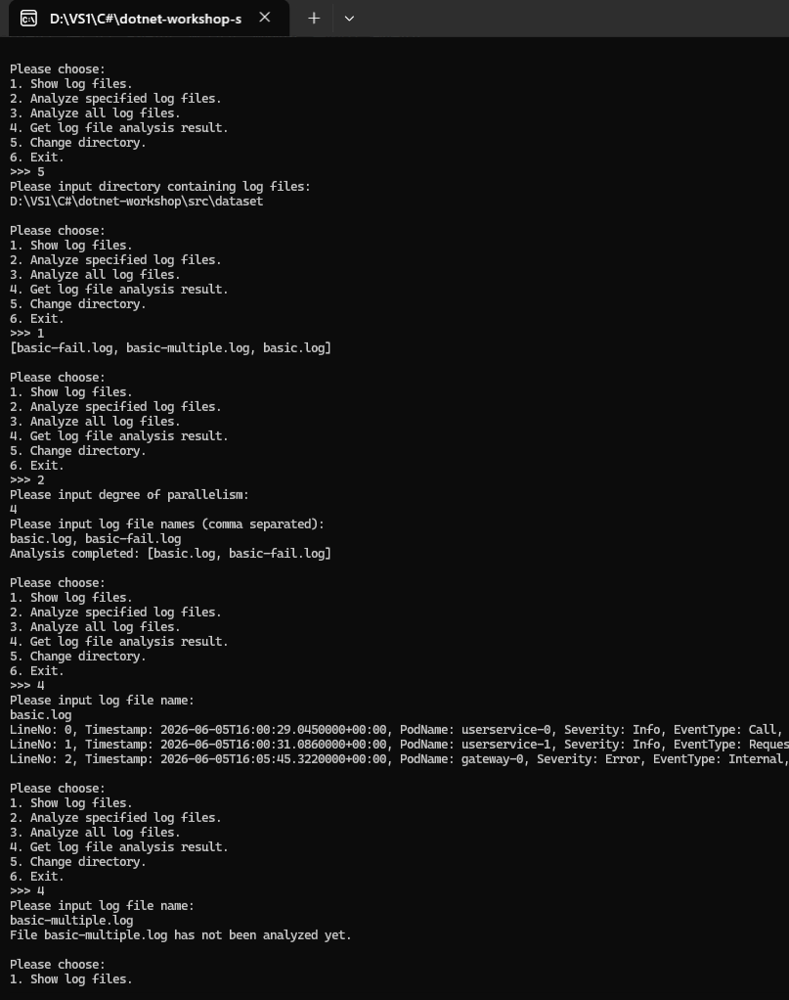
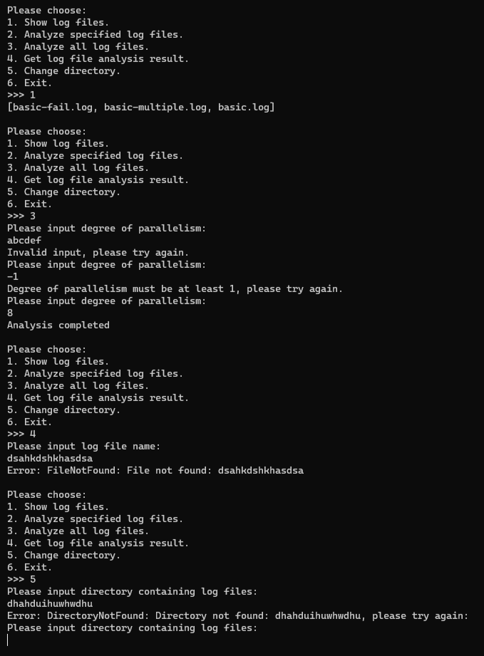

# Guidance for Async and gRPC

## 训练目标

+ 了解什么是异步编程，体会异步编程的优点
+ 学会在 C\# 中使用 `async` 和 `await` 关键字进行异步编程
+ 了解 Protobuf 与 gRPC 框架
+ 学会使用 C\# 语言编写基于 gRPC 通信的网络应用程序

## 背景介绍

### 云服务日志的并行解析

在上一节中，我们完成了日志的并行解析功能。但是，真实的云服务日志通常位于部署在远程的众多服务器或具有众多计算结点的集群上，而我们可能具有在本地机器上查看日志的需求。我们希望实现在本地能够远程操控运行在远程服务器或结点上的日志解析程序进行日志解析并远程查看结果的功能。因此，我们需要一种跨机器调用方法的机制，即网络通信。

通常来讲，在云原生领域，使用最多的通信协议是 HTTP 协议和 RPC。在这里，我们选用 RPC 方法来实现这一功能。

RPC，全称 Remote Procedure Call，即远程过程调用，其设计理念是能够让我们像调用普通函数一样通过网络服务调用远程的函数来完成网络通信。常用的 RPC 框架有 gRPC、Apache Thrift 等。我们这里选用由 Google 公司开发的基于 Protobuf 的 RPC 框架 gRPC。

本节将编写一个能够常驻运行在服务器或结点上的 Agent，它对外提供 24h 的 gRPC 服务，可以通过外部的 gRPC 调用来作出响应，例如执行日志分析任务、返回日志分析结果等等，让我们在上一节完成的功能全部可以在远程操控，如图所示：



## 知识速递

为防止涉及到暑培的讲解死角，我们在这里先快速回顾一下本节任务用到的一些需要的知识，并对一些额外用到的知识进行补充。

### 异步

程序一般可以分为 CPU 密集型程序（或称计算密集型程序）和 I/O 密集型程序。前者指程序运行的大部分时间在 CPU 上执行机器指令，体现为高的 CPU 占用率，其执行时间瓶颈通常体现在 CPU 的计算能力、计算并行度等等；而后者则指程序运行大部分时间在进行外设的 I/O（例如网络通信、磁盘读写、等待打印机等设备，等等），而不适用 CPU，其执行时间瓶颈通常体现在外设的带宽、延迟等等。

无论是我们在程序设计课程中编写的单线程程序，还是我们在上一节编写的云服务日志并行解析这样的多线程程序，这些程序都有一个特点——任何的函数调用均是顺序的，即一个函数执行完毕后再才能继续向下执行程序。这样对函数的调用方式通常称作 **同步（synchronization，通常简写作 sync）**。这种方式在通常在 CPU 密集型程序是没有问题的，因为无论程序以何种顺序进行执行，其所需的计算总量（CPU 总计算量）都是固定的，不存在任何的浪费。

但对于本节，我们的目标是编写一个具有远程解析云服务日志功能的网络应用，这种情况就不同了。网络应用需要的计算量未必很大，相当多的网络应用的时间瓶颈在网络 I/O 上。想象这样一个场景，一个网络应用，通常需要同时处理来自用户的输入或网络请求，还要向其他服务或数据库等发出网络请求来获取结果才能返回给用户。假设用户的需求是输入 `a` 和 `b` 两个数字，你要调用远程的服务才能获取 `a + b` 的值（假设你的本机不具有计算 `a + b` 的能力），如果我们按照之前同步调用的方式，你需要：

```csharp
int CalculateAdd(int a, int b) {	     // a 和 b 为用户输入，需要为用户返回结果
    var request = new Request(a, b);     // 构造一个网络请求
    var response = NetworkCall(request); // 发出网络请求，获取响应
    var result = response.Result;        // 从远端发回的响应中获取计算结果
    return result;					     // 将结果返回给用户
}
```

这造成了一个结果——在进行网络 IO `NetworkCall` 的时候，实际上 CPU 是空闲的、不被占用的，程序唯一在做的是等待网络发回响应。但这样的操作，会导致当前的线程阻塞在了 `NetworkCall` 处。这样，如果此时用户还有其他的事情要做，例如用户发来了一个新的请求，或者用户要让你的程序做一些 UI 交互，等等，你的程序由于阻塞在了 `NetworkCall` 处，并没有办法去抽身处理新的事情。但这引入了一个矛盾——明明现在的 CPU 是闲下来的，有能力去处理新的事情，但你的程序编写方式，使得你的程序没办法利用闲下来的 CPU 来做新的事情。以下是两个典型案例：

+ 网站后端。网站后端通常存在诸多需要同时处理的事情——一方面要处理高频率的用户请求，因为网站可能同时被上万人访问；另一方面可能要通过高频的网络请求来完成用户的请求，因为用户的个人信息、用户要访问的资源，都可能是存储在云上的数据库，或是调用其他网络服务才能够获取的。
+ 图形界面程序（或网站前端）。图形界面程序（或网站前端）也存在这个问题。如果一个图形界面程序需要做很多网络的事情，例如这个图形界面程序需要用户登录，所以需要连接到服务器进行用户登陆操作。但另一方面，即使在等待服务器响应的过程中，用户也需要与图形界面进行交互，例如按按钮、关闭这个程序，等等——如果程序被网络阻塞，无法腾出手处理图形界面和用户的交互，那么用户看到的是图形界面卡死，这是一个极其糟糕的用户体验。我们在下一节 `04-avalonia` 中就是这种情况的应用。

聪明的同学可能会想到，多线程可能可以解决这个问题——我可以开辟两个线程，一个线程用来等 `NetworkCall`，另一个线程用来做事情。这当然是可以的，不过这仍然有一个缺点——如果同时有三个事情需要做呢？那就要开辟三个线程。如果有 100 件事需要做呢？如果有 10000 件事需要做呢？线程毕竟是操作系统级资源，如此大加挥霍地开辟线程，是开销极大的行为。所以，我们希望的是能把需要等待网络的线程复用起来，让这些线程不再阻塞在等待网络上，而是可以腾出手来做其他事。能够实现这种目标的编程模型，就是 **异步（asynchronize，通常简写作 async）** 。

实现异步的编程模型有很多种，例如 JavaScript 的 Promise-Then 模型，利用回调函数来设置获取网络结果之后做什么事情：

```javascript
networkCall(new request(a, b))  // 网络调用不直接返回结果，而是返回一个 Promise 对象
    .then(result => {           // Promise 存在 then 方法，用来设置请求返回后要做的事情（回调函数）
        console.log(result);    // 把结果返回给用户（控制台输出）
    });
// 在发出 networkCall 后，程序还可以接着做其他事，无需等待（控制台输出）
console.log("hello");
```

除了 Promise-Then 模型之外，还有 C++ 的 Future 模型，这是我们在未来的队式开发中要用到的：

```csharp
var fut = std::async([&]() { return NetworkCall(Request(a, b)).GetResult(); }); // 返回一个 std::future<T>
// 你可以在这里做任何事情
// 等到你需要结果的时候，你可以再获取结果：
std::cout << fut.get() << std::endl; // 获取结果
```

对未来队式开发感兴趣的同学可以参考 [std::async - cppreference.com](https://en.cppreference.com/cpp/thread/async) 详细了解。

但本 workshop 使用的既不是 Promise-Then 模型，也不是 Future 模型，而是应用最广泛的异步模型——async-await 模型。该模型是 JavaScript 和 C++20 及以上都支持的模型，也是 C\# 首要支持的异步模型：

```csharp
public async Task<int> CalculateAddAsync(int a, int b) { // a 和 b 为用户输入

    // 构造一个网络请求
    var request = new Request(a, b);
    
    // 发出网络请求，await 用于等待异步请求，但等待之前便让出线程，不会占用线程
    var response = await NetworkCallAsync(request); 
    
    // 远端响应到达后，重新占用一个线程，从远端发回的响应中获取计算结果
    var result = response.Result;

    // 将结果返回给用户
    return result;
}
```

在使用 async-await 编程模型进行异步编程时，C\# 的 .NET 运行时会使用 .NET 内置的线程池 [System.Threading.ThreadPool 类](https://learn.microsoft.com/zh-cn/dotnet/api/system.threading.threadpool?view=net-10.0) 来进行线程调度。 **该线程池十分诡异，默认情况下，在线程池满后会等待约 1 秒钟，如果没有线程让出来再扩容线程池。** 这 1 秒钟会一直阻塞。因此，在你能确定你在做什么之前，需要注意不要想当然地随手使用此线程池和 `Task`，因为大多数使用异步的场景，都已经由 .NET 库或第三方库封装好异步接口了，需要自己开辟新的 `Task` 用于异步的场景不算多。

需要注意的是，我们在前一节多线程当中使用的同步互斥方案如 `lock`、`Monitor.Wait` 等，以及常用的 `Thread.Sleep(1000)` 等都是会占用真正的线程的，在异步编程中应当用 `await Task.Delay(1000)` 来进行等待。

但本 workshop 当中不涉及网络应用异步编程当中进行同步互斥，因此同学们无需苦恼。前一节当中使用的同步互斥与并行解析是单纯等待多线程的应用，是用于优化 CPU 对日志解析的计算过程（虽然也存在文件读写的磁盘 I/O，且短而快的 CPU 密集型任务通常也会使用线程池进行复用，但两者均并非本 workshop 中所指的异步编程的目标），而非本节异步编程的目标。

### 单例模式

在 `01-basic` 一节中，我们使用了简单工厂模式和访问者模式两种设计模式。本节我们将接触到一种新的设计模式——单例模式（Singleton Pattern）。

单例模式的核心思想是：在整个程序运行过程中，某个类只允许存在一个对象实例，并提供一个全局访问点来获取这个对象实例，通常包含如下两个要点：

- 私有构造方法：防止外部通过 `new` 直接创建对象
- 静态实例访问方法或属性：向外部提供获取唯一对象实例的入口

单例模式分为懒汉式（Lazy）和饿汉式（Hungry）两类，前者是在第一次用到对象时创建对象，而后者是在程序初始化时即创建对象。懒汉式相对比较复杂，需要考虑线程安全等问题，并且有多种实现（如 DCL 等等），但有利于在运行过程中动态传入参数来构造对象。但我们本节需求比较简单，使用的是最简单的饿汉式单例模式：

```csharp
class Singleton {
    // 构造方法
    private Singleton() {}
    // 初始化静态单例为静态字段，并提供 get 属性作为获取单例的接口
    public static GrpcLogEntryVisitor Instance { get; } = new();
}
```

### 依赖注入

依赖注入（Dependency Injection, DI）是一种常用的编程范式，在网络服务应用当中广泛使用。C\# 的 ASP.NET 框架、Java 的 Spring 框架等都把依赖注入作为一等公民来支持。本节将使用 C\# 的 ASP.NET 中的依赖注入范式来启动 gRPC 服务。

设当前有两个类 `A` 和 `B`，当 `A` 类使用 `B` 类提供的某些功能时，我们称 `A` 具有对 `B` 的依赖。众所周知，若 `A` 要调用 `B` 的方法之前，`B` 必须曾被创建过对象来给 `A` 进行调用。如果 `A` 不直接创建 `B` 的对象，而把创建 `B` 对象的任务交给外部，`B` 对象由 `A` 的构造方法，或者由 `A` 提供一个 setter 方法，来交给 `A`，这种编程范式便称为依赖注入。这种方法有助于进行实现类之间的松耦合、应用程序的可扩展性、进行单元测试，等等。例如下面的例子：

```csharp
class Model;

interface IDatabase;
class RemoteDatabase : IDatabase;
class FakeDatabase : IDatabase;

class Service {
    private readonly Model _model;
    private readonly IDatabase _db;
    
    public Service(Model model, IDatabase db) {
        _model = model;
        _db = db;
    }
}
```

该例子中，`Service` 依赖的 `Model` 和 `IDatabase` 均需要外部来实例化 `Model` 对象和某个实现了 `IDatabase` 的类的对象，通过构造方法传给 `Service`。

## 本节任务

### 任务描述

本节需要实现一个常驻运行在服务器或结点上的 Agent 程序，对外开放 gRPC 服务。服务的接口与我们在上一节实现的 `LogFileAnalyzer` 提供的接口类似。服务接口定义在 `LogAnalyzerRpc/Protos/log_analyzer.proto` 中的 `LogAnalyzerAgentService` 中：

```protobuf
service LogAnalyzerAgentService {
	rpc Ping(google.protobuf.Empty) returns (google.protobuf.Empty);
	rpc GetAgentStatus(google.protobuf.Empty) returns (AgentStatusResponse);
	rpc ChangeDirectory(ChangeDirectoryRequest) returns (ChangeDirectoryResponse);
	rpc GetLogFiles(google.protobuf.Empty) returns (GetLogFilesResponse);
	rpc AnalyzeAll(AnalyzeAllRequest) returns (AnalyzeAllResponse);
	rpc AnalyzeFiles(AnalyzeFilesRequest) returns (AnalyzeFilesResponse);
	rpc GetAnalysisResult(GetAnalysisResultRequest) returns (stream GetAnalysisResultResponse);
}
```

一些需要注意的信息介绍如下：

+ `Ping`：由于 gRPC 是 lazy 连接，即在第一次调用服务时而非连接创建时连接，因此 `Ping` 用于测试服务是否连通

+ `OperationStatusMessage`：几乎全部操作都需要返回此信息作为操作是否成功的标志，其包含如下字段：

  + `success`：如果操作合法，则值为 `true`，否则为 `false`
  + `code`：如果 `success` 为 `true`，则 `code` 值为 `NO_AGENT_ERROR`，否则：
    + `INVALID_ARGUMENT`：客户端输入的参数非法
    + `DIRECTORY_NOT_FOUND`：客户端指定的日志目录不存在
    + `FILE_NOT_FOUND`：客户端指定的日志文件不存在
    + `INVALID_OPERATION`：客户端进行了非法操作，例如尚未制定日志目录，或客户端向正在分析日志的 Agent 发出日志分析请求
    + `INTERNAL_ERROR`：Agent 发生了内部错误
  + `message`：如果 `success` 为 `true`，则 `message` 为字符串 `""`，否则 `message` 包含错误信息，例如错误提示信息、Agent 内部抛出的异常信息等

+ `ChangeDirectory`：gRPC 中的 `ChangeDirectory` 相比比上一节中的 `ChangeDirectory` 需要额外返回两个字段，方便下一节中当选择了新的目录后立刻显示 Agent 完整路径以及目录中存在的日志文件：

  + `current_directory`：Agent 当前日志目录路径
  + `file_names`：日志目录中的全部日志文件名

+ `GetAnalysisResult`：获取指定文件的分析结果。可以看到返回是流式的，返回一系列的 `GetAnalysisResultResponse`。

  ```protobuf
  message GetAnalysisResultResponse {
  	oneof payload {
  		AnalysisResultHeaderMessage header = 1;
  		LogEntryMessage log_entry = 2;
  	}
  	OperationStatusMessage status = 3;
  }
  ```

  分为以下几种情况：

  + 若用户指定的文件不存在，则只返回一个 `GetAnalysisResultResponse`，通过 `status` 指定操作非法；
  + 若指定的文件尚未有分析结果，或分析失败，则操作成功，且只返回一个 `GetAnalysisResultResponse`，`payload` 为 `header`
  + 若指定的文件分析成功，则操作成功，首先返回一个 `payload` 为 `header` 的 `GetAnalysisResultResponse`，随后流式返回一系列的 `payload` 为 `log_entry` 的 `GetAnalysisResultResponse`（每一个响应对应日志文件中的一条日志，按照文件中的顺序依次返回。这是因为 gRPC 单次返回具有最大长度限制，而日志文件可能很长，因此用流式多次返回的方式）

### （S3.1）Step 1：实现 gRPC 服务的 Agent

我们将实现一个启动了 gRPC 服务的 Agent。本步骤代码结构如下：

```shell
src
|
+---LogAnalyzerAgent
|   |   appsettings.json              # 启动参数配置
|   |   appsettings.Development.json  # 开发环境启动参数配置
|   |   Program.cs                    # 程序入口与 gRPC 服务配置及依赖注入
|   |
|   +---Properties
|   |       launchSettings.json       # 开发环境启动配置
|   |
|   +---Applications
|   |       AgentSession.cs           # gRPC 服务处理逻辑
|   |
|   \---Services
|           AgentService.cs           # gRPC 服务
|
+---LogAnalyzerRpc
    |   GrpcLogEntryVisitor.cs        # 将日志解析结果类型转换为 Protobuf 消息类型
    |   GrpcTypeConverter.cs          # 进行日志解析系统内部 C# 类型与 Protobuf 消息类型的互相转换
    |
    \---Protos
            log_analyzer.proto        # 定义 Protobuf 消息类型与 gRPC 服务
```

#### 类型转换

在 `LogAnalyzerRpc/Protos/log_analyzer.proto` 中，我们给出了 Agent 所开放的 gRPC 服务的全部定义。

由于 gRPC 传输的均为 Protobuf 所定义的消息类型，因此你需要将你在编写 `LogParser` 和 `LogAnalyzer` 时使用的数据类型与要传输的 Protobuf 消息类型间进行转换。

1. 首先要转换的是几种 `LogEntry` 类型。你需要使用我们在 `01-basic` 当中学习到的访问者模式来将日志解析得到的 `LogEntry` 类型转换为 Protobuf 中定义的 `LogEntryMessage` 类型。我们将在 `LogAnalyzerRpc/GrpcLogEntryVisitor.cs` 中的 `GrpcLogEntryVisitor` 类进行转换。由于这类转换的工作是无状态的（没有任何的中间数据需要保存），因此我们使用 **单例模式** 将该类做成是单例的。我们的代码框架已经提供了对 `CallLogEntry` 的转换，请你补充其他两种类型的转换。
2. 为了给所有的类型均提供统一的转换接口，我们需要将所有的类型转换逻辑编写在 `LogAnalyzerRpc/GrpcTypeConverter.cs` 的 `GrpcTypeConverter` 类的静态方法中，分为 `ConvertToGrpc` 和 `ConvertFromGrpc`。其中包括将 `GrpcLogEntryVisitor` 的使用封装起来，以及其他几种枚举类型。请你将 `GrpcTypeConverter` 补充完整。

#### Agent 实现

随后，我们将完成 `LogAnalyzerAgent` 的实现。

在项目 `LogAnalyzerAgent` 中，为了方便进行单元测试，我们将 gRPC 服务拆成两部分。`Services/AgentService.cs` 中的 `AgentService.cs` 是 `gRPC` 服务的入口类，负责开启 `gRPC` 服务。但该类不负责处理任何逻辑，我们把处理请求的逻辑移到 `Applications/AgentSession.cs` 的 `AgentSession` 类中。`AgentService` 会把用户请求转发给 `AgentSession` 类的对象，而 `AgentSession` 则调用我们之前编写的 `LogFileAnalyzer` 类的对象来进行日志分析。

`AgentSession` 和 `AgentService` 的构造方法如下：

```csharp
class AgentSession {
    private readonly LogFileAnalyzer _analyzer;
    private readonly ILogger _logger;

    public AgentSession(LogFileAnalyzer analyzer, ILoggerFactory loggerFactory);
}

class AgentService : LogAnalyzerAgentService.LogAnalyzerAgentServiceBase {
    private readonly AgentSession _session;

    public AgentService(AgentSession session);
}
```

其中，`ILogger` 是 .NET 库提供的日志公共接口，而 `ILoggerFactory` 是创建日志的接口（这实质上是「工厂方法模式（Factory Method Pattern）」的应用，我们将在 `04-avalonia` 一节中介绍）。它是做什么的呢？众所周知，我们的 `Agent` 本质上也是一种云服务，它的运行也会产生很多需要输出的信息，这些都可以输出为日志。我们将要输出的信息交给 `_logger` 进行输出，`_logger` 会帮助我们进行格式化。具体的格式依赖于外部传入的具体日志工厂类产生的日志类所设置的日志格式。

这里存在依赖关系：`AgentService` 依赖 `AgentSession`，而 `AgentSession` 依赖 `LogFileAnalyzer` 和 `ILoggerFactory`。外部需要通过构造方法来传入它们所依赖的对象，即需要进行 **依赖注入** 。

我们选用 [ASP.NET](https://dotnet.microsoft.com/zh-cn/apps/aspnet) 框架所支持的 [gRPC on .NET](https://learn.microsoft.com/zh-cn/aspnet/core/grpc/?view=aspnetcore-10.0) 来开启 gRPC 服务，其启动代码位于 `LogAnalyzerAgent/Program.cs` 中，我们提供的代码框架已经完全写好了 `Program.cs`，无需更改。ASP.NET 框架是带有依赖注入的功能的，我们无需手动使用 `new` 创建对象，只需要向 `AST.NET` 框架注册要创建和的对象即可，ASP.NET 框架会自动创建对象并进行依赖注入。

由于我们的服务是 **有状态服务** ，即需要保存当前选取的日志目录、当前日志的分析结果，等等，因此我们将其注册成单例的。ASP.NET 使用 `AddSingleton` 方法来注册单例，参见 `Program.cs` 的如下代码片段：

```csharp
builder.Services.AddSingleton<LogFileAnalyzer>();   
builder.Services.AddSingleton<AgentSession>();
builder.Services.AddSingleton<AgentService>();
```

当你在 Visual Studio 中将 `LogAnalyzerAgent` 设为启动项目后，在 Visual Studio 中调试 `LogAnalyzerAgent`，它将会在 `Properties/launchSettings.json` 中指定的 `"applicationUrl"` 地址上监听 gRPC 服务。

>  如果你想直接运行 `.exe` 程序（会生成在项目的 `bin` 目录中），需要设置环境变量 `ASPNETCORE_URLS`（`localhost` 和 `127.0.0.1` 上开的服务仅本机可访问，`0.0.0.0` 上开的服务可以被其他主机访问，如果你的主机在公网上注意防止被 DDoS）：
>
>  **Windows**
>
>  CMD：
>
>  ```cmd
>  > set ASPNETCORE_URLS=http://localhost:7777
>  > .\<path>\LogAnalyzerAgent.exe
>  ```
>
>  PowerShell：
>
>  ```powershell
>  PS> $env:ASPNETCORE_URLS="http://localhost:7777"
>  PS> .\<path>\LogAnalyzerAgent.exe
>  ```
>
>  **Linux / macOS**
>
>  ```bash
>  export ASPNETCORE_URLS="http://localhost:7777"
>  ./<path>/LogAnalyzerAgent
>  ```


在本步骤，你的任务是完成 `GrpcLogEntryVisitor`、`GrpcTypeConverter`、`AgentSession`、`AgentService` 的实现。

> [!NOTE]
>
> **任务 3.1（T3.1）**
>
> 请完成 `GrpcLogEntryVisitor`、`GrpcTypeConverter`、`AgentSession`、`AgentService` 的实现，来完成 Agent 的实现。
>
> 当你完成你的实现后，运行测试 `test-03-async-grpc`，你将会通过全部测试。
> 
> **提示：**
> 
> 1. 你可以参考你上一节实现的 `LocalCli` 的代码，将 `LocalCli` 对 `LogAnalyzerAgent` 的调用相关代码平移至 `AgentSession` 中，你将会节省相当多的时间和精力。
> 2. 如果发现你的实现存在 bug 且一时间找不到 bug 位置，你可以先进行 S3.2 的实现。

> [!IMPORTANT]
>
> Agent 作为常驻的服务，一定要注意 **绝对不应该** 因为用户请求的非法，或是一些内部错误而崩溃，否则就会造成服务的不可用（我们通常说的网站挂掉了）。因此， **一定要做好** 异常处理，注意捕获异常。可以参考 `AgentSession` 给出的样例。


**可能用到的接口：**

+ gRPC 服务器 stream 返回：

  ```protobuf
  service UtilsService {
  	rpc Iota(IotaRequest) returns (stream IotaResponse);
  }
  
  message IotaRequest {
    int32 x = 1;
    int32 y = 2;
  }
  
  message IotaResponse {
    int32 value = 1;
  }
  ```

  ```csharp
  public override async Task Iota(IotaRequest request, IServerStreamWriter<IotaResponse> responseStream, ServerCallContext context) {
      for (int i = request.X; i < request.Y; ++i) {
          await responseStream.WriteAsync(new IotaResponse() { Value = i });
      }
  }
  ```

+ 对应的 gRPC 客户端接收 stream 返回：

  ```csharp
  var request = new IotaRequest() { X = 0, Y = 10 };
  
  // 流式返回必然是异步的，因此此处调用是 Iota 而不是 IotaAsync
  using var call = client.Iota(request);
  
  // 1. 逐个读取
  await foreach (var response in call.ResponseStream.ReadAllAsync()) {
      Console.WriteLine(response.Value);
  }
  
  // 2. 直接读取到结束为止，生成一个 List
  var response_list = await call.ResponseStream.ReadAllAsync().ToListAsync();
  ```

  

### （S3.2）Step 2：一个远程的控制台交互界面

我们相对完整地完成了 Agent，但 Agent 作为网络应用，进行直接地 Debug 相对困难。而且，由于下一节就要编写图形界面客户端了，届时需要同时考虑图形界面存在的问题，以及 gRPC 客户端调用存在的问题。因此，为了尽可能地先让大家熟悉 gRPC 客户端调用，这里让大家实现一个远程的控制台交互界面 `RemoteCli`。

我们在上一节实现了一个本地的控制台交互界面 `LocalCli`，现在我们需要写一个对接 gRPC 服务的客户端版本 `RemoteCli`。

本步骤代码位于 `RemoteCli/Program.cs` 中。

gRPC，核心是 RPC，即远程过程调用。「过程」一词，在现代编程语言中体现为函数或方法。因此，RPC 的核心含义就是能让我们调用网络服务就仿佛是在调用本地函数一样。因此，我们编写的 `RemoteCli` 就可以由上一节编写的 `LocalCli` 改装得到。我们需要做的是将 `LocalCli` 中对 `LogFileAnalyzer` 的函数调用修改为对应的 gRPC 调用，并对远程的需求做一些调整，即可完成 `RemoteCli` 的编写。

为了给下一节的图形界面打好基础，我们本节要求，`RemoteCli` 对 gRPC 的调用 **必须全为异步调用** ，均需要调用 gRPC 的异步版本（即方法名后多加了一个 `Async` 的调用版本），因此 `RemoteCli` 将含有大量的 `async` 方法。可以看到，C\# 的 `Main` 方法也已经声明为了 `async` 方法。具体可以参考代码框架已经给出的 `InputDirectory` 实现中的 `var response = await client.ChangeDirectoryAsync(request)`，调用的是 `client.ChangeDirectoryAsync` 而非 `client.ChangeDirectory`。

但此时我们的调试方式和以往相比会存在一些不同。我们以往的程序都是调试单一的可执行程序，但对网络程序我们需要服务器和客户端同时启动，而 Visual Studio 同时只能调试一个程序，这就需要我们在 Visual Studio 外启动我们的另一个程序。我们需要使用 Visual Studio 将一个项目设置为启动项目（参见 `00-prepare` 中 `guidance.md` 介绍的方法），而对于另一个项目，我们需要手动启动它的可执行文件。而 .NET 程序编译出的可执行文件的结果位于项目所在目录（`.csproj` 文件所在的目录中的 `bin/[Debug|Release]/net10.0/` 目录中，存在一个和项目同名的可执行文件。

一个可以参考的界面成品截图如下：




你的程序需要具有足够的鲁棒性，来应对各种非法输入，保证你的程序尽可能地不崩溃，如下图所示：




> [!NOTE]
>
> **任务 3.2（T3.2）**
>
> 请完成 `RemoteCli/Program.cs` 中的实现。
>
> 当你完成你的实现后，请在 `docs/03-async-grpc` 目录中新建一个名为 `report.md` 的文本文件，在其中介绍你实现的功能，并给出完整功能的截图（参考以上给出的参考截图），以及你程序的鲁棒性测试截图（各种非法输入的情况）。
>
> **提示：** 你可以参考你上一节实现的 `LocalCli` 的代码，将 `LocalCli` 对 `LogAnalyzerAgent` 的调用相关代码修改为相应的 gRPC 调用，你将会节省相当多的时间和精力。


## 问答题

问答题的提交方式是在 `docs/03-async-grpc` 中的 `report.md` 文件中进行你对问题的解答。本节问答题均为开放题，回答个人的真实感受即可。

### (Q3.1)

你认为，你在开发网络应用程序，与你在以往开发非网络应用程序的区别在哪里？网络应用程序的开发存在哪些额外的难点？存在哪些额外的复杂之处？

### (Q3.2)

本次作业中，你是否使用了 AI？根据你的使用情况，在以下 (Q3.2.a) (Q3.2.b) 两个问题中选择一题作答：

#### (Q3.2.a)

如果没有使用 AI，你花了大约多长时间完成了整个 `03-async-grpc`？你是否借助了传统搜索引擎来完成本节？你认为本节的难度是是否显著高于编写普通的非网络应用程序的难度？你是否卡在某一处花费较长时间（如果有，是哪处）？

#### (Q3.2.b)

如果使用了 AI，你给予 AI 的提示词是什么？你对 AI 的使用是询问 AI 一些接口的用法、gRPC 的使用，或是在某处的写法，还是让 AI 帮你写一部分作业代码，又或是让 AI 给你讲解代码框架？AI 的解答是否出现过错误（如果有，是哪些）？你从 AI 那里是否得知了一些关于异步，或是 gRPC 等原本你不知道或是难以理解的知识？

关于本节的任务分值等信息，参看 [tasks.md](./tasks.md)。

## 拓展阅读

未完待续……

## 前进 / 后退

+ 上一篇：[Tasks in Multithreading](../02-multithreading/tasks.md)
+ 下一篇：[Tasks in Async and gRPC](./tasks.md)

