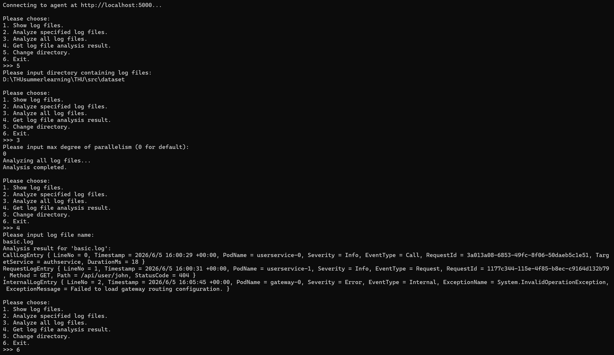
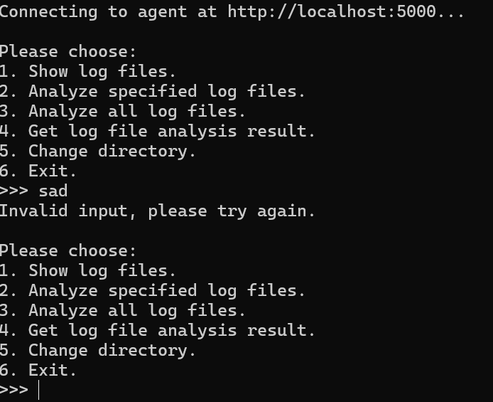

# gRPC
## 1.功能介绍和截图
### 1.1功能介绍
* 作为常住在服务器的Agent，通过gRPC服务完成日志解析。启动后自动发送Ping请求，确认状态正常，同时工作后支持用户输入工作目录，对指定日志文件进行分析，流式输出结果。

## 2.问题回答
### Q3.1
* 区别：网络开发分为服务端和客户端，需要多个项目同时启动，非网络只需要本地内存方法调用，网络则需要跨进程/网络调用。
* 额外难点：存在网络环境延迟，报错时候难以具体区分原因。
* 复杂之处：需要异步处理。
### Q3.2b
* 给予AI的提示词是报错信息和讲解代码框架，并命令AI讲解一些知识点。AI分析报错原因时候常常不能结合多个.cs文件一同考量，AI同时会讲解一下理论知识。
