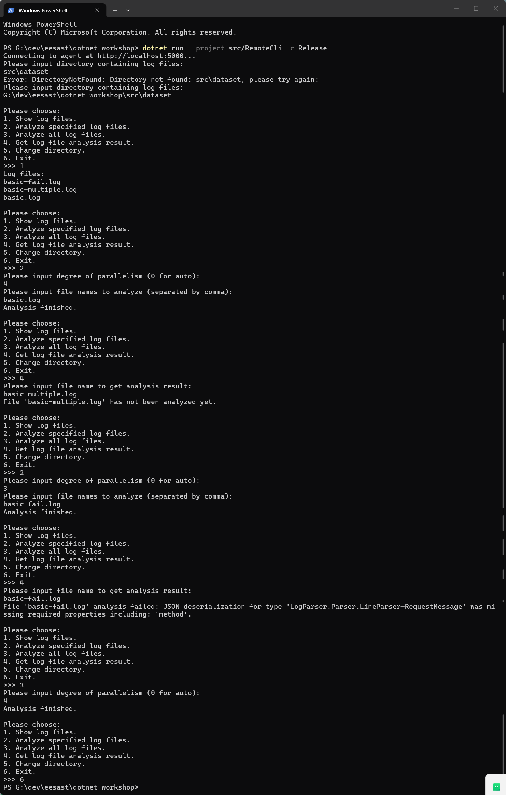

# C03 Async and gRPC 作业报告

## 功能实现介绍

本节在 C02 并行日志分析器之上，实现了一个对外提供 gRPC 服务的常驻 Agent，以及一个使用异步 gRPC 调用该服务的远程命令行客户端。

### 1. gRPC 契约层（`LogAnalyzerRpc`）

- `log_analyzer.proto` 定义了 `LogAnalyzerAgentService` 的全部 RPC：`Ping`、`GetAgentStatus`、`ChangeDirectory`、`GetLogFiles`、`AnalyzeAll`、`AnalyzeFiles`，以及服务端流式的 `GetAnalysisResult`；
- `GrpcLogEntryVisitor` 以单例 + 访问者模式把 Call / Request / Internal 三种 `LogEntry` 转换为 Protobuf 的 `LogEntryMessage`（oneof 结构）；
- `GrpcTypeConverter` 完成枚举（`AnalysisState`、`LogSeverity`、`LogEventType`）与日志条目的双向转换，时间戳使用 `google.protobuf.Timestamp`。

### 2. Agent 服务（`LogAnalyzerAgent`）

- `AgentService` 继承 proto 生成的服务基类，负责把每个 RPC 请求转发给 `AgentSession`，流式方法逐个 `WriteAsync` 写出响应；
- `AgentSession` 通过构造函数注入 `LogFileAnalyzer` 与 `ILoggerFactory`，把请求翻译为分析器调用，并保证服务不会因用户请求或内部错误而崩溃：
  - 目录不存在 → `DIRECTORY_NOT_FOUND`；
  - 参数非法（如负数并行度、空文件名列表）→ `INVALID_ARGUMENT`；
  - 尚未设置目录或正在分析 → `INVALID_OPERATION`；
  - 文件不存在 → `FILE_NOT_FOUND`；
  - 其余异常 → `INTERNAL_ERROR` 并记录日志；
- `GetAnalysisResult` 按约定流式返回：文件不存在只回一个失败状态；未分析/失败只回 header；成功先回 header，再逐条回日志条目。

### 3. 远程客户端（`RemoteCli`）

- 使用 `GrpcChannel` 与生成的客户端 Stub 连接 Agent，启动时 `Ping` 探活并输入日志目录；
- 菜单功能与 `LocalCli` 对齐：显示文件、分析指定文件、分析全部、查看分析结果、切换目录；
- 所有网络调用均为异步版本（`XxxAsync`），流式结果通过 `await foreach` + `ReadAllAsync` 读取；
- 对目录不存在、文件不存在、非数字输入、非法并行度等均提示错误并允许重试，不会崩溃。

## 运行截图

## Q3.1

网络程序让我对前后端分离有了更深的了解：代码的耦合度相比单机程序更低，自由度更高，不同模块之间规定统一的借口而不关心其他模块内部的实现细节。
感觉和我硬设比赛的项目比较类似，我们小组的项目使用了两块开发板，一块作为前端，一块作为后端，前端负责采集数据并显示，后端负责处理数据。

## Q3.2.b

本次作业使用了 AI 辅助完成，回答 (Q3.2.b)。

 这次除了前两次中提到的讲解代码框架，查缺补漏，确定方案后编写代码之外，AI还讲解了部分gRPC的知识（比如流式客户端中的流式的具体含义，在生活应用场景中的体现及其好处）

 测试时发现AI在将本地客户端的代码迁移到客户端时没有给出初始化目录的入口，虽然仍能通过更改目录的入口来使用，但在实际使用中，一般会希望在启动时就能指定目录。
