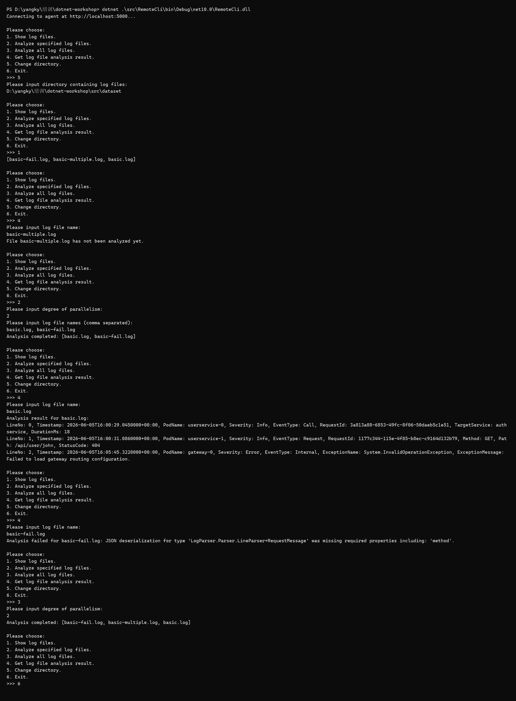
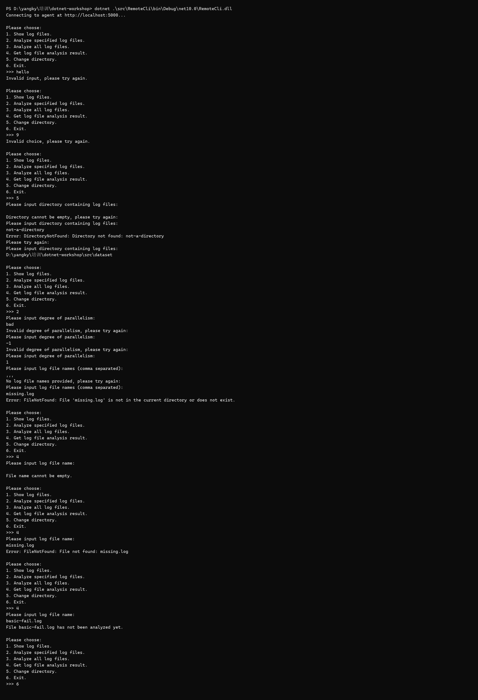

# T3.2 RemoteCli 实现报告

## 实现功能

- 连接并检测 LogAnalyzer Agent，支持通过命令行参数或环境变量指定服务地址。
- 异步切换日志目录、查看日志文件、分析指定文件和分析全部文件。
- 异步读取 `GetAnalysisResult` 响应流，区分文件头与日志条目，并将日志转换后完整输出。
- 检查每次 RPC 返回的操作状态，分别提示非法参数、目录或文件不存在等业务错误。
- 处理非法菜单、空输入、非法并行度、空文件列表和 gRPC 连接异常，避免程序意外退出。

## 鲁棒性测试截图

## Q3.1

与本地程序相比，网络应用多了客户端与服务端之间的通信边界。一次调用可能因断网、服务不可用或业务状态失败，不能只考虑本地异常，还需要处理异步调用、序列化转换、状态码和流式响应。调试时也要同时启动两端，并区分传输错误与业务错误，因此状态同步、错误处理和联调过程更加复杂。

## Q3.2

我使用了AI.提示词为“请帮我解决目前T3.2”中的bug。
