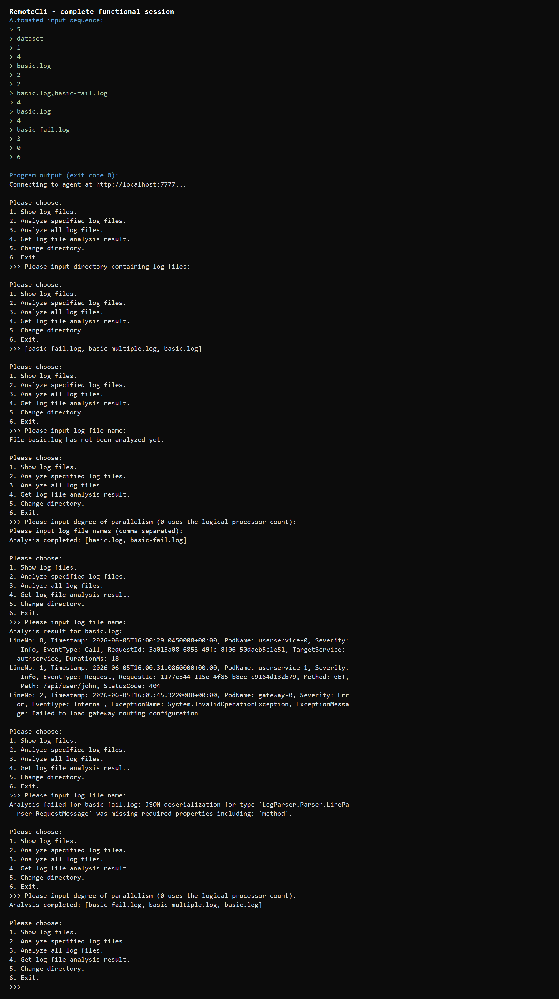
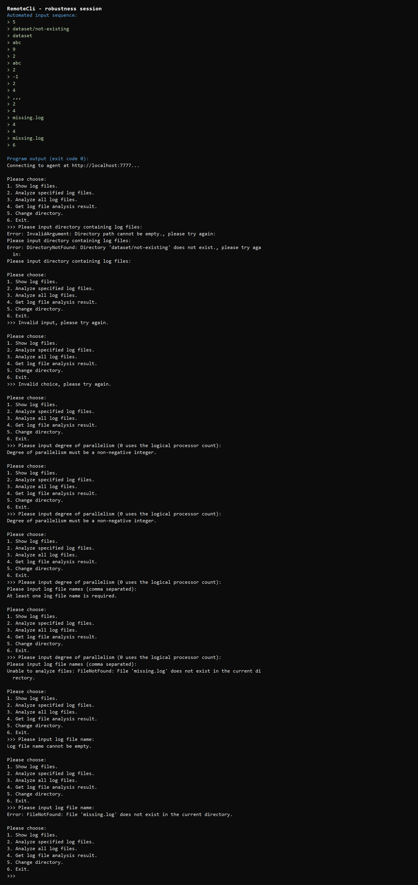

# 03-async-grpc 实现报告

## T3.1 Agent

本节完成了日志分析系统与 Protobuf 类型之间的转换，以及 gRPC Agent 的请求处理逻辑。

`GrpcLogEntryVisitor` 使用访问者模式把 `CallLogEntry`、`RequestLogEntry` 和 `InternalLogEntry` 转换为对应的 `LogEntryMessage`。`GrpcTypeConverter` 负责分析状态、日志级别、事件类型和三种日志记录的双向转换。

`AgentSession` 实现了目录切换、全部日志分析、指定日志分析和分析结果查询。请求参数或当前状态不合法时，Agent 会返回对应的 `INVALID_ARGUMENT`、`DIRECTORY_NOT_FOUND`、`FILE_NOT_FOUND` 或 `INVALID_OPERATION`，其他异常转换为 `INTERNAL_ERROR`，避免请求异常导致服务退出。分析成功的结果首先返回 header，随后按原顺序返回每条日志记录。

`AgentService` 只负责把 gRPC 请求和取消令牌转交给 `AgentSession`。对于分析结果，它使用服务器流逐条写出 `GetAnalysisResultResponse`。

在 Release 配置运行 `test-03-async-grpc`，T3.1.1 至 T3.1.3 共 3 项测试全部通过。

## T3.2 RemoteCli

`RemoteCli` 实现了以下功能：

1. 切换 Agent 使用的日志目录。
2. 获取当前目录中的日志文件列表。
3. 按指定并行度分析部分或全部日志文件，其中并行度 `0` 使用逻辑处理器数量。
4. 查询未分析、分析成功和分析失败三种状态。
5. 异步读取 gRPC 服务器流，并把每条 Protobuf 日志转换回日志模型后输出。
6. 处理空目录、无效目录、非法菜单、非法并行度、空文件列表和不存在的日志文件。

正常会话覆盖了目录切换、文件列表、未分析状态、指定文件分析、三种日志类型的成功结果、失败结果和全部文件分析。程序最终以退出码 `0` 结束。

鲁棒性会话连续输入多种非法内容。每次错误后程序都会给出原因并返回菜单或重新提示输入，没有因客户端参数错误退出。

## Q3.1

网络应用与以前本地程序最直接的区别是调用跨越了进程边界。调用方不能直接共享 Agent 中的对象，只能使用 `.proto` 约定的消息，因此需要维护内部模型和 Protobuf 模型之间的转换。网络调用还可能遇到服务未启动、地址错误、连接中断和请求取消；这些情况在普通本地方法调用中通常不需要考虑。

本节另一个明显区别是调试时必须同时运行 Agent 和客户端。客户端创建 channel 并不表示连接已经成功，第一次 RPC 才真正建立连接，所以程序先调用 `PingAsync`。查询分析结果又不能假定响应可以一次装入内存，而是要先处理 header，再异步读取服务器流中的日志记录。

服务端的输入也不能被信任。目录、文件名和并行度都需要检查，分析器当前是否已有目录或正在分析也会影响请求是否合法。Agent 是常驻服务，因此这些错误必须转换为协议状态，而不能让异常终止服务。

## Q3.2.b

本次作业使用了 AI。主要提示词包括：

> 请你阅读 guidance 中的更新内容，帮助我完成 03-async-grpc 中的任务。

> 我在 Visual Studio 2026 中已经打开了这个项目，请你帮助我完成第 3 节全部要求。

> 请告诉我为什么要这样做

AI 用于阅读任务说明、解释代码框架、补全 T3.1/T3.2 的 TODO、运行测试和组织控制台验证。过程中 AI 一开始为了增强鲁棒性改动了 `RemoteCli` 已有的入口和菜单流程，这不符合工程只修改 TODO 区域的规则。指出问题后，AI 阅读了 `00-prepare/guidance.md`，撤回了 TODO 之外的改动，并通过 `git diff` 重新检查修改范围。

通过本次实现，我更清楚地理解了 gRPC 的惰性连接、普通异步 RPC 与服务器流的区别，以及 `oneof` 消息如何承载 header 或日志记录。服务器流客户端方法本身没有 `Async` 后缀，但响应通过 `ReadAllAsync` 异步读取；这与一次返回单个响应的 `ChangeDirectoryAsync` 等调用不同。
