# 03 async-gRPC 作业报告

## T3.2 实现说明

我实现了远程控制台客户端：切换日志目录、显示日志文件、按指定并行度分析指定文件或全部文件、流式查看分析结果。客户端全部使用 gRPC 的异步调用.

## 完整功能截图

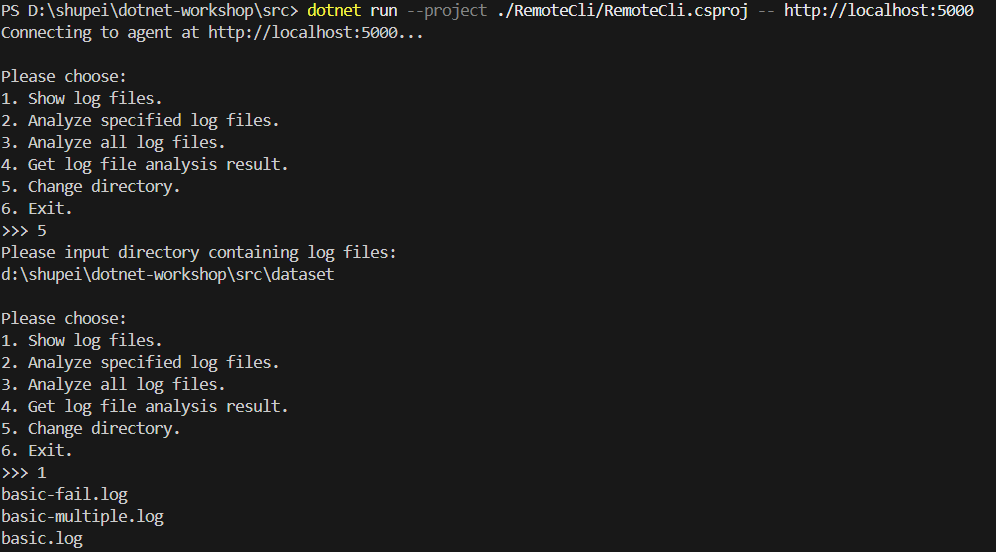
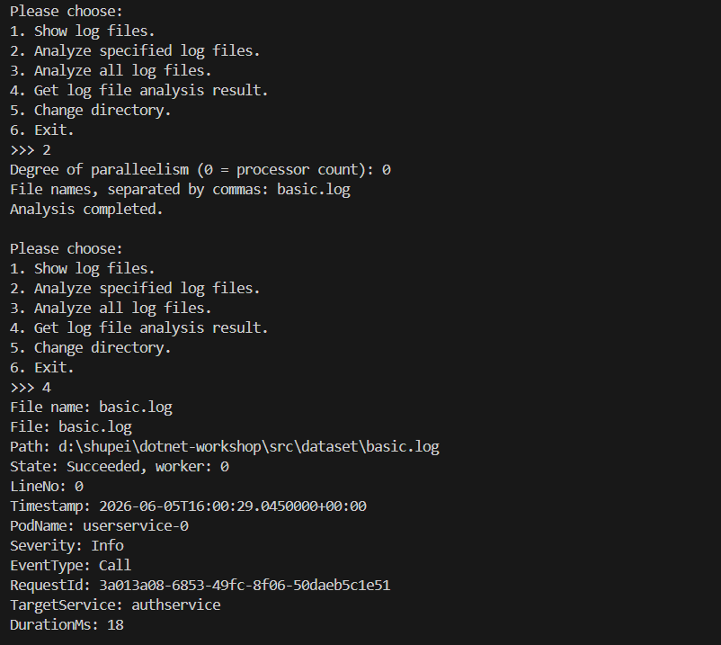
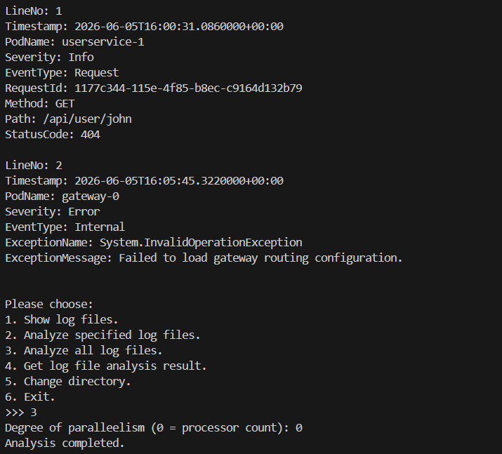
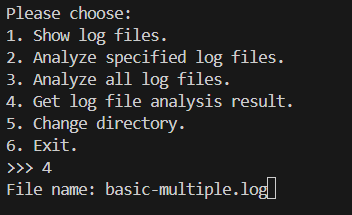
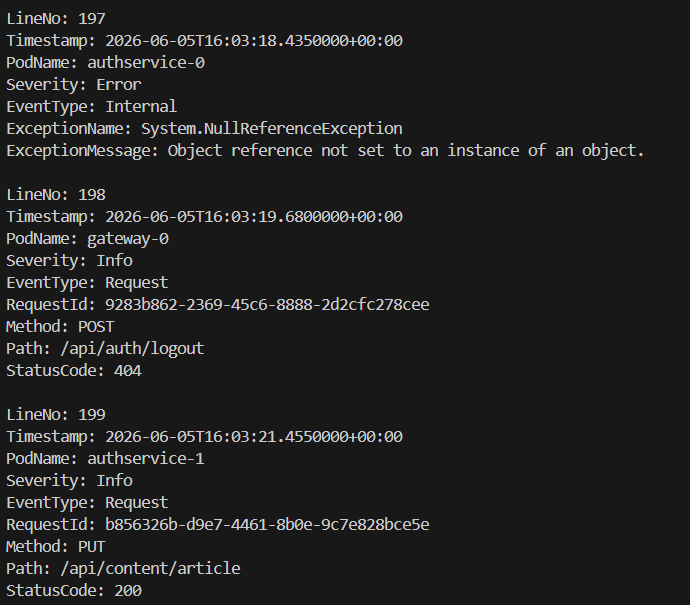
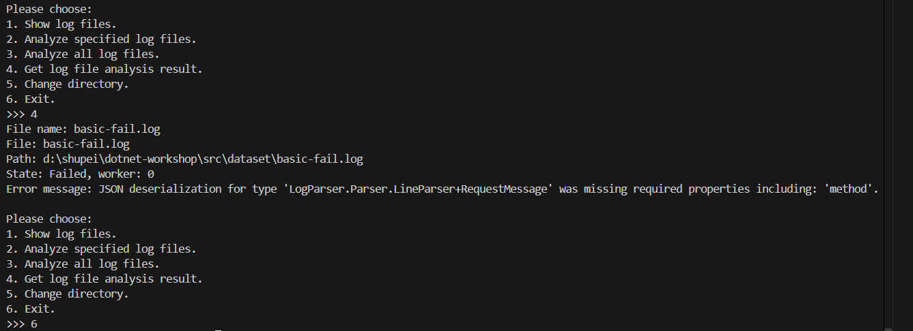

## 鲁棒性测试截图

我测试了菜单非法输入、目录错误后的恢复、负并行度/空文件名的本地校验、错误文件的服务端状态，以及“未选择目录直接分析”等异常处理。

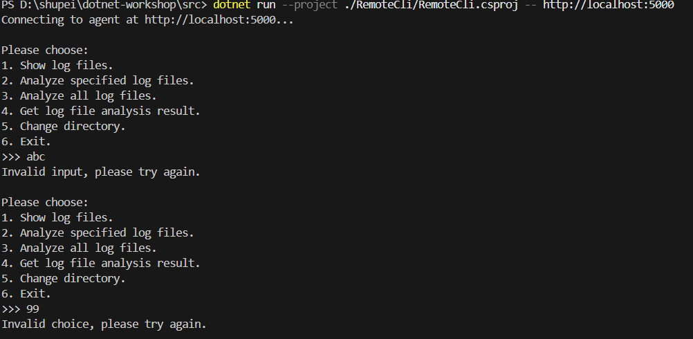
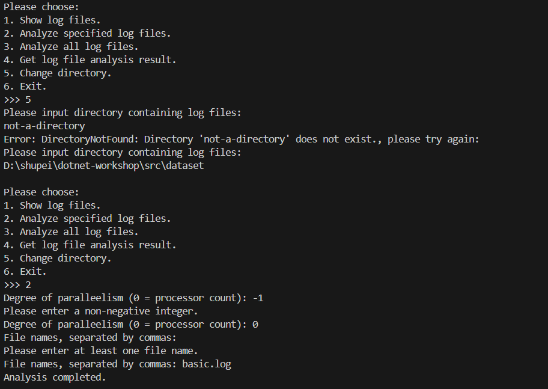
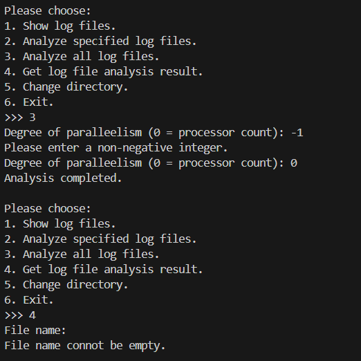
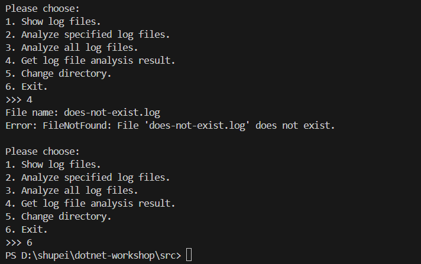
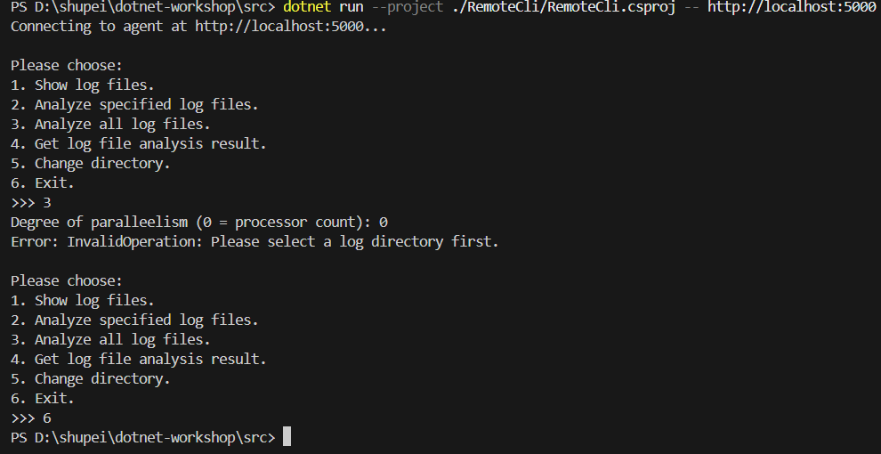

## Q3.1：你认为，你在开发网络应用程序，与你在以往开发非网络应用程序的区别在哪里？网络应用程序的开发存在哪些额外的难点？存在哪些额外的复杂之处？

新增的难点主要在于：1.涉及不同端的连接和协同，程序结构更加复杂，构思和编写难度增加。2.需要处理的可能异常情形增加了连接失败等，鲁棒性维护难度增加。3.程序调试检查需要同时运行不同端，更不容易发现、定位和修正bug。

## Q3.2
### Q3.2.b：如果使用了 AI，你给予 AI 的提示词是什么？你对 AI 的使用是询问 AI 一些接口的用法、gRPC 的使用，或是在某处的写法，还是让 AI 帮你写一部分作业代码，又或是让 AI 给你讲解代码框架？AI 的解答是否出现过错误（如果有，是哪些）？你从 AI 那里是否得知了一些关于异步，或是 gRPC 等原本你不知道或是难以理解的知识？

我使用了 AI。提示词大意为“请为我提供一版在原代码基础上通过注释标明用到的gRPC讲义中知识点和用途，并讲解几个todo部分代码的编写思路（如用到的类或语法等）的说明文档”。用途包括从复杂程序中寻找用到的接口、讲解用到的gRPC使用的知识点，以及提供代码编写思路和示例。AI的错误有类似功能代码写法不同导致混乱、弄混用到的相对地址和绝对地址等。得知的知识有领域模型与Proto模型的转换、gRPC各端安全与鲁棒性的维护方法等。