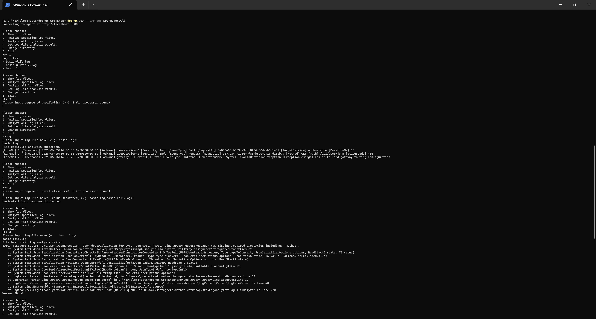

功能截图：

(Q3.1)
你认为，你在开发网络应用程序，与你在以往开发非网络应用程序的区别在哪里？网络应用程序的开发存在哪些额外的难点？存在哪些额外的复杂之处？

区别在于需要处理数据在不同进程间的传输问题。难点在于接口的设计如何在满足需求的前提下尽量简单。复杂之处在于需要处理数据的序列化、反序列化，网络通信的不稳定等问题。

(Q3.2)
本次作业中，你是否使用了 AI？根据你的使用情况，在以下 (Q3.2.a) (Q3.2.b) 两个问题中选择一题作答：

(Q3.2.a)
如果没有使用 AI，你花了大约多长时间完成了整个 03-async-grpc？你是否借助了传统搜索引擎来完成本节？你认为本节的难度是是否显著高于编写普通的非网络应用程序的难度？你是否卡在某一处花费较长时间（如果有，是哪处）？

未使用AI，总时间约2.5小时。使用了搜索引擎查找grpc的API等。我认为使用grpc后编写难度与普通应用程序相近，但是还是增加了很多用于数据转换之类的代码。花费时间较多的地方主要是理解grpc接口中使用的数据类型的定义以及cli的编写。