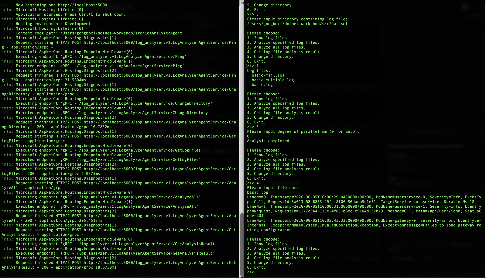
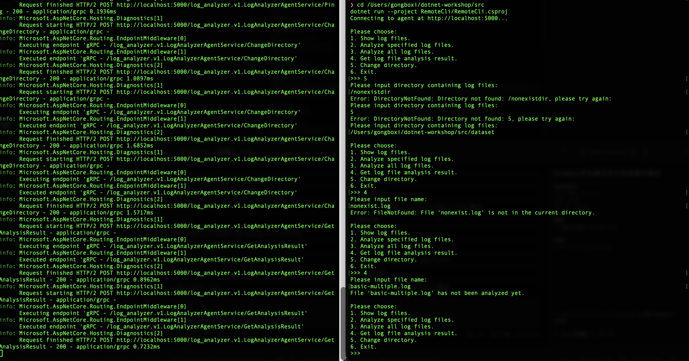

# Report for Async and gRPC

## 功能实现简介

本节在 `02-multithreading` 的基础上，实现了一个常驻运行的 gRPC Agent 服务，以及一个远程控制台客户端，共完成四个部分：

1. **类型转换 `GrpcLogEntryVisitor` / `GrpcTypeConverter`**（`LogAnalyzerRpc`）：利用访问者模式将 `LogEntry` 与 Protobuf 的 `LogEntryMessage` 互相转换，并完成 `LogSeverity`、`LogEventType`、`AnalysisState` 等枚举的相互转换。
2. **gRPC 服务 `AgentService`**（`LogAnalyzerAgent/Services`）：gRPC 服务入口，把用户请求转发给 `AgentSession`。
3. **业务逻辑 `AgentSession`**（`LogAnalyzerAgent/Applications`）：调用 `LogFileAnalyzer` 完成 `ChangeDirectory`、`GetLogFiles`、`AnalyzeAll`、`AnalyzeFiles`、`GetAnalysisResult`，并做好异常处理，保证服务永不因非法请求而崩溃。
4. **远程控制台客户端 `RemoteCli`**：将上一节的 `LocalCli` 改装为 gRPC 客户端版本，全部使用异步调用，并具备非法输入鲁棒性。

### 完整功能截图

完整功能包括：启动 Agent → 运行 RemoteCli → 切换目录 → 展示文件列表 → 分析全部文件 → 查看单个文件的流式解析结果。

### 鲁棒性测试截图

覆盖场景：输入不存在的目录（返回 `DirectoryNotFound`）、查看不存在的文件（返回 `FileNotFound`）、查看尚未分析的文件（返回 `NotAnalyzed` 提示）、输入非法的并行度、菜单选项输入非数字等。

---

## Q3.1

我认为开发网络应用程序与以往开发非网络应用程序最大的区别在于**程序运行的边界不再局限于单个进程**，而在于：

1. **错误来源更多、更不可控**：本地程序的错误基本可以确定（逻辑错误、越界等）；而网络程序还需要面对网络抖动、对端进程崩溃、连接超时、序列化/反序列化失败、协议不匹配等大量额外的失败场景，必须假定"对端随时可能出错"。
2. **需要处理跨语言、跨机器的一致性问题**：本地程序内存中的对象直接使用即可；网络程序则必须把内存中的对象序列化成协议（这里用 Protobuf），并在两端保持类型、字段、枚举的定义一致，任何一边改动都可能破坏通信。
3. **并发与异步是常态**：网络程序天然是 I/O 密集型，阻塞式等待会浪费 CPU，因此需要异步编程（`async`/`await`）让线程在等待网络时不空转；同时服务端要同时响应多个客户端，必须考虑线程安全。
4. **服务可用性是硬指标**：本地程序崩了重开即可；而 Agent 作为常驻服务，一旦因某个非法请求崩溃，所有客户端都无法使用，所以必须对所有输入做防御式处理，保证"尽可能不崩溃"。
5. **调试更复杂**：需要同时运行服务端和客户端两个程序，还要观察网络上的实际请求/响应，比单进程调试繁琐得多。

额外的难点主要集中在：异常处理要覆盖网络层与业务层、数据一致性、并发安全，以及异步调用链的正确性。

---

## Q3.2

### Q3.2.b

本次作业我使用了 AI 辅助完成。我给予 AI 的提示词大致是："切换到 03-async-grpc 分支，阅读 guidance 文档后完成 GrpcLogEntryVisitor、GrpcTypeConverter、AgentSession、AgentService、RemoteCli 的实现"。

我对 AI 的使用主要是：询问 gRPC 客户端对 server-streaming 调用的接收方式（`client.GetAnalysisResult(request)` 返回 `AsyncServerStreamingCall`，用 `await call.ResponseStream.ReadAllAsync().ToListAsync()` 读取），以及 Protobuf `oneof` 与 `optional string` 在 C# 生成代码里的表现形式（`EntryOneofCase`/`PayloadOneofCase`、`HasErrorMessage` 等）。

AI 的解答基本正确，但有一些需要人工确认的细节：例如 `AnalysisResultHeaderMessage.ErrorMessage` 是 `optional string`，其 setter 会对 `null` 抛异常，因此需要先判断 `result.ErrorMessage is not null` 再赋值，否则分析成功的文件（`ErrorMessage == null`）会导致服务端出错；又如 Agent 必须捕获所有异常并转化为 `OperationStatusMessage`，不能直接把异常抛给客户端。这些都是需要结合生成代码与"服务不崩溃"这一目标自行判断的点。

从 AI 那里我还了解到：gRPC 是 lazy 连接（第一次调用时才真正建立连接，所以用 `Ping` 预热），以及服务端流式返回（`IServerStreamWriter`）与客户端流式读取的配对方式。整体而言，本节难度适中。
