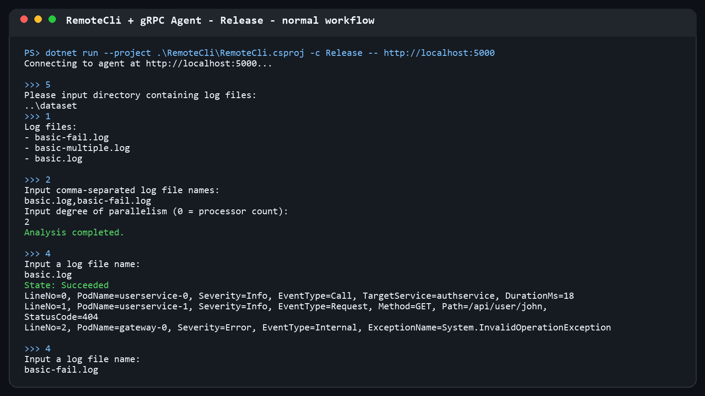

# 03-async-grpc 实验报告

姓名：李易臻  
班级：秀钟31  
学号：2023013461

## 功能实现

本节完成了日志模型与 Protobuf 消息的双向转换、gRPC Agent 的业务会话与服务入口，以及异步远程命令行客户端：

- 使用访问者模式转换 `CallLogEntry`、`RequestLogEntry` 和 `InternalLogEntry`；
- 实现目录切换、文件列表、指定/全部分析与服务器流式结果返回；
- 将非法参数、目录不存在、文件不存在和非法状态转换为明确的 `AgentErrorCode`，内部异常写入服务日志；
- `RemoteCli` 的 RPC 调用全部使用异步接口，并对 RPC 错误和用户非法输入进行处理。

Release 配置下运行 `test-03-async-grpc`，3 项测试全部通过。

## 运行截图

Agent 与 RemoteCli 正常交互：

非法目录、空文件列表、非法并行度和未知文件：

## Q3.1

网络应用除了本地业务逻辑，还要定义稳定的通信契约，并处理序列化、连接状态、超时、取消和远端错误。本次实现中，日志对象不能直接跨进程传递，需要先转换为 Protobuf 消息；分析结果又通过服务器流逐项发送，客户端必须异步读取。服务器还不能因为单个非法请求崩溃，因此需要把业务异常转换为状态码，同时把真正的内部异常记录到服务日志。相比本地控制台程序，调用链更长，定位问题时也要区分客户端输入、网络传输和服务器业务三个层次。

## Q3.2.b

本次作业使用了 AI。主要提示是让 AI依据课程讲义、`.proto` 定义和单元测试完成 `03-async-grpc`，并启动真实 Agent 与 RemoteCli 做端到端验证。AI 协助实现了枚举和日志类型转换、Agent 错误映射、流式 RPC 以及异步客户端。实现后没有只依赖静态检查：Release 测试 3 项通过，并实际验证了正常分析、失败日志、未知目录和未知文件。通过这次过程，我进一步理解了 `await` 不只是语法形式，服务器流必须异步消费，而 RPC 的业务错误也不应简单等同于进程异常。
