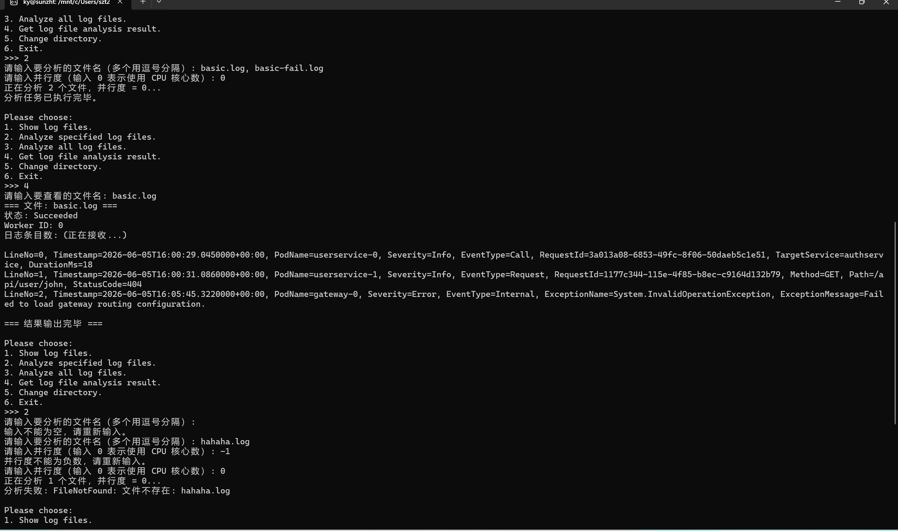

## T3.2 RemoteCli 功能说明

本次 T3.2 实现了一个远程命令行客户端 `RemoteCli`，通过 gRPC 协议与 Agent 服务端通信，实现了以下功能：

### 功能列表

| 菜单项 | 功能 | 对应 RPC 方法 |
|--------|------|---------------|
| 1 | 显示当前目录下的所有 `.log` 文件 | `GetLogFiles` |
| 2 | 分析指定的日志文件（支持多文件） | `AnalyzeFiles` |
| 3 | 分析当前目录下的所有日志文件 | `AnalyzeAll` |
| 4 | 查看指定文件的分析结果 | `GetAnalysisResult`（流式） |
| 5 | 切换日志文件目录 | `ChangeDirectory` |
| 6 | 退出程序 | - |

### 关键实现

1. **异步调用**：所有 gRPC 调用均使用 `Async` 后缀的异步方法（如 `client.AnalyzeFilesAsync`），配合 `await` 关键字实现非阻塞等待。

2. **流式处理**：`GetAnalysisResult` 使用 `responseStream.ReadAllAsync()` 逐条读取服务端返回的 `LogEntry`，先接收 `Header`（文件信息），再逐条接收日志条目。

3. **鲁棒性设计**：
   - 用户输入非法目录路径时，提示 `DirectoryNotFound` 并重新等待输入
   - 用户输入不存在的文件名时，提示 `FileNotFound`
   - 用户输入空字符串时，提示重新输入
   - 并行度输入负数时，提示不能为负数
   - 所有可能抛出异常的代码都包裹了 `try-catch`

4. **类型转换**：使用 `GrpcTypeConverter.ConvertFromGrpc` 将 Protobuf 消息转回 C# 对象，再用 `KeyValueVisitor` 输出键值对。

### Q3.1：网络应用程序开发与普通应用程序开发的区别

#### 开发区别

| 方面 | 普通应用程序 | 网络应用程序 |
|------|-------------|-------------|
| 运行环境 | 单机运行，只依赖本地资源 | 需要服务端和客户端同时运行 |
| 数据存储 | 本地内存或文件 | 远程服务 + 本地缓存 |
| 错误来源 | 代码逻辑错误、本地资源不足 | 网络超时、服务端错误、序列化错误等 |
| 调试方式 | 直接运行，单步调试 | 需要同时启动服务端和客户端 |

#### 额外难点

1. **网络不可靠**：网络请求可能超时、失败、重发，需要处理各种异常情况。
2. **数据序列化/反序列化**：数据需要在 C# 对象和 Protobuf 消息之间转换，类型必须匹配。
3. **服务状态管理**：Agent 作为有状态服务，需要维护目录路径、分析结果等状态，多个 RPC 调用之间共享状态。
#### 个人感受
网络编程对于程序的鲁棒性要求更高，同时还要考虑与其他设备连接交互的问题，更加复杂。
### Q3.2.b：AI 使用情况

**1. 我的提示词**

我向 AI 提供了本节 `guidance.md` 的任务描述，并附上已有的 `GrpcLogEntryVisitor.cs`、`GrpcTypeConverter.cs`、`AgentService.cs`、`AgentSession.cs` 代码文件，要求逐行讲解每一段代码的含义，特别是异步编程中的 `async`/`await`、gRPC 的流式调用、Protobuf 类型转换等概念。

**2. AI 的使用方式**
- 让 AI 解释代码框架和设计思路（单例模式、依赖注入、gRPC 服务定义），遇到编译错误或测试失败时，将错误信息反馈给 AI，由 AI 分析原因并提出修改建议

**3. AI 解答的优点**
- 逐行解释了 Protobuf 消息结构、`oneof` 的使用方式、`Timestamp` 类型转换等
- 在 T3.1 测试失败后，通过分析错误堆栈，指出 `GetAnalysisResult` 中 `Failed` 分支的状态应为 `Success` 而非 `Failure`（获取结果操作本身是成功的，只是分析结果状态为 `Failed`）

**4. AI 解答的缺点**
- `GrpcTypeConverter.ConvertFromGrpc` 中新增 `Request` 和 `Internal` 分支时，AI 最初没有正确处理 `EventType` 字段的转换，需要我补充

**5. 从 AI 学到的新知识**
- Protobuf 的 `oneof` 类型：同一个消息中只能设置一个字段，通过 `EntryCase` 判断具体是哪种类型
- gRPC 流式调用：`ReadAllAsync()` 逐条读取服务端返回的消息序列

**6. 本节难度评价**
个人认为本节**难度偏高**。
- 调试时需要在两个终端之间切换，错误信息可能来自任何一方
- 类型转换（C# ↔ Protobuf）容易出现不匹配问题
