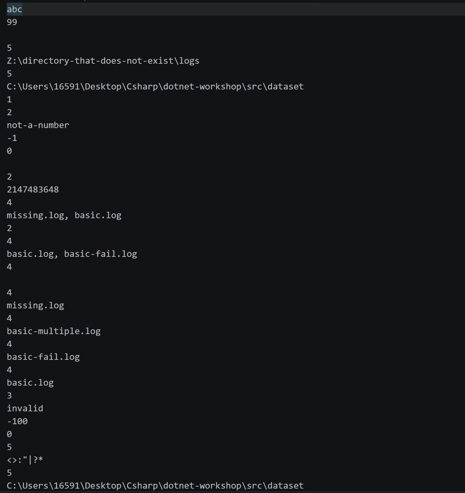
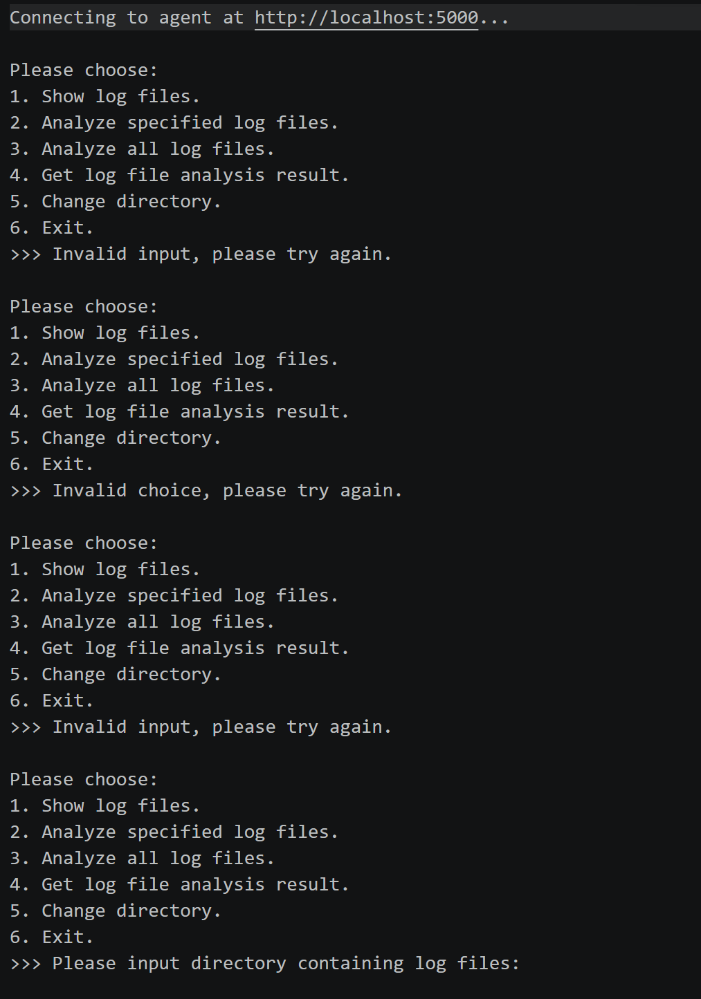

# 异步 gRPC 实验报告

## T3.2 截图与功能实现

### 输入图片

### 输出图片

## Q3.1

我认为，在 gRPC 的帮助下，二者的区别被减小了很多。但是以往我“开发”的应用程序往往都是自己使用或者测试，不太需要考虑特别高度的稳定性与对于输入的鲁棒性，因为即使程序崩掉了，也不过是重启一下，但是在本次的作业里，我发现了大量的异常处理等等保证鲁棒性的措施。此外，以往的开发中，我面对的往往是 CPU 密集型任务，因此不太常用多线程，但是网络中，通信成为了一个障碍，所以我在本次作业中也学着使用了一些异步语法。

我认为，本次的网络开发的主要难点在于，之前我的思维中，“服务”与“客户”是耦合的，但是在本次作业中，我们需要对二者做高度的解耦，这给我的理解带来了困难。

我认为本次主要的复杂之处在于信息流的长度比以前长了很多，以前简单的类型现在可能需要从服务端编码为 Protobuf 再在客户端解码，我认为这是较为复杂的。

## Q3.2

本次我使用了 AI。

### Q3.2.b

**提示词：**

> 这段代码中的最后一个方法应当实现流式返回，但是没有传入流对象，我应当如何处理？

这是因为我不理解为什么 `AgentSession.GetAnalysisResult` 没有传入流对象，但是教学里对于流式 gRPC 要求传入一个流对象，AI 为我解答：这个方法并不是 gRPC 服务方法本身，其本身在 `AgentService` 里，我又查看了 `AgentService` 的代码，之后我理解了其层级。

由于我不会 Markdown 语法，本文的 Markdown 格式由 AI 进行了修改。
