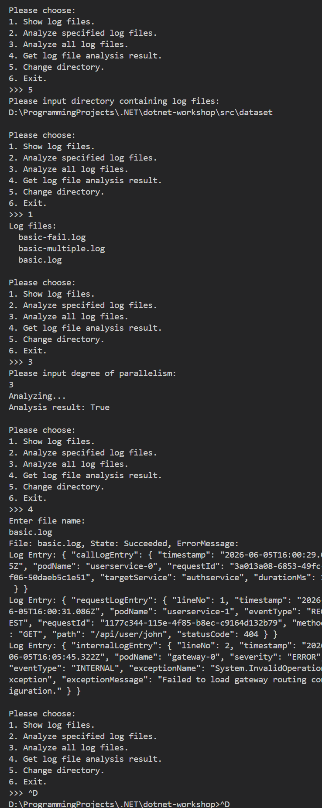
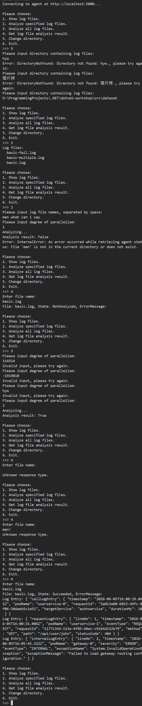

- 普通测试

- 稳健性测试

## Q3.1
- 最大的区别是需要考虑网络通信的延迟、丢包、超时等各种未知情况，这些情况都需要服务端和客户端处理。这也使得异步、握手、状态码等机制在网络通信中得到广泛应用
- 难点与复杂之处主要在于，需要处理网络通信的不稳定性，除此之外还要考虑前后端通信接口的一致性、可维护性，以及服务器在大量访问请求下的稳定性等
## Q3.2
有使用
### 3.2.b
- AI主要负责自动补全，解释一些语句、接口的用法，以及帮忙找bug
- 提示词：解释一下xxx的用法与参数含义
- 至少在自动补全方面，AI经常捏造出各种各样实际不存在的字段或参数，比如往`var request = new ChangeDirectoryRequest()`的构造函数加了个不知哪来的`Force = true`，这时就只能翻定义
- 确有了解更多知识，比如CancellationToken，在gRPC中可以让服务端按需取消某些任务，比如客户端断连时触发，防止服务端做无用功