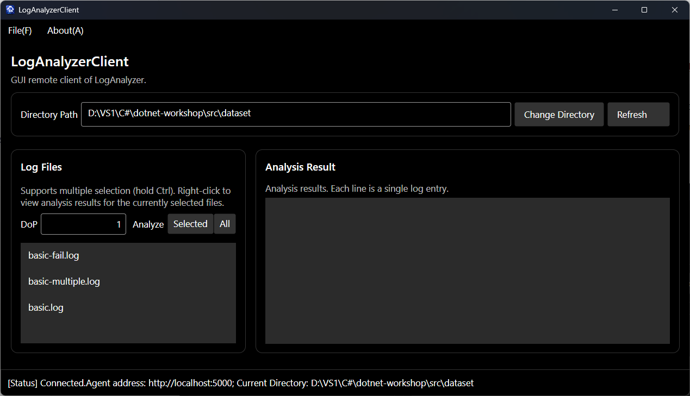
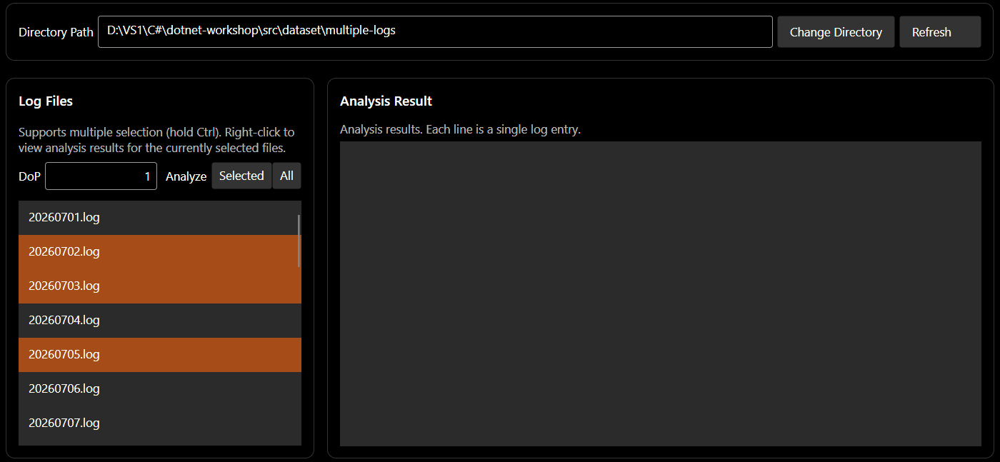
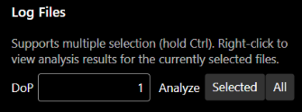
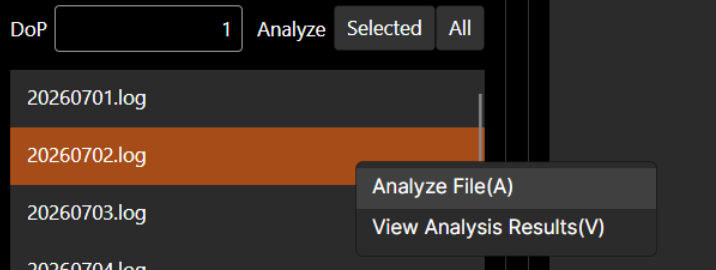
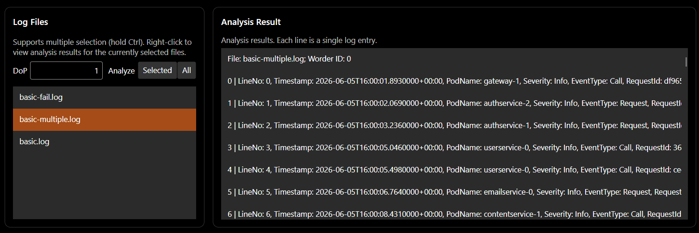
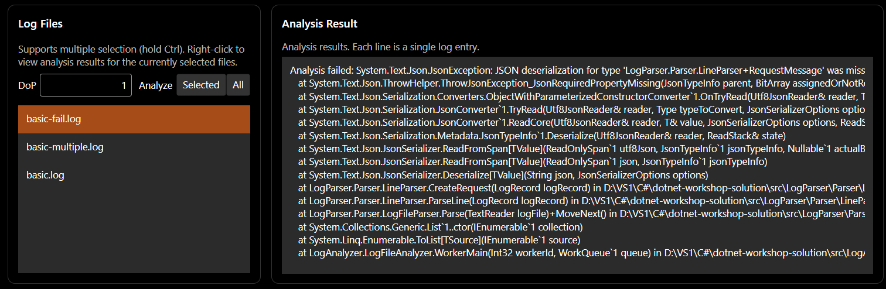
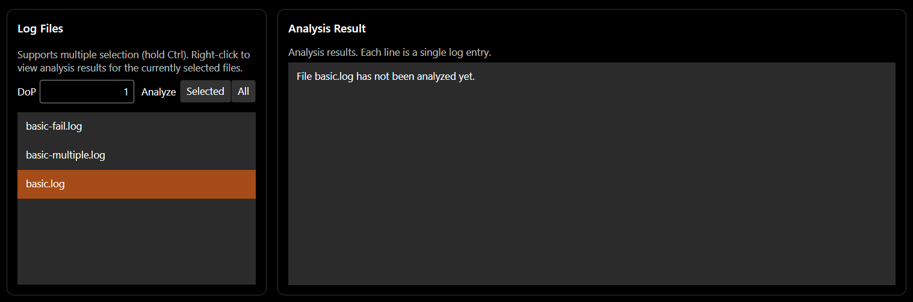

# Guidance for Avalonia

## 训练目标

+ 了解图形界面应用程序
+ 初步掌握使用 Avalonia UI 框架进行图形界面应用程序的编写
+ 初步掌握使用 `CommunityToolkit.Mvvm` 进行 MVVM 模式的编写

**意外的训练目标：**

+ 了解工厂方法模式的应用

## 背景介绍

这一节的背景应该没什么好介绍的了。上一节我们做了一个控制台的客户端，控制台的客户端简直易用性太差了！因此，我们要做一个好看的 GUI 的客户端！

[Avalonia UI](https://avaloniaui.net/) 是基于 .NET 的跨平台 GUI 框架，被称作「跨平台的 [WPF](https://learn.microsoft.com/zh-cn/dotnet/desktop/wpf/overview/)」（后者是 .NET 官方提供的 Windows 平台的 GUI 框架，其首创的 MVVM 模式目前是一种网站前端极其常用的架构，尤其是著名的 [Vue.js](https://cn.vuejs.org/) 就是基于 MVVM 模式的网站前端框架）。

现在，就让我们开始吧！

## 知识速递

为防止涉及到暑培的讲解死角，我们在这里先快速回顾一下本节任务用到的一些需要的知识，并对一些额外用到的知识进行补充。

### 工厂方法模式

我们在 `01-basic` 一节中学习了简单工厂模式。但简单工厂模式有一个弊端，即所有对象的创建逻辑均由同一个工厂类的同一个方法创建。如果不同的类的创建逻辑完全不同，且需要分布在不同的位置，由不同的角色进行创建，以至于无法写在一起，这时候简单工厂模式就无法应对需求了。我们需要 **工厂方法模式（Factory Method Pattern）** 。

我们在前一节 `03-async-grpc` 中介绍 `ILogger` 时就提到了工厂方法模式。在工厂方法模式当中，不同的类需要由不同的工厂来实例化对象，不同的工厂也有一个公共的工厂接口。如下例：

```csharp
abstract class Product {}
class ConcreteProductA : Product {}
class ConcreteProductB : Product {}

interface IFactory {
    Product CreateProduct(string args);
}

class ConcreteFactoryA : IFactory {
    Product CreateProduct(string args) {
        return new ConcreteProductA(args);
    }
}

class ConcreteFactoryB : IFactory {
    Product CreateProduct(string args) {
        return new ConcreteProductB(args);
    }
}
```

在使用时，我们可以：

```csharp
class FactoryMethodPatternDemo {
    private readonly IFactory _factory;
    
    public FactoryMethodPatternDemo(IFactory factory) {
        _factory = factory;
    }
    
    public void UseProduct(string args) {
        var product = _factory.CreateProduct(args);
        // 使用 product
    }
}
```

## 本节任务

### 任务描述

本节需要编写一个图形界面（GUI）客户端，来代替上一节编写的 `RemoteCli`。该客户端需要包含 `RemoteCli` 的全部功能。

### （S4.1）Step 1：图形界面客户端的实现

本步骤的代码均位于 `src/LogAnalyzerClient` 目录中，代码结构如下：

```shell
LogAnalyzerClient
|
+---LogAnalyzerClient            # 该项目用于编写图形界面，我们的几乎全部图形界面均在此项目中编写
|   |   App.axaml                # 应用程序入口类（XAML 部分）
|   |   App.axaml.cs             # 应用程序入口类（C# 部分）
|   |   ViewLocator.cs
|   |
|   +---Services                 # gRPC 服务相关
|   |       IClientFactory.cs    # 用来定义 gRPC Client 工厂的接口
|   |       AppService.cs        # 用于注册 gRPC Client 工厂
|   |
|   +---Views                    # 各种界面（视图）
|   |       MainWindow.axaml     # 应用程序主窗口
|   |       MainWindow.axaml.cs
|   |       MainView.axaml       # 应用程序主窗口所显示的界面
|   |       MainView.axaml.cs
|   |
|   +---Styles                   # 存储样式
|   |       Controls.axaml       # 各种控件的样式
|   |
|   +---ViewModels               # 各种 ViewModel
|   |       ViewModelBase.cs     # 所有 ViewModel 的公共基类
|   |       MainViewModel.cs     # MainView 的 ViewModel
|   |
|   +---Models                   # 用于定义一些存储数据的数据结构
|   |       RemoteModels.cs      # 用于储存日志文件名和日志解析结果的数据结构
|   |
|   +---Dialogs                         # 各种临时弹出的对话框的定义
|   |       ConnectDialog.axaml         # 用于连接 Agent 的对话框
|   |       ConnectDialog.axaml.cs
|   |       MessageDialog.axaml         # 用于弹出临时消息的消息框
|   |       MessageDialog.axaml.cs
|   \---Helpers                         # 一些工具类
|           DialogHelper.cs             # 用于处理弹出对话框的相关逻辑，方便使用 Dialogs 中定义的对话框
|           ClientInternalException.cs  # 用于表示客户端内部发生的异常
|
\---LogAnalyzerClient.Desktop           # Desktop 平台（Windows、Linus、macOS）客户端
        Program.cs                      # Desktop 程序总入口
                                        # 1. 注册 gRPC Client 工厂，用于创建 gRPC 客户端
                                        # 2. 调用 LogAnalyzerClient 开启图形界面
```

首先介绍我们是如何创建 gRPC Client 并连接到 Agent 的。本 workshop 虽然仅在 Desktop 上运行（Windows、Linux、macOS），但为了软件的可扩展性，依然保留增加多平台的能力（如 Android、iOS、浏览器，等等）。由于 gRPC Client 在不同平台创建的方式不尽相同（有兴趣可以参看 [开发札记](../../DEVLOG.md) 中 「关于 AvaloniaUI 的网页端和移动端」和「关于编写 WebAssembly 目标平台客户端的额外难题」两节），因此我们将创建 Desktop 端 gRPC Client 的逻辑放到专门生成 Desktop 平台程序的 `LogAnalyzerClient.Desktop` 项目中，而非用于全平台的 `LogAnalyzerClient` 项目中。

由于 gRPC Client 可能需要多次创建，例如我们的客户端支持切换远程 Agent 的地址，等等，我们需要做的是将创建 gRPC Client 的逻辑在 `LogAnalyzerClient.Desktop` 中写成一个通用的可以被随时调用的方法。因此，我们选取 **工厂方法** 来做到这一点。

我们在 `LogAnalyzerClient/Services/IClientFactory.cs` 中定义了工厂具有的接口：

```csharp
using LogAnalyzerAgentServiceClient = LogAnalyzerAgentService.LogAnalyzerAgentServiceClient;

public interface IClientFactory {
    LogAnalyzerAgentServiceClient CreateClient(string address);
}
```

即输入远程 Agent 地址，返回一个 gRPC Client。同时，我们在 `LogAnalyzerClient/Services/AppService.cs` 定义了用于注册 Client 工厂的属性：

```csharp
public static class AppService
{
    public static IClientFactory ClientFactory { get; set; } = new NullClientFactory();
}
```

在 `LogAnalyzerClient.Desktop` 项目中，我们于 `Program.cs` 中实现创建 Desktop 端的 gRPC Client 的工厂：

```csharp
internal class ClientFactory : IClientFactory {
    public LogAnalyzerAgentServiceClient CreateClient(string address) {
        var channel = GrpcChannel.ForAddress(address);
        var client = new LogAnalyzerAgentServiceClient(channel);
        return client;
    }
}
```

我们在程序启动后且在 GUI 窗口启动前，在 `Main` 方法中将该工厂实例化并注册给 `AppService`：

```csharp
[STAThread]
public static void Main(string[] args) {
    AppService.ClientFactory = new ClientFactory();  // 注册工厂
    // 启动 GUI 窗口
}
```

在 `LogAnalyzerClient` 已经写好的部分界面。目前已经写好的界面中已经完成的功能如下：

+ 菜单栏：菜单栏位于窗口顶部，已写好

  + 连接到 Agent。在 `File(_F)` 中的 `Connect...(_C)` 菜单项用于输入地址并连接到 Agent。该菜单项绑定到 `ConnectCommand` 这个 `ReplayCommand`，其会调用 `ViewModels` 中的 `ConnectAsync` 方法连接到 Agent

+ 状态栏：状态栏位于窗口底部，已写好，用于显示当前连接状态、远程 Agent 地址，以及当前所选择的日志目录

+ Change Directory 按钮和输入框：通过输入框输入 Agent 所在服务器的日志所在目录，然后点击 Change Directory 按钮更改日志

+ 并行度输入框：DoP 右侧的输入框用于输入一个非负整数作为分析的并行度

+ 显示日志目录中的文件列表：Log Files 块中显示了日志目录中的文件列表。如图所示，日志中包含 `basic.log`、`basic-fail.log`、`basic-multiple.log`：

  


阅读已经完成的实现，以其作为参考，你需要完善的剩余的功能。


> [!IMPORTANT]
>
> + **图形界面程序的 UI 渲染以及对用户操作的响应等仅有单一的 UI 线程负责，因此为了防止 UI 线程阻塞导致程序看似卡死，你需要让所有的 gRPC 请求均为异步请求并进行 `await`！！！** 具体原理参考上一节 `03-async-grpc` 中「知识速递」一节的讲解
> + **本项目作为图形界面程序， 绝对不应该因为用户输入的非法，或是一些内部错误而崩溃。因此，你应当做好输入检查以及异常处理，即使通过消息框向用户弹出出错信息**


你需要完成的功能如下：

+ Refresh 按钮：该按钮用于刷新日志目录中的文件列表（即 Log Files 中的文件列表）。给出的代码框架的 `MainView.axaml` 文件中已将按钮绑定到 `RefreshCommand` 上，你需要完成 ViewModel 中的 `RefreshAsync` 的实现。

+ 分析选中的多个文件：Log Files 中的文件列表支持文件多选，方法为按住 Ctrl 键，鼠标左键即可点击多个文件选中，如下图所示：

  

  由于 MVVM 模式中，View Model 无法获取列表框的全部选中项，只能获取到最近的选中项，因此我们将该 `ListBox` 设置了 `LogFileListBox_SelectionChanged` 回调方法。当鼠标进行多次点击时，在 `MainView.axaml.cs` 的 `LogFileListBox_SelectionChanged` 方法中会对 View Model 中的 `SelectedFiles` 进行更新。

  在 `MainView.axaml` 中，我们将 `Analyze` 右面的 `Selected` 按钮绑定到了 `AnalyzeSelectedFilesCommand` 上，你要做的是完成 `AnalyzeSelectedFilesAsync` 的实现（即调用 `AnalyzeFiles` 这个 RPC，参数为 `SelectedFiles`）。

+ 分析全部文件。在 `Analyze` 右面的 `Selected` 按钮后面，你需要添加一个 `All` 按钮，如下图所示：

  

  该 `All` 按钮将用于调用 `AnalyzeAll` RPC，来分析全部文件。

+ 分析指定的文件：在给出的代码框架中，Log Files 中的文件列表已经支持了右键菜单（`ListBox.ContextMenu`），右键菜单中包含了 `Analyze File(A)` 菜单项，如下图所示：

  

  当前 `MainView.xaml` 已经将该菜单项绑定到了 `AnalyzeRightClickedFileCommand` 上，且当前正在选中的文件已经通过 `SelectedItem="{Binding SelectedLogFile, Mode=OneWayToSource}"` 绑定到了 `SelectedLogFile` 属性。你需要完成 `AnalyzeRightClickedFileAsync` 的实现，来实现分析单个文件的功能。

+ 查看分析结果：

  + 在给出的代码框架中，Log Files 中的文件列表已经支持了右键菜单（`ListBox.ContextMenu`），右键菜单中包含了 `View Analysis Results(_V)` 菜单项，并绑定到了 `GetAnalysisResultCommand` 上。因此，你需要完成的其中这一是 `GetAnalysisResultAsync` 的实现，让用户点击 `View Analysis Results(_V)` 菜单项后，对所选日志文件的分析结果进行显示。

  + 此外，你还需要完成的是日志分析结果的显示。日志分析结果的显示在 Analysis Result 下方的列表框中：

    ```xaml
    <ListBox Name="ResultEntryListBox"
             Grid.Row="2"
             ItemsSource="{Binding ResultEntries, Mode=OneWay}">
        <ListBox.ItemTemplate>
            <DataTemplate x:DataType="models:LogFields">
                <TextBlock Text="{Binding Summary, Mode=OneWay}" TextWrapping="NoWrap" />
            </DataTemplate>
        </ListBox.ItemTemplate>
    </ListBox>
    ```

    该列表框的内容绑定到 `ResultEntries` 属性上，且类型为 `LogFields`（定义在 `Models/RemoteModels.cs` 中），显示内容取决于 `LogFields` 类的 `Summary` 属性。

    你需要完成文件分析结果的显示。下面给出了一组你可以根据心情采纳的显示样例，分别对应分析成功、分析失败、尚未分析三种情况：

    

    

    


> [!NOTE]
>
> **任务 4.1（T4.1）**
>
> 你需要实现以上提到的全部功能。
>
> 当你完成你的实现后，请在 `docs/04-avalonia` 目录中新建一个名为 `report.md` 的文本文件，在其中介绍你实现的功能，并给出完整功能的截图，以及你程序的鲁棒性测试截图（各种非法输入的情况）。
>
> **提示：** 你可以参考你上一节实现的 `RemoteCli` 的代码，将 `RemoteCli` 的 gRPC 调用相关代码移过来，并把你在 `RemoteCli` 中的输出错误信息修改为弹出消息框，你将会节省相当多的时间和精力。

> [!IMPORTANT]
>
> Agent 作为常驻的服务，一定要注意 **绝对不应该** 因为用户请求的非法，或是一些内部错误而崩溃，否则就会造成服务的不可用（我们通常说的网站挂掉了）。因此， **一定要做好** 异常处理，注意捕获异常。可以参考 `AgentSession` 给出的样例。


**可能用到的接口：**

[`CommunityToolkit.Mvvm`](https://learn.microsoft.com/zh-cn/dotnet/communitytoolkit/mvvm/) 是方便我们编写 MVVM 的工具。例如，我们要在 ViewModel 中创建一个公有属性，可以直接给私有字段加上 `[ObservableProperty]` 修饰：

```csharp
using CommunityToolkit.Mvvm.ComponentModel;

partial class MainViewModel {
    [ObservableProperty]
    private string _greeting = "Welcome to Avalonia!";
}
```

此时将会自动为我们生成代码：

```csharp
partial class MainViewModel {
    public partial string Greeting {
        get => _greeting;
        set => SetProperty(ref _greeting, value);
    }
}
```

其中 `SetProperty` 的内容大致意思如下：

```csharp
bool SetProperty<T>(ref T field, T newValue, string? propertyName = null)
{
    OnPropertyChanging(propertyName);
    field = newValue;
    OnPropertyChanged(propertyName);
    return true;
}
```

当我们要创建一个响应函数时，只需要用 `[ReplayCommand]` 修饰即可：

```csharp
using CommunityToolkit.Mvvm.Input;

partial class MainViewModel {
    [RelayCommand]
    private async Task PressAsync() {
        // ...
    }
}
```

此时也会为我们自动生成代码：

```csharp
partial class MainViewModel {
    private RelayCommand? pressCommand;
    public IRelayCommand PressCommand => pressCommand ??= new RelayCommand(PressAsync);
}
```


## 问答题

问答题的提交方式是在 `docs/04-avalonia` 中的 `report.md` 文件中进行你对问题的解答。本节问答题均为开放题，回答个人的真实感受即可。

### (Q4.1)

你认为，你在开发 GUI 应用程序，与你在以往开控制台应用程序的区别在哪里？GUI 应用程序的开发存在哪些额外的难点？存在哪些额外的复杂之处？你是否有通过编写 GUI 应用程序对异步 `async` 和 `await` 有了更进一步的理解？异步编程是否又给你带来的额外的困扰？说说你的看法。

### (Q4.2)

本次作业中，你是否使用了 AI？根据你的使用情况，在以下 (Q4.2.a) (Q4.2.b) 两个问题中选择一题作答：

#### (Q4.2.a)

如果没有使用 AI，你花了大约多长时间完成了整个 `04-avalonia`？你是否借助了传统搜索引擎来完成本节？你认为本节的难度是是否显著高于编写普通的控制台应用程序的难度？你是否卡在某一处花费较长时间（如果有，是哪处）？

#### (Q4.2.b)

如果使用了 AI，你给予 AI 的提示词是什么？你对 AI 的使用是询问 AI 一些接口的用法、gRPC 的使用，或是在某处的写法，还是让 AI 帮你写一部分作业代码，又或是让 AI 给你讲解代码框架？AI 的解答是否出现过错误（如果有，是哪些）？你从 AI 那里是否得知了一些关于异步，或是 gRPC 等原本你不知道或是难以理解的知识？

关于本节的任务分值等信息，参看 [tasks.md](./tasks.md)。

## 拓展阅读

未完待续……

## 前进 / 后退

+ 上一篇：[Tasks in Async and gRPC](../03-async-grpc/tasks.md)
+ 下一篇：[Tasks in Avalonia](./tasks.md)

