# C04 Avalonia 作业报告

## 功能实现介绍

本节使用 Avalonia UI 编写了一个图形界面的远程日志分析客户端（`LogAnalyzerClient`），以 MVVM 模式替代上一节的命令行客户端 `RemoteCli`。界面基于给定的 `MainView.axaml` 骨架，业务逻辑集中在 `MainViewModel` 中，通过 `CommunityToolkit.Mvvm` 的 `[ObservableProperty]` / `[RelayCommand]` 完成属性与命令的生成。

实现的功能包括：

1. **连接 Agent**：通过 `Connect...` 菜单输入 Agent 地址，`PingAsync` 探活后更新状态栏；
2. **切换目录**：输入 Agent 上的日志目录并调用 `ChangeDirectory` RPC；
3. **刷新文件列表**：调用 `GetLogFiles` RPC，用返回的文件名重建 `LogFiles` 集合；
4. **分析选中的多个文件**：支持按住 Ctrl 多选，通过 code-behind 的 `SelectionChanged` 把全部选中项同步到 `SelectedFiles`，再调用 `AnalyzeFiles` RPC；
5. **分析全部文件**：在 Analyze 区域新增 `All` 按钮，调用 `AnalyzeAll` RPC；
6. **右键分析单个文件**：通过 `SelectedItem` 的 `OneWayToSource` 绑定拿到右键选中的文件并调用 `AnalyzeFiles`；
7. **查看分析结果**：右键菜单调用流式 `GetAnalysisResult` RPC，把 header 与每条日志条目转换成 `LogFields` 列表显示在 Analysis Result 区域，覆盖成功 / 失败 / 尚未分析三种状态。

所有 gRPC 调用均为异步（`await` / `await foreach`），不阻塞 UI 线程；对未连接、输入非法、服务端返回错误等情况均通过消息框提示，程序不会因非法输入或异常而崩溃。并行度输入框会校验为非负整数（0 表示自动），未选中文件时执行分析会给出提示。

## 功能截图

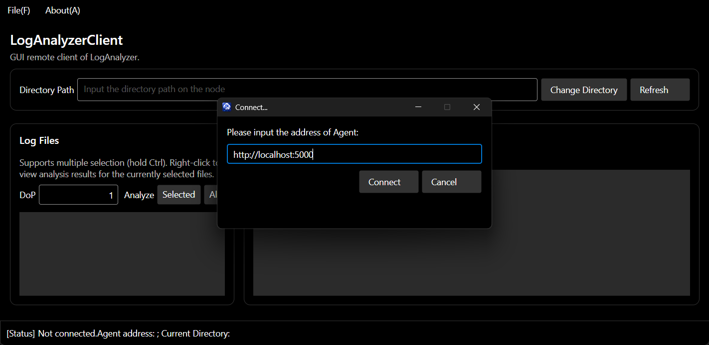

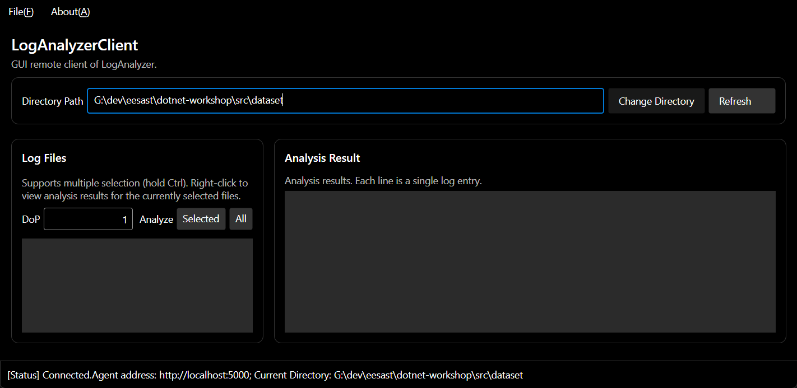

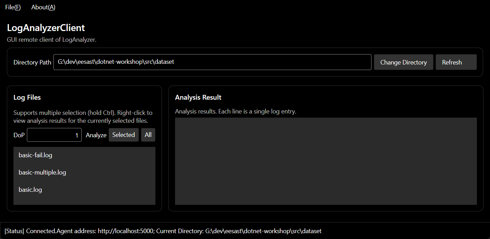

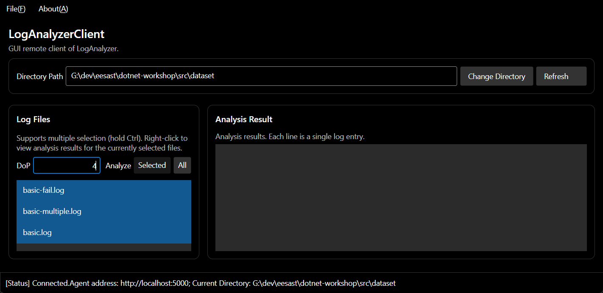

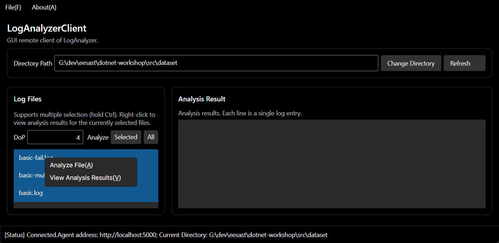

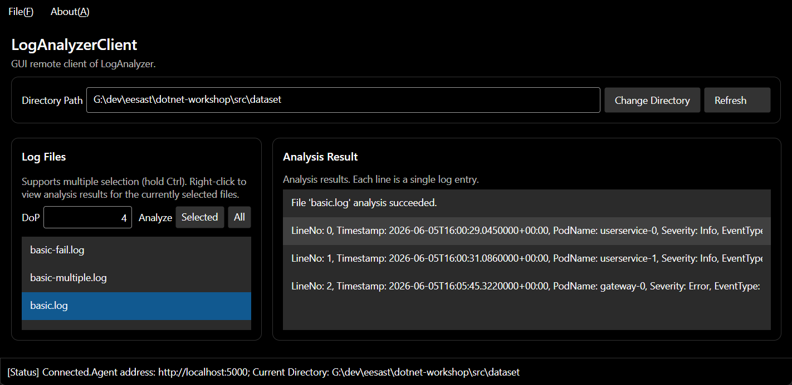

## 鲁棒性测试截图

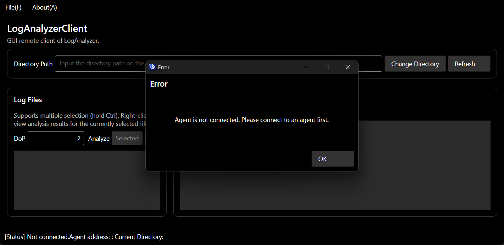

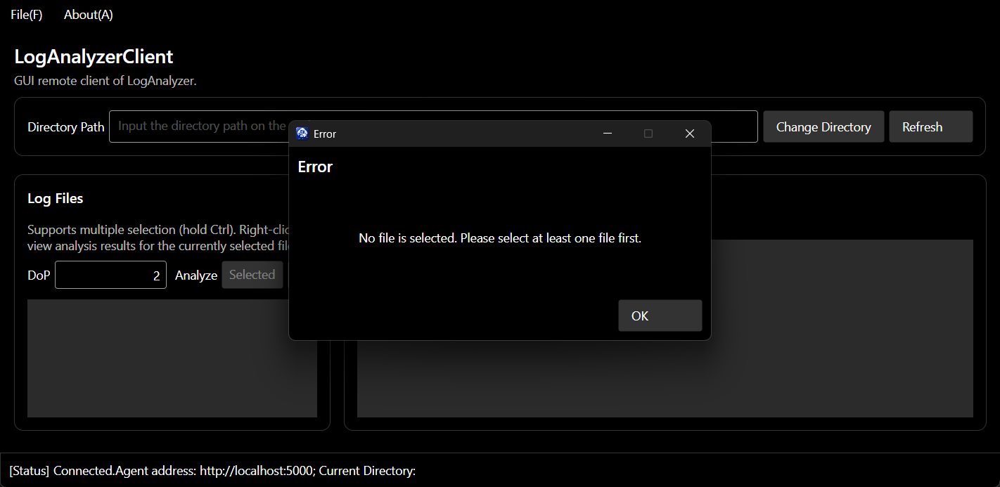

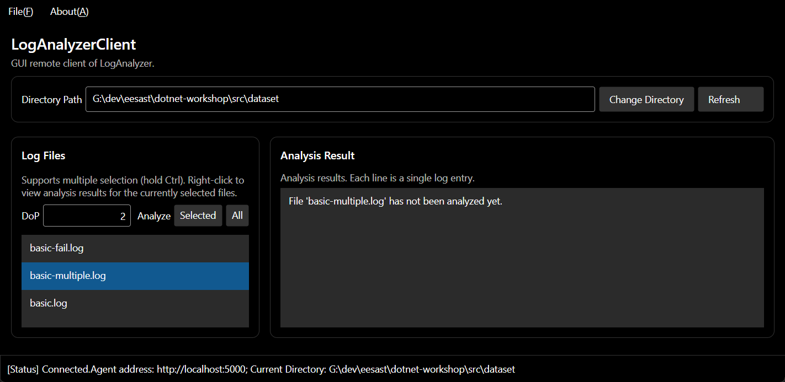

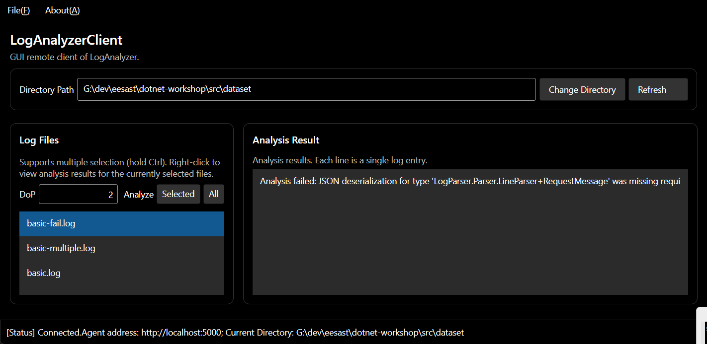

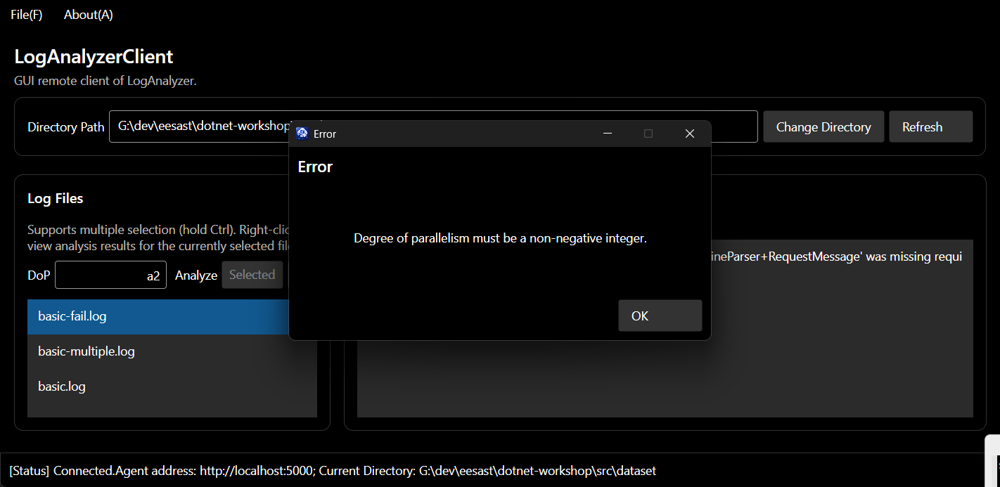

## Q4.1

 最重要的区别就是控制台程序的界面由文本组成，是一行一行的，同时只有一个输入入口，而 GUI 程序的界面由多个部分组成，用户可以同时操作多个控件，输入也可以在不同的控件中进行，需要额外花精力去规划界面布局和各种绑定关系。这次作业我感觉比之前更复杂，规划时我基本提不出什么具体的方案，都是AI提供了大量细节我再试着理解。

## Q4.2.b

本次作业使用了 AI（Coding Agent）辅助完成，回答 (Q4.2.b)。

 具体对关于使用方式的提示词在之前的几次作业中已经约定好，因此这次作业和AI的交流基本都是确定这次作业的实现方案。除此之外，我还让AI帮我详细的讲了一下工厂方法模式，以及在写本md文档时填充代码中具体变量名等。

 这次测试时没发现AI的错误，第一次测试时就通过了。
