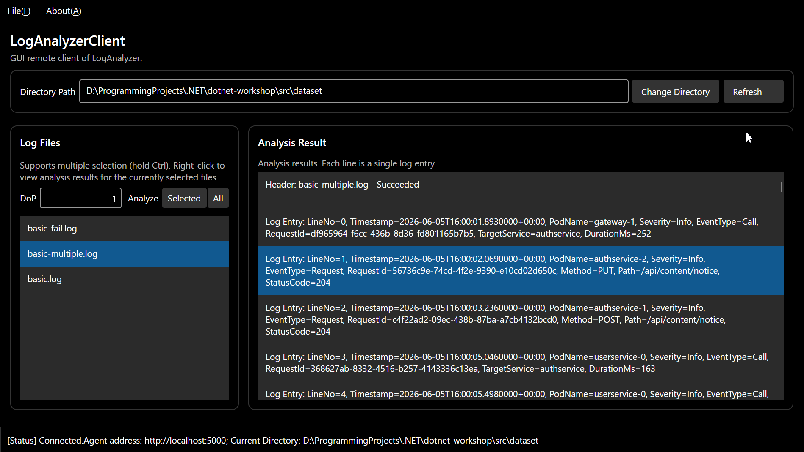
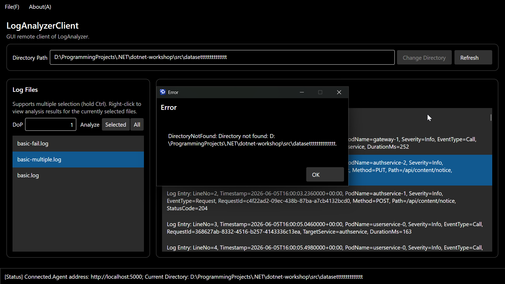

## Q4.1
- 感觉GUI界面最大的特点就是用户与程序的交互变得多元化了，比如光一个按钮就可能有左键、右键、点击、长按、拖动等多种交互方式。并且UI设计的层次性、美观性也有要求。如何让UI交互直观、顺手、不卡顿闪退，都是难点。
- 编程过程中更加体会到了异步编程的重要性，UI的流畅性无比重要，不能每点一下就卡一会儿
- 异步编程并非顺序运行，因此经常感到程序的时序混乱，比如此处要不要等？能容忍多久的延迟？返回之后如何处理？都会带来一些困惑
## Q4.2
有使用
- AI主要负责自动补全，解释一些语句、接口的用法，以及帮忙找bug
- 提示词：解释一下xxx的用法与参数含义/根据04-avalonia中的指南，看看我刚写的ui实现是否正确稳健，之后检查一下xxx的报错原因
- 至少在自动补全方面，AI经常捏造出各种各样实际不存在的字段或参数，比如往`var request = new ChangeDirectoryRequest()`的构造函数加了个不知哪来的`Force = true`，这时就只能翻定义
- 确有了解更多知识，比如CancellationToken，在gRPC中可以让服务端按需取消某些任务，比如客户端断连时触发，防止服务端做无用功