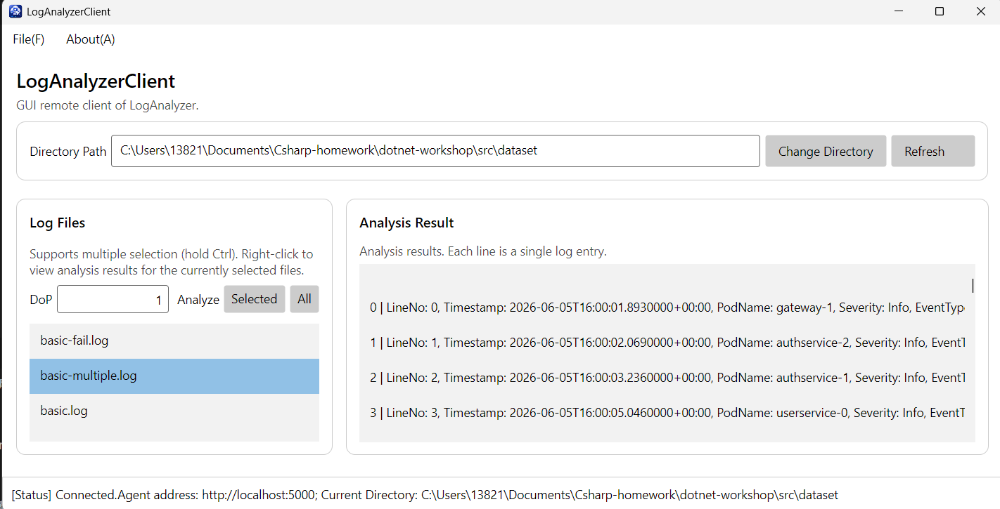
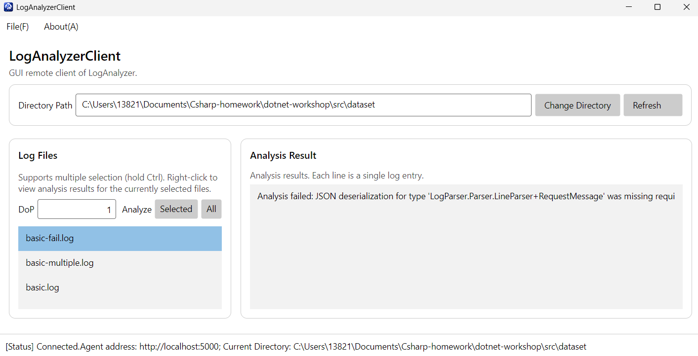
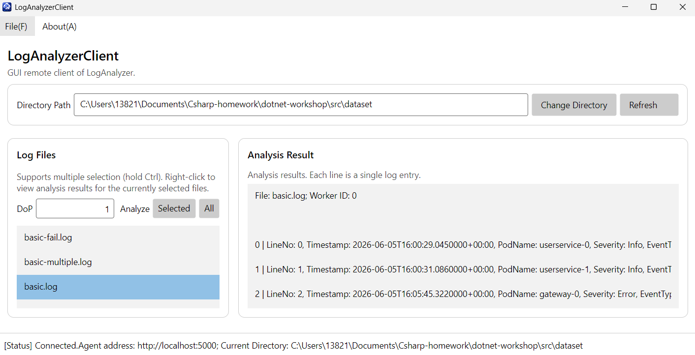
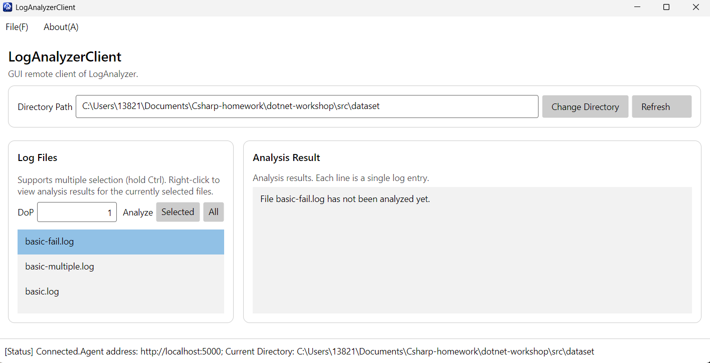
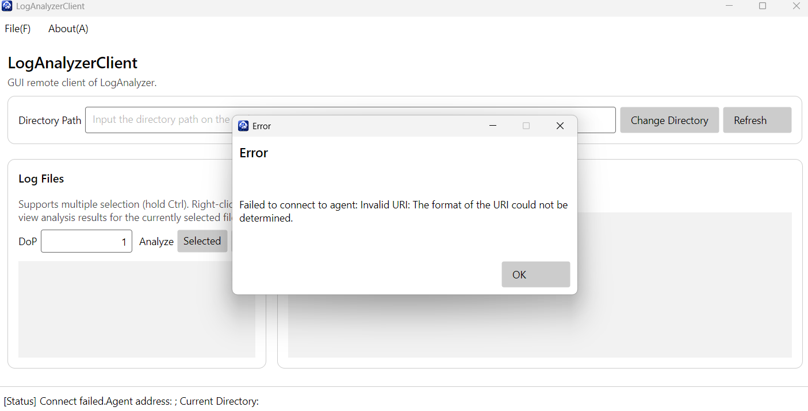

*功能汇总
刷新文件列表：连接 Agent 后支持读取并动态刷新远程目录下的日志文件。
多文件/全量分析：支持多选文件并配置并发度（DoP）进行异步批量分析，新增了“All”按钮用于一键分析全量文件。
单文件快捷分析：支持通过文件列表的右键菜单发起针对特定单文件的分析任务。
流式查看分析结果：通过 gRPC 服务端流式拉取日志，并在界面上实时呈现“分析成功（带行号与Worker ID）”、“分析失败（带详细错误堆栈）”以及“尚未分析”三种状态的排版结果。
鲁棒性与异常捕获：集成统一的弹窗提示机制，有效拦截非法输入及网络/服务端异常。
*功能截图

*鲁棒性测试

Q4.1：
开发 GUI 应用程序与控制台程序的核心区别在于其“事件驱动”和“非阻塞响应”的特性。GUI 开发的额外难点与复杂之处主要体现在严格的 UI 线程约束（必须由主线程更新控件以避免崩溃）、错综复杂的界面状态与生命周期管理，以及多线程交织带来的并发挑战。通过本次开发，对 async 和 await（尤其是异步流 await foreach）有了更深层的理解，认识到其在保持界面流畅和处理网络 I/O 管道上的威力；不过，异步编程也带来了控制流和异常捕获的复杂化，全链路异步化稍有不慎便容易引发死锁或异常处理难题。
Q4.2:
在这项作业中，我对 AI 的使用涵盖了询问 gRPC 与异步流（await foreach）的接口用法、排查具体的编译与通信报错（如异常捕获及数据模型绑定问题），以及让 AI 协助完成部分视图模型的逻辑代码。在协助过程中，AI 曾因未注意到数据模型中属性的硬编码而导致界面显示出现偏差，经指出后修正了代码。通过与 AI 的协作，我不仅理清了客户端与服务端通过 gRPC 流式传输的交互机制，还对 async/await 在保持 GUI 界面响应性及处理非阻塞网络 I/O 上的应用有了更深入的理解。