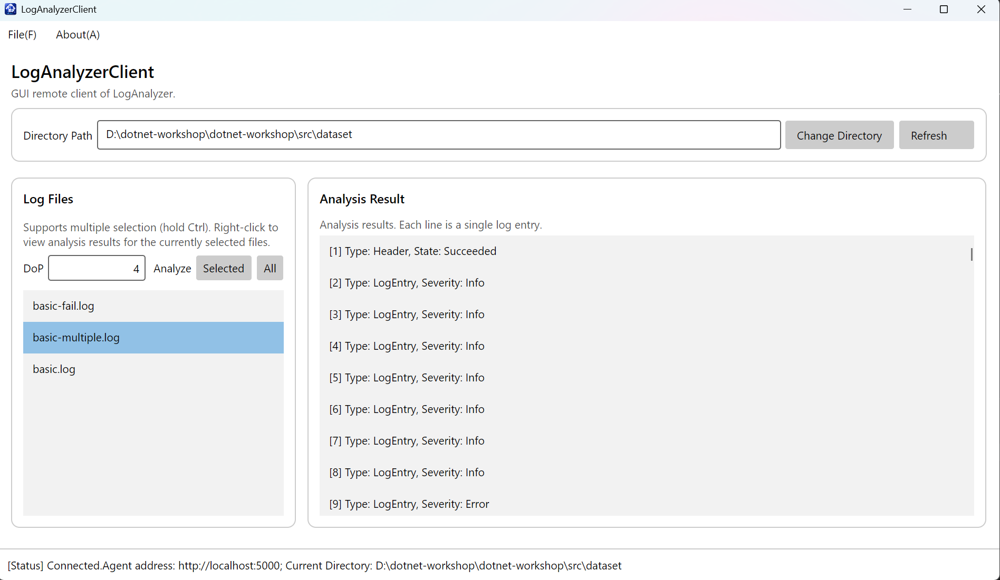

# 04-avalonia 实验报告

## 1. 功能介绍

本项目基于 Avalonia UI 框架实现了一个图形界面的日志分析客户端，完整复刻并扩展了控制台版本的功能。具体实现的功能如下：

*   **刷新日志文件列表**：用户可以点击界面的 Refresh 按钮，通过发起 RPC 请求实时获取服务端指定目录下的最新日志文件，并更新显示在 Log Files 列表中。
*   **分析选中的多个文件**：支持通过按住 Ctrl 键在列表中多选文件。点击 Selected 按钮后，客户端将所选文件名和输入的并行度（DoP）发送给服务端进行批量分析。
*   **分析全部文件**：在界面上新增了 All 按钮，允许用户一键提交当前目录下的所有文件进行分析，无需逐一选中。
*   **右键菜单分析指定文件**：为文件列表添加了右键上下文菜单，用户可以直接右键点击某个特定的日志文件并选择“Analyze File(A)”进行针对性分析。
*   **查看并显示分析结果**：通过右键菜单的“View Analysis Results(V)”选项，可以通过服务端流（Server Stream）持续获取特定文件的日志分析结果。结果列表（Analysis Result）能够根据返回的日志状态及内部字段进行动态格式化并直观展示。
*   **异常拦截与鲁棒性保障**：在发起所有请求前均加入了对并行度（如负数或非数字）及选中状态的合法性校验。对于底层 gRPC 通信异常或服务端的报错，统一通过图形化的消息对话框（MessageDialog）向用户提示，确保程序在遇到非法输入或内部错误时绝对不会崩溃。

## 2. 完整功能截图

## 3. 问答题

### (Q4.1) 你认为，你在开发 GUI 应用程序，与你在以往开控制台应用程序的区别在哪里？GUI 应用程序的开发存在哪些额外的难点？存在哪些额外的复杂之处？你是否有通过编写 GUI 应用程序对异步 `async` 和 `await` 有了更进一步的理解？异步编程是否又给你带来的额外的困扰？说说你的看法。
> 控制台只能让用户线按顺序线性地操作，而gui可以让用户多方面打乱顺序操作
> 难点在于对异步通信的要求更高，主线程ui渲染绝对不能被卡死
> 有，这个异步操作保证了程序在等待gpc响应是仍然能与用户进行交互
> 代码实现与逻辑上更为复杂，并且异步编程一些语法容易在编写时疏漏
### (Q4.2) 本次作业中，你是否使用了 AI？根据你的使用情况，在以下 (Q4.2.a) (Q4.2.b) 两个问题中选择一题作答：

#### (Q4.2.b) 如果使用了 AI，你给予 AI 的提示词是什么？你对 AI 的使用是询问 AI 一些接口的用法、gRPC 的使用，或是在某处的写法，还是让 AI 帮你写一部分作业代码，又或是让 AI 给你讲解代码框架？AI 的解答是否出现过错误（如果有，是哪些）？你从 AI 那里是否得知了一些关于异步，或是 gRPC 等原本你不知道或是难以理解的知识？
> 项目到了这个整个项目结构已经比较复杂，故本节使用ai，问题中三种情况均存在。
> 本节中没有出现错误，我从ai获得过未知以及之前遗忘的知识。

