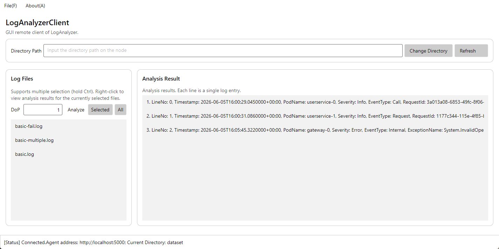
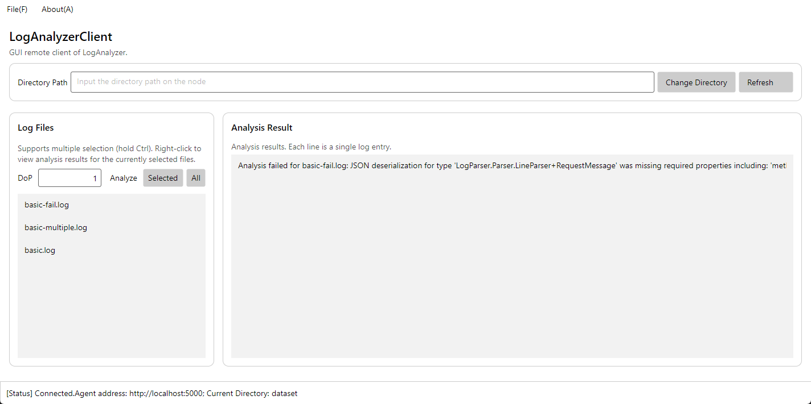
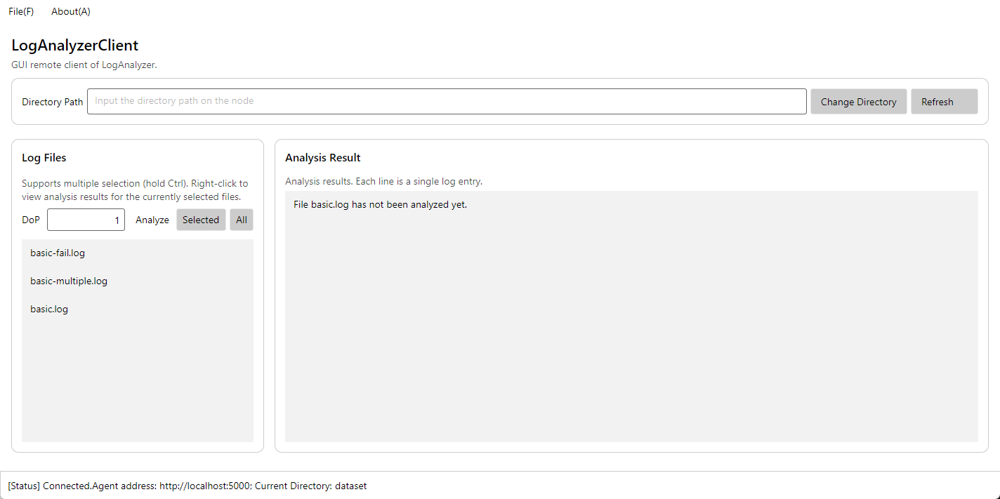
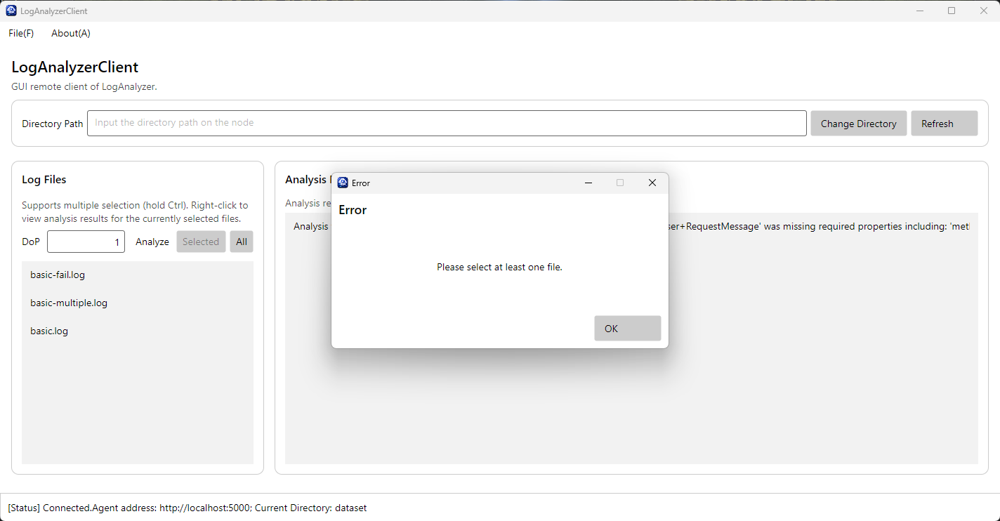
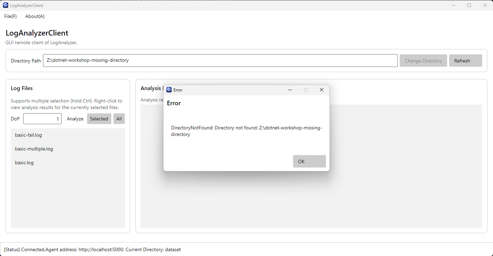

# Avalonia 作业报告

## T4.1

实现了目录刷新、多选和全部分析以及右键单文件分析和结果查看；同时校验连接，文件选择，并行度及服务端错误。

### 功能测试

分析成功：

分析失败：

尚未分析：

### 鲁棒性测试

非法并行度：

未选择文件：

无效目录：

## Q4.1

GUI需处理状态、交互和UI线程；异步可避免界面卡顿，但增加了异常与状态管理复杂度。

## Q4.2

使用了AI，提示词为：“请根据项目中已经实现的RemoteCli，完成T4.1的图形界面客户端”。