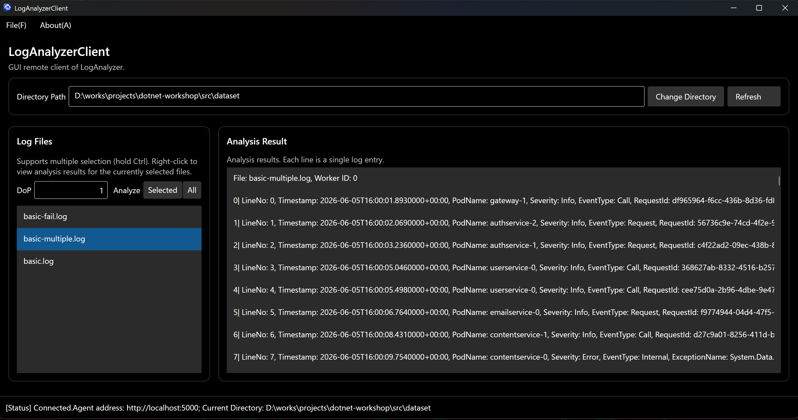
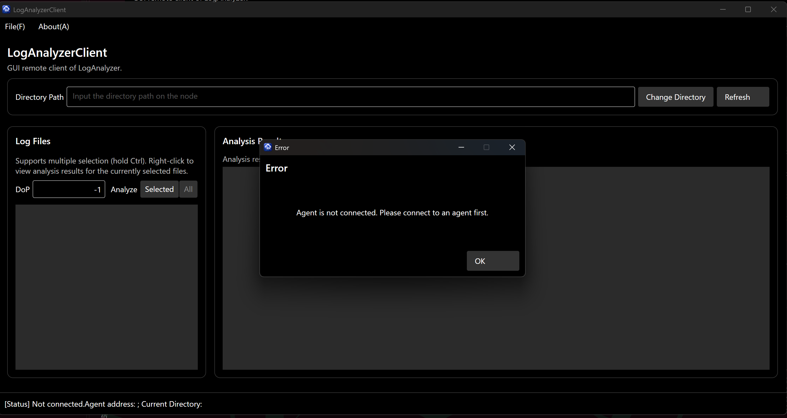
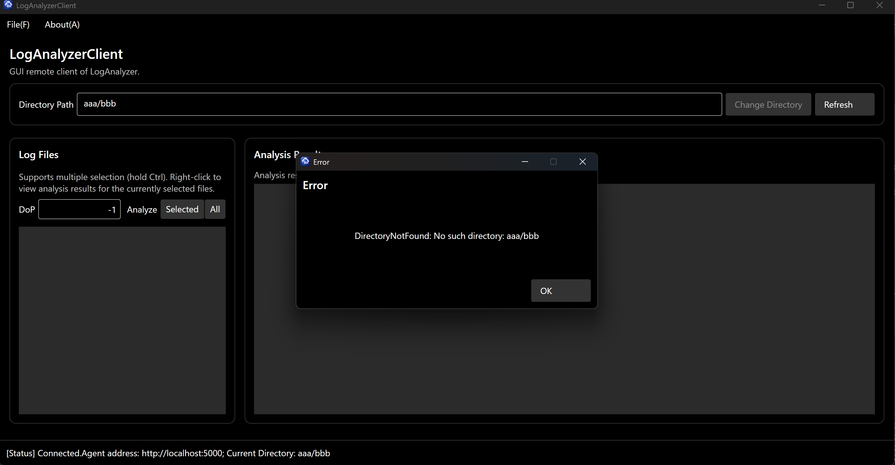
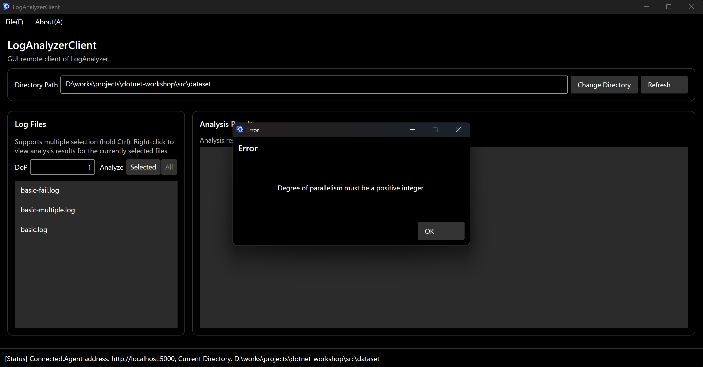

已完成guidance.md中要求的所有功能，包括连接Agent、分析文件、显示分析结果等

鲁棒性测试：

### (Q4.1)

你认为，你在开发 GUI 应用程序，与你在以往开控制台应用程序的区别在哪里？GUI 应用程序的开发存在哪些额外的难点？存在哪些额外的复杂之处？你是否有通过编写 GUI 应用程序对异步 `async` 和 `await` 有了更进一步的理解？异步编程是否又给你带来的额外的困扰？说说你的看法。

区别在于还要额外关注元素在界面中的布局，UI编写更复杂，以及多使用异步编程和回调函数等机制。async和await对于GUI程序可以避免长时间耗时操作（如网络请求）阻塞GUI线程，造成反馈迟钝等问题。使用async和await进行异步编程总体和同步代码差异不大。

### (Q4.2)

本次作业中，你是否使用了 AI？根据你的使用情况，在以下 (Q4.2.a) (Q4.2.b) 两个问题中选择一题作答：

#### (Q4.2.a)

如果没有使用 AI，你花了大约多长时间完成了整个 `04-avalonia`？你是否借助了传统搜索引擎来完成本节？你认为本节的难度是是否显著高于编写普通的控制台应用程序的难度？你是否卡在某一处花费较长时间（如果有，是哪处）？

未使用AI，花费1小时完成。并未借助搜索引擎。由于框架整体已经搭好大部分代码可以直接迁移并不存在多少难度。