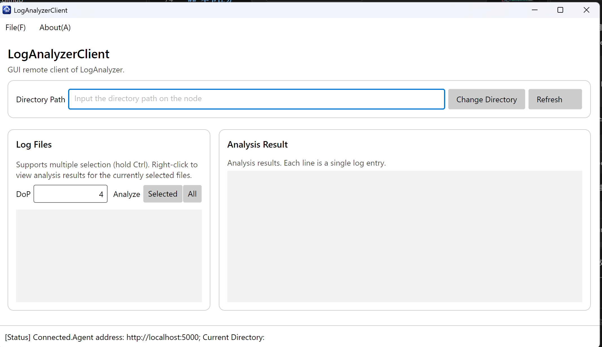
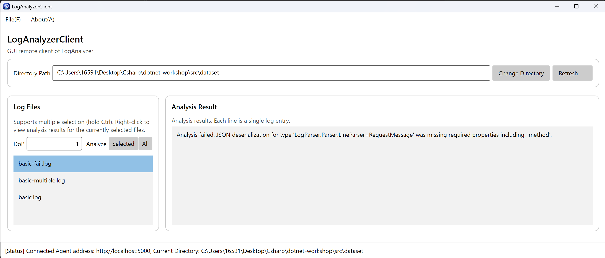
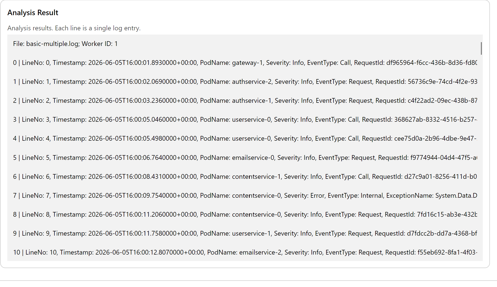
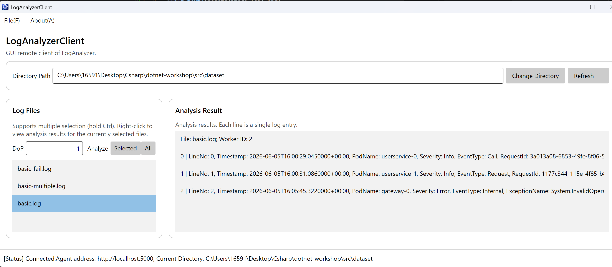
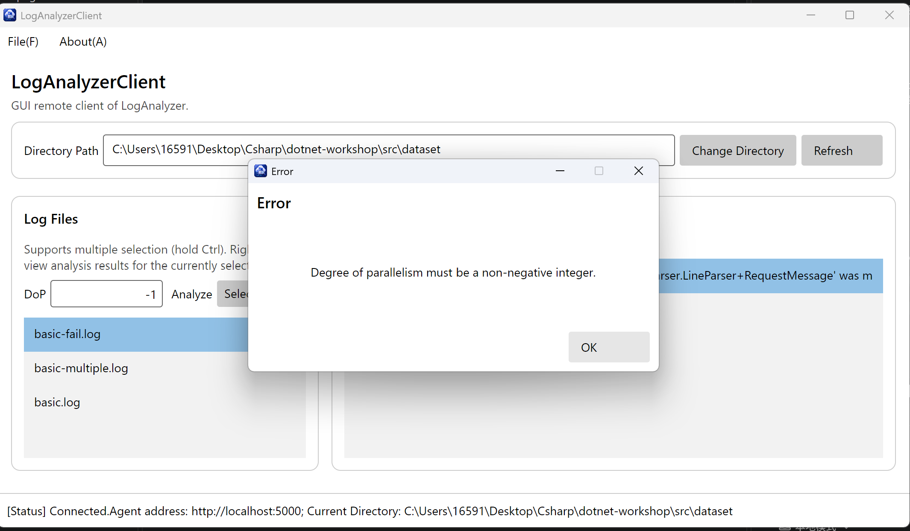
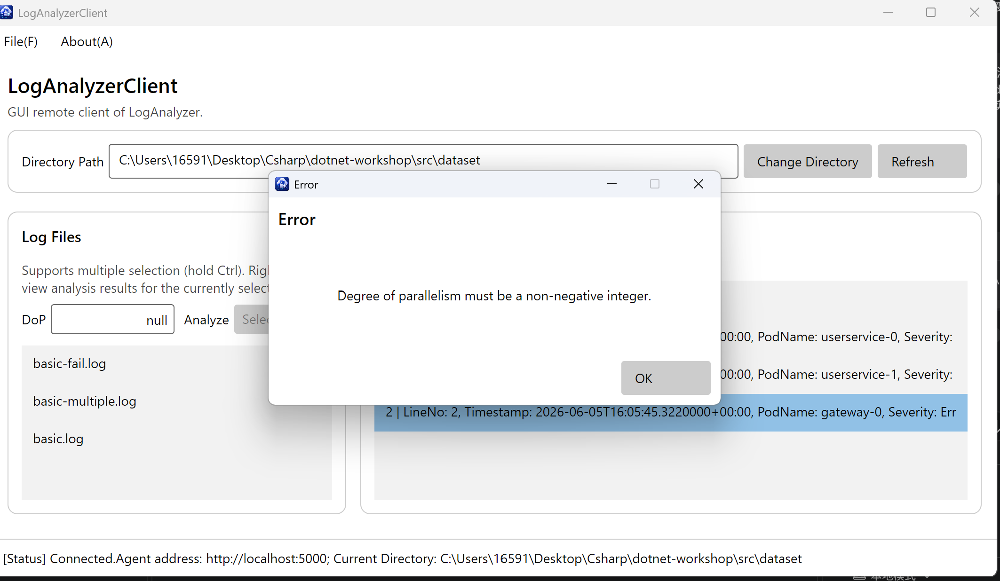
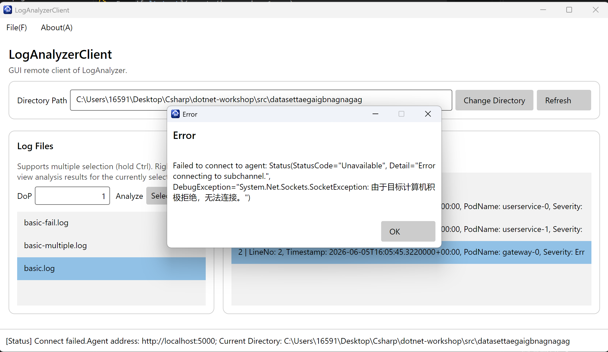

# T4.1 Avalonia 图形界面客户端实现报告

## 实现的功能

本次我 `LogAnalyzerClient` 中所有 `TODO: T4.1` 的功能：

1. **刷新日志文件列表**：`RefreshAsync` 异步调用 `GetLogFiles` RPC，并使用返回的文件名更新 `LogFiles`。如果 Agent 返回失败状态，则通过消息框提示错误。
2. **分析选中的多个文件**：`AnalyzeSelectedFilesAsync` 将 `SelectedFiles` 传入 `AnalyzeFiles` RPC
3. **目前支持分析全部文件**
4. **查看分析结果**，可以通过右键查看结果

## 功能截图

### 完整界面

客户端成功连接到 Agent，界面包含日志目录操作、刷新按钮、并行度输入框、`Selected` 和 `All` 分析按钮，以及分析结果列表。

### 分析失败的日志文件

对于内容不符合日志格式的文件，客户端能够显示 Agent 返回的具体解析失败原因。

### 显示多条日志的分析结果

分析结果中显示文件名、工作线程编号，并按序号展示每条日志的全部字段。

### 显示普通日志文件的分析结果

客户端能够正确显示包含 Call、Request 和 Internal 等不同事件类型的日志字段。

## 鲁棒性测试

### 并行度为负数

输入 `-1` 时，请求不会发送到 Agent，客户端弹出消息框提示并行度必须为非负整数。

### 并行度不是整数

输入 `null` 等非整数文本时，客户端能够识别非法输入并显示错误信息。

### Agent 地址不可用

当目标地址或端口没有 Agent 监听时，连接异常会被捕获，并通过消息框显示连接失败信息，程序不会崩溃。

## Q4.1

区别主要在于：GUI应用程序中，采用了MVVM的架构，分离了前端，后端与其中的传输处理，但是这也带来了清晰的好处：能够分别在model,view,veiwmodel中处理后端，前端与传输，所以相比于之前的开发，我认为主要的难点与复杂点是吧MVVM架构学习明白。

## Q4.2
我使用了AI，提示词：详细地讲解MVVM架构，并具体地讲解这个项目中是如何使用这一架构的
此外，我还询问了几处报错（都是因为接口使用错误导致的），并进行了修复。