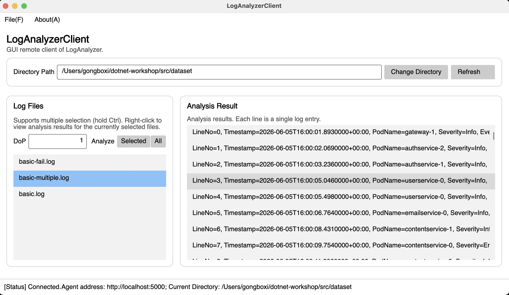
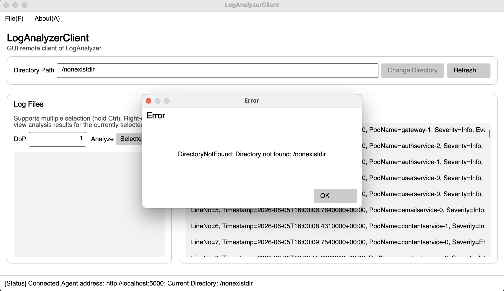

# Report for Avalonia

## 功能实现简介

本节在 `03-async-grpc` 的基础上，用 Avalonia UI 框架编写了一个图形界面的日志分析客户端 `LogAnalyzerClient`，替代上一节的 `RemoteCli`。采用 MVVM 模式（`CommunityToolkit.Mvvm`），并实现了以下功能：

1. **连接 Agent**：通过 `File → Connect...` 菜单输入远程 Agent 地址并连接（`ConnectAsync`，已由框架给出）。
2. **Change Directory**：输入目录路径并切换 Agent 的日志目录。
3. **Refresh**：刷新日志文件列表（`RefreshAsync`，调用 `GetLogFiles` RPC）。
4. **多选分析**：按住 Ctrl 多选文件后点击 `Selected` 按钮分析选中文件（`AnalyzeSelectedFilesAsync`，调用 `AnalyzeFiles` RPC）。
5. **全部分析**：新增 `All` 按钮，分析目录下全部日志（`AnalyzeAllAsync`，调用 `AnalyzeAll` RPC）。
6. **右键单文件分析**：右键菜单 `Analyze File` 分析当前文件（`AnalyzeRightClickedFileAsync`）。
7. **查看分析结果**：右键菜单 `View Analysis Results` 流式获取并显示分析结果（`GetAnalysisResultAsync`），区分"分析成功/失败/未分析"三种展示（`LogFields.Summary`）。

所有 gRPC 调用均为异步（`async`/`await`），避免阻塞 UI 线程；所有异常与非法输入均通过消息框提示，保证 GUI 不崩溃。

### 完整功能截图

完整功能包括：连接 Agent → Change Directory → Refresh 展示文件列表 → Selected/All 分析 → 右键 View Analysis Results 展示结果。

### 鲁棒性测试截图

覆盖场景：未连接 Agent 时点击按钮（弹出"请先连接"提示）、输入非法并行度（负数或非数字）、输入不存在的目录、查看不存在的文件、查看尚未分析的文件（"未分析"提示）、查看分析失败的文件（错误信息）。

---

## Q4.1

我认为开发 GUI 应用程序与开发控制台应用程序最大的区别在于：

1. **交互模型完全不同**：控制台是"一问一答"的顺序式输入输出；GUI 则是事件驱动的，程序被动地响应用户在任意时刻、任意控件上的操作，需要为每个交互（按钮、菜单、右键、多选）绑定对应的事件/命令。
2. **必须保证 UI 线程不被阻塞**：GUI 只有一个 UI 线程负责渲染与响应，一旦阻塞（如同步等待网络），界面就会"卡死"。因此所有耗时操作（这里是 gRPC 调用）都必须异步 `await`，让 UI 线程在等待时能继续响应。这让我对 `async`/`await` 的理解从"语法"上升到了"为什么非用不可"——控制台里同步异步差别不大，但 GUI 里同步调用就是致命的。
3. **引入 MVVM 分层**：控制台可以直接把逻辑写在 `Main` 里，而 GUI 需要把"界面（View）"与"数据/逻辑（ViewModel）"解耦，用数据绑定（`Command`、`ItemsSource`、`ObservableProperty`）连接两端，结构更复杂但更易维护。
4. **状态可视化与一致性**：状态栏、文件列表、结果列表等都需要随操作实时更新（`ObservableCollection`），必须处理好集合的线程/通知问题。

异步编程确实带来了一些额外困扰：命令是 `async` 的，出错点分散在各个异步调用中，需要逐一 `try/catch` 并用消息框兜底；此外 ViewModel 无法直接拿到 ListBox 的全部选中项，需要通过代码后置（`SelectionChanged`）回写 `SelectedFiles`，这也是 MVVM 与 GUI 框架能力之间的折衷。

---

## Q4.2

### Q4.2.b

本次作业我使用了 AI 辅助完成。我给予 AI 的提示词大致是："切换到 04-avalonia 分支，阅读 guidance 文档后完成 MainViewModel 的 Refresh/AnalyzeSelected/AnalyzeAll/AnalyzeRightClicked/GetAnalysisResult 与 LogFields.Summary，并添加 All 按钮"。

我对 AI 的使用主要是：让 AI 帮我梳理 ViewModel 中已有的 `WithClientNotNull`、`DialogHelper`、`[RelayCommand]`/`[ObservableProperty]` 等框架约定，以及把 `RemoteCli` 中 gRPC 调用的逻辑平移到 ViewModel 中。

AI 的解答基本正确，但有一处典型错误需要人工修正：在 `LogFields.Summary` 中用 `field` 作为 lambda 变量名，由于 C# 14 中 `field` 已成为属性访问器的关键字，导致编译错误，需要改名为 `item`。这提醒我：即使有 AI，也要自己编译验证。此外，AI 容易忽略"未连接 Agent 时的兜底提示"和"并行度输入校验"这类 GUI 特有的健壮性细节，需要结合作业要求自行补全。

从 AI 那里我进一步明确了 MVVM 中命令绑定与 `ObservableCollection` 的用法，以及 GUI 环境下"所有网络请求必须异步"的原因。整体而言，本节难度适中偏高（GUI + MVVM + 异步的组合较复杂）。
