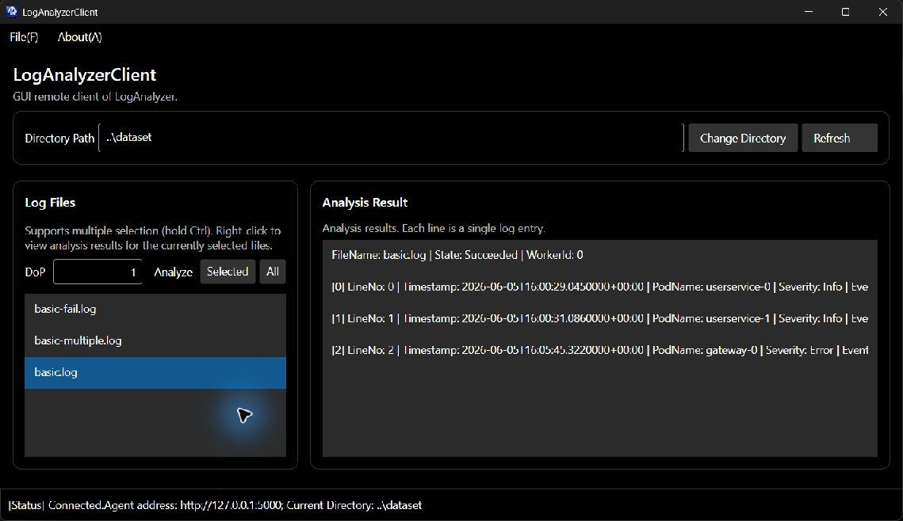
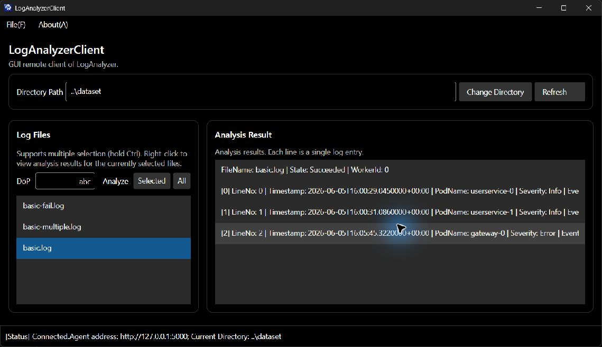
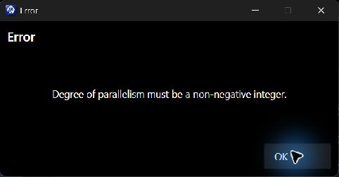

# 04-avalonia 实验报告

姓名：李易臻  
班级：秀钟31  
学号：2023013461

## 功能实现

本节补全了 Avalonia GUI 远程客户端：

- 实现刷新日志文件列表；
- 支持多选文件后分析、分析全部文件，以及通过右键菜单分析单个文件；
- 通过服务器流异步读取并显示分析结果，区分成功、失败与尚未分析状态；
- 对未连接 Agent、未选择文件、非法并行度和 RPC 错误使用消息框提示；
- 所有 gRPC 请求均使用异步调用，避免阻塞 UI 线程。

`LogAnalyzerClient.Desktop` 在 Release 配置下构建成功，结果为 0 个警告、0 个错误。随后启动真实 Agent 和 GUI 客户端，完成连接、切换目录、分析全部文件、查看 `basic.log` 结果及非法并行度输入验证。

## 运行截图

连接 Agent 并显示 `basic.log` 的分析结果：

在并行度输入框中输入非法值 `abc`：

程序弹出错误消息，而不是崩溃：

## Q4.1

GUI 应用不再按固定顺序从标准输入读取命令，而是由按钮、菜单、列表选择等事件驱动；状态还要通过绑定及时反映到界面上。本次作业中，客户端需要维护连接状态、当前目录、文件列表、选中项和结果列表，任何一项变化都可能触发 UI 更新。相比控制台程序，额外难点是 UI 线程不能被网络调用阻塞，所以 RPC 必须异步 `await`。异步让界面在请求期间仍能响应，但也带来了异常传播、重复点击和状态更新时机等问题，需要把输入检查、RPC 状态检查和消息框提示统一处理。

## Q4.2.b

本次作业使用了 AI。主要提示是要求 AI 根据 `04-avalonia` 讲义和已有 MVVM 框架补全全部 TODO，实际构建并运行 GUI 验证。AI 协助实现了 RelayCommand、异步 gRPC 调用、流式结果转换、结果摘要和错误消息框。编译时曾遇到 C# 14 将 `field` 视为属性访问器关键字的问题，改名后 Release 构建达到 0 警告、0 错误。之后没有只依赖编译结果，而是连接真实 Agent，点击 “All” 分析并通过右键菜单查看结果，还用 `abc` 验证了非法并行度会弹窗提示。我因此更直观地理解了 `async`/`await` 对 GUI 响应性的意义。
