# 04-avalonia 实验报告

## 一、T4.1 功能说明

`LogAnalyzerClient` 是一个基于 [Avalonia UI]的跨平台图形界面客户端，用于替代上一节的控制台客户端 `RemoteCli`。它包含 `RemoteCli` 的全部功能：连接 Agent、切换日志目录、刷新文件列表、（按并行度）分析选中 / 全部 / 右键单个文件、以及流式查看分析结果。整个客户端采用 MVVM 模式编写，借助 `CommunityToolkit.Mvvm` 的 `[ObservableProperty]` 与 `[RelayCommand]` 源生成器大幅减少了样板代码。

### 1. 实现的功能

| 入口 | 功能 | 对应的 gRPC 异步调用 | 说明 |
| :--- | :--- | :--- | :--- |
| `File → Connect...` | 连接到 Agent | `PingAsync` | 通过工厂 `AppService.ClientFactory.CreateClient` 创建 gRPC Client，再 `Ping` 验证连通性 |
| `Change Directory` 按钮 | 切换 Agent 的日志目录 | `ChangeDirectoryAsync` | 框架已实现，切换成功后自动刷新文件列表 |
| `Refresh` 按钮 / `File → Refresh` | 刷新日志目录文件列表 | `GetLogFilesAsync` | 用返回的 `file_names` 重建 `LogFiles` |
| `Analyze → Selected` 按钮 | 分析多选的若干文件 | `AnalyzeFilesAsync` |参数为 `SelectedFiles`（由 `LogFileListBox_SelectionChanged` 维护） |
| `Analyze → All` 按钮 | 分析当前目录全部文件 | `AnalyzeAllAsync` | 在 XAML 中新增 `All` 按钮并绑定 `AnalyzeAllCommand` |
| 右键菜单 `Analyze File` | 分析右键选中的单个文件 | `AnalyzeFilesAsync` | 参数为当前 `SelectedLogFile` |
| 右键菜单 `View Analysis Results` | 查看所选文件分析结果 | `GetAnalysisResult`（`ResponseStream.ReadAllAsync`） | 逐条接收并填充 `ResultEntries` |
| Analysis Result 列表 | 展示分析结果 | —— | `LogFields.Summary` 负责每行的文本格式 |

### 2. 关键实现要点

1. **全异步调用**：图形界面程序只有单一的 UI 线程负责渲染与响应，任何阻塞都会让程序看起来「卡死」。因此所有的 gRPC 调用都使用 `Async` 版本并 `await`；对于服务端流式接口 `GetAnalysisResult`，使用 `await foreach (var response in call.ResponseStream.ReadAllAsync())` 逐条读取。

2. **统一的异常兜底 `WithClientNotNull`**：所有需要客户端的命令都套在 `WithClientNotNull` 中。它先检查是否已连接（`_client is null` 时弹出提示），再用 `try/catch (Exception)` 兜住一切 gRPC 网络异常与内部错误，转为消息框，保证「GUI 程序绝不应因用户非法输入或内部错误而崩溃」。

3. **输入校验前置**：
   - 并行度通过 `TryGetDegreeOfParallelism` 校验，必须是**非负整数**（`0` 表示使用 `ProcessorCount`），非法时弹框提示并不发起请求。
   - 「分析选中文件」会检查 `SelectedFiles.Count == 0`；「右键分析 / 查看结果」会检查 `SelectedLogFile is null`，避免空引用。

4. **服务端返回状态二次检查**：除了捕获网络层的 `RpcException`，还对每个响应的 `OperationStatusMessage.Success` 做检查，失败时将 `Code: Message` 通过消息框展示给用户。

5. **流式结果解析**（`GetAnalysisResultAsync`）：根据 `PayloadCase` 分别处理：
   - `Header`：按 `State` 分三种情况——`NotAnalyzed` 显示「尚未分析」提示；`Failed` 显示 `Analysis failed: {ErrorMessage}`；`Succeeded` 继续接收后续条目。
   - `LogEntry`：经 `GrpcTypeConverter.ConvertFromGrpc` 转回内部 `LogEntry`，再用 `KeyValueVisitor` 转成键值对，包装成 `LogFields` 加入 `ResultEntries`。每次查看前先 `ResultEntries.Clear()`，避免与上次结果混淆。

6. **`LogFields.Summary` 的显示格式**：
   - 普通日志条目：`序号 | Key: Value, Key: Value, ...`（与示例截图一致，序号取日志的 `LineNo`）。
   - 错误 / 未分析：直接展示 `ErrorMessage` 文本（如 `File 'xxx' has not been analyzed yet.`）。

7. **新增 `All` 按钮**：在 `MainView.axaml` 的分析操作 `Grid` 中，把列定义从 `Auto,*,Auto,Auto` 扩展为 `Auto,*,Auto,Auto,Auto`，在 `Selected` 之后追加 `All` 按钮并绑定 `AnalyzeAllCommand`。

### 3. 运行方式

GUI 客户端需要**同时**运行 Agent（服务端）与客户端两个程序。下面所有截图均按以下命令启动：

```bash
# 终端 1：启动 Agent（gRPC 服务端，监听 http://localhost:5000）
dotnet run --project src/LogAnalyzerAgent

# 终端 2：启动 Avalonia 桌面客户端
dotnet run --project src/LogAnalyzerClient/LogAnalyzerClient.Desktop
```

> 客户端启动后，点击菜单 `File → Connect...`，在弹窗中输入 `http://localhost:5000` 即可连接。
> 测试所用日志目录（任选其一填入 *Directory Path* 输入框）：
> - `src/dataset`（含 `basic.log`、`basic-fail.log`、`basic-multiple.log`）
> - `src/dataset/multiple-logs`（含 30 个 `20260701.log` ~ `20260730.log`）

---

## 二、功能演示截图（命令 / 操作标注）

### 1. 启动并连接到 Agent

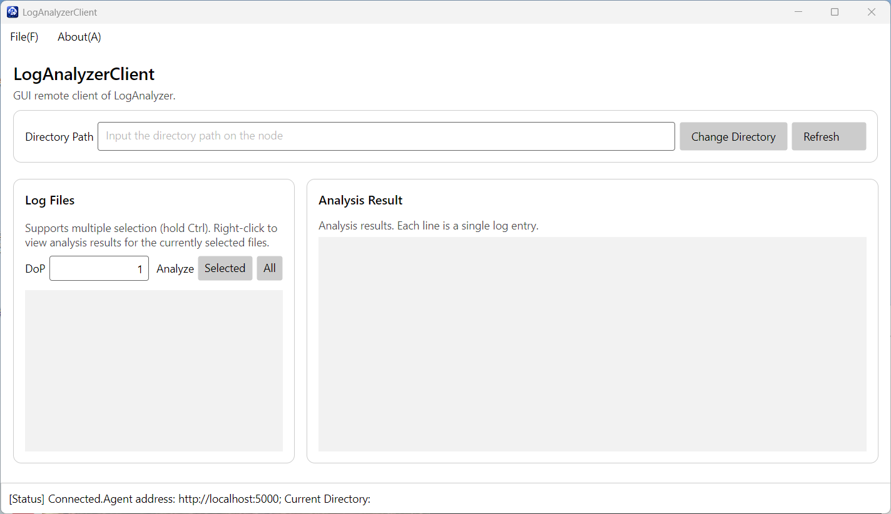

### 2. 切换目录并刷新出文件列表

在 *Directory Path* 输入框输入绝对路径 → 点击 `Change Directory`
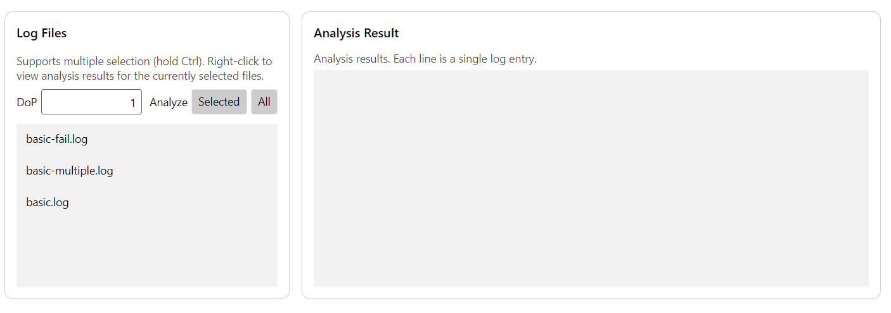

### 3. 多选文件并分析（Analyze → Selected）

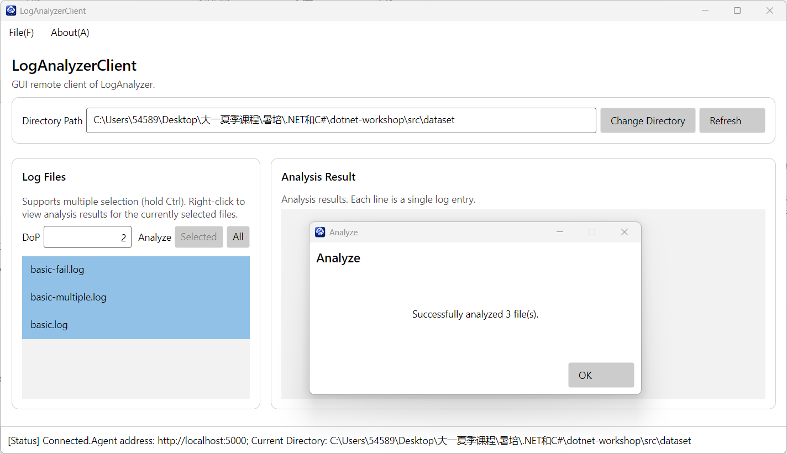

### 4. 分析全部文件（Analyze → All）

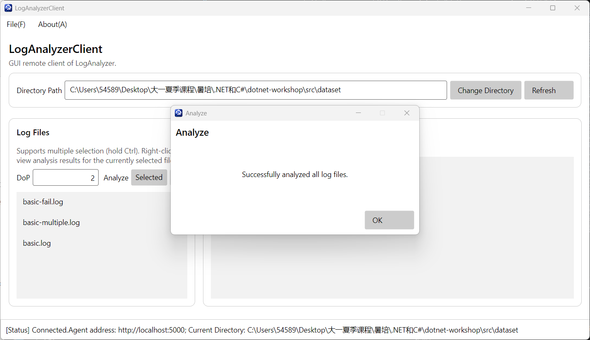

### 5. 右键分析单个文件（右键菜单 Analyze File）

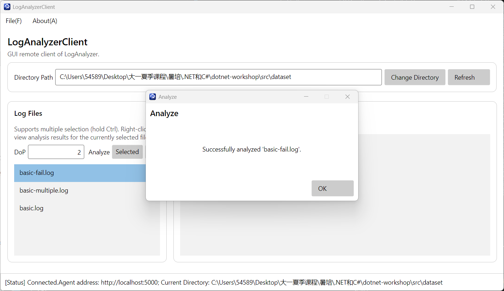

### 6. 查看分析结果（右键菜单 View Analysis Results）—— 成功

选中已分析成功的文件（如 `basic-multiple.log`）→ 右键 → 点击 `View Analysis Results(V)`（调用流式 `GetAnalysisResult`）

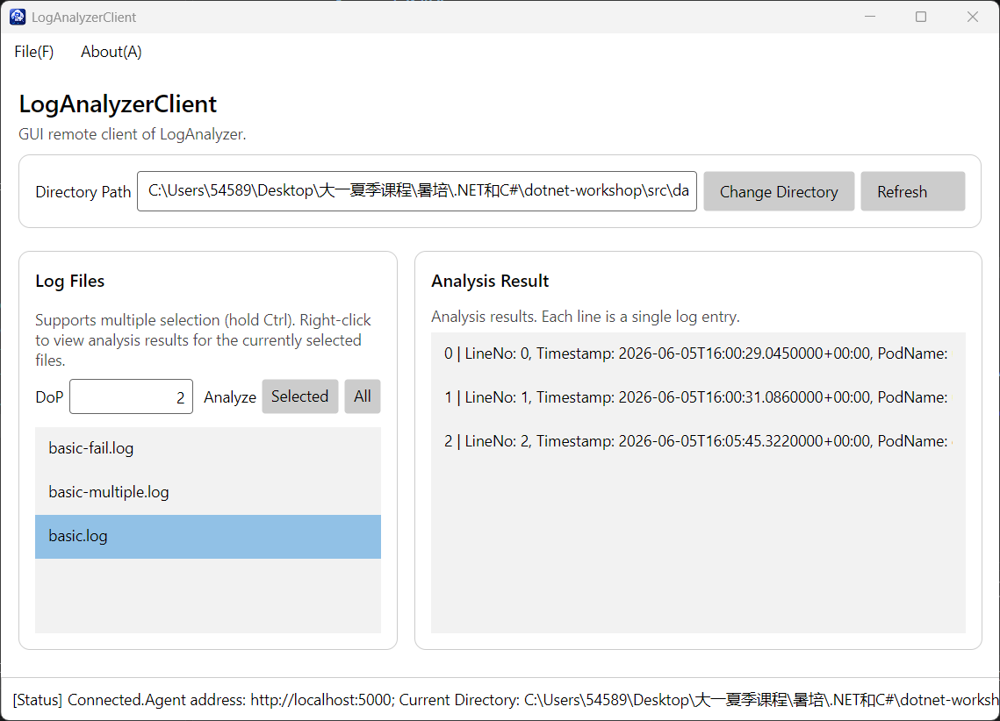

### 7. 查看分析结果 —— 失败 / 尚未分析

失败：选中 `basic-fail.log`，用 `All` 或 `Selected` 分析它（会解析失败）→ 右键 → `View Analysis Results(V)`
未分析：连接并切换目录后，**不**进行分析，直接选中某文件 → 右键 → `View Analysis Results(V)`

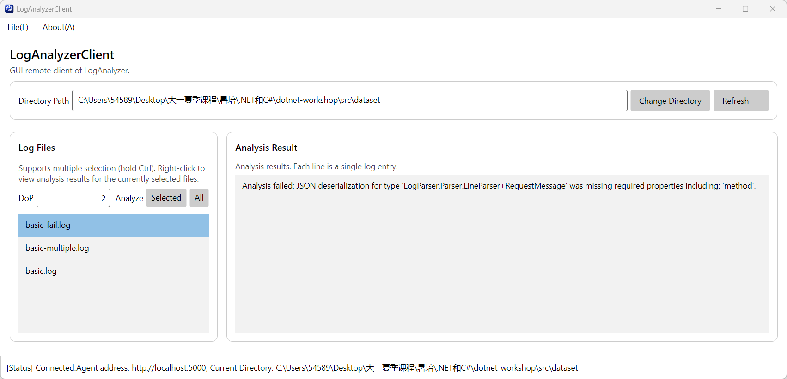
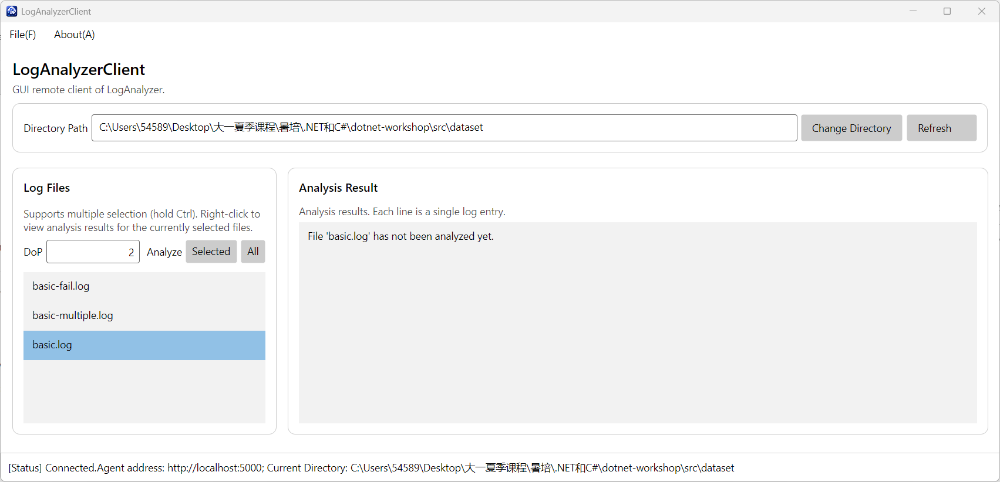
---

## 三、鲁棒性测试截图（命令 / 操作标注）

### 1. 未连接 Agent 就执行操作

**不**点击 `Connect...`，直接点击 `Refresh` / `Change Directory` / `Selected` 等任意按钮
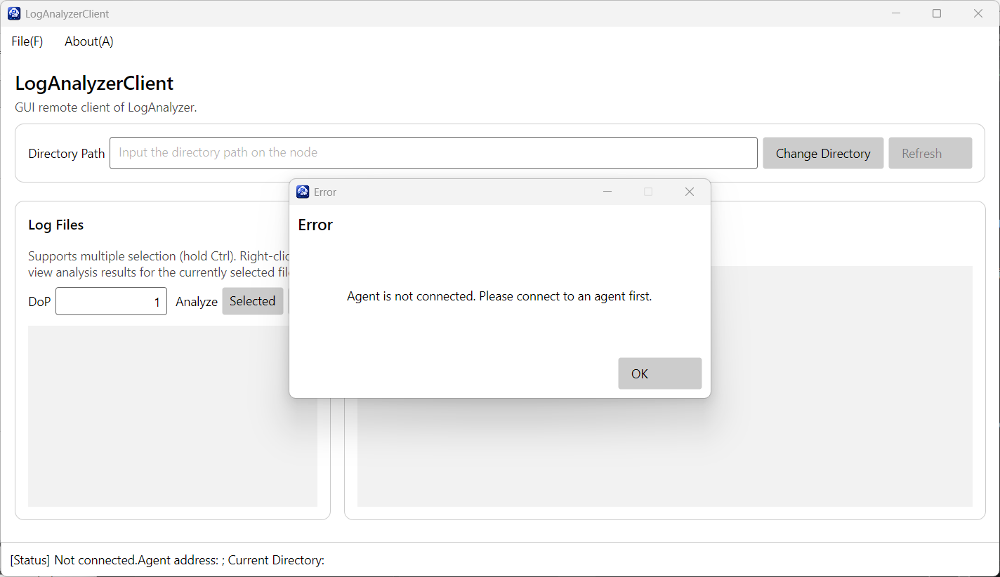

### 2. 连接到不存在的 Agent 地址

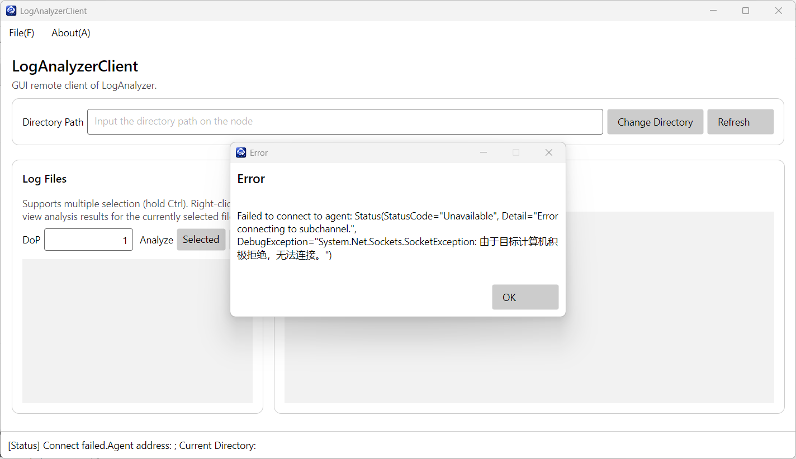

### 3. 非法的目录路径

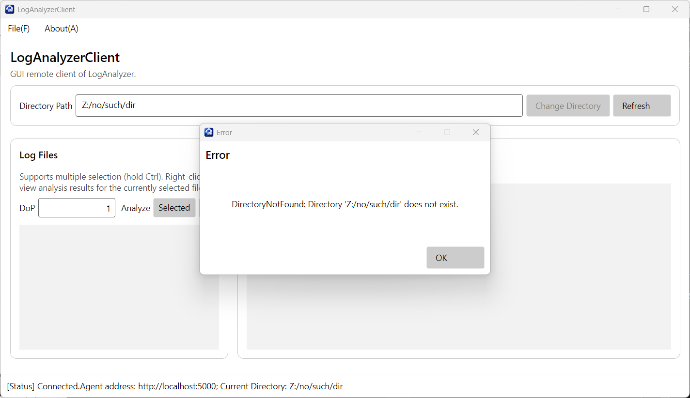

### 4. 非法的并行度输入

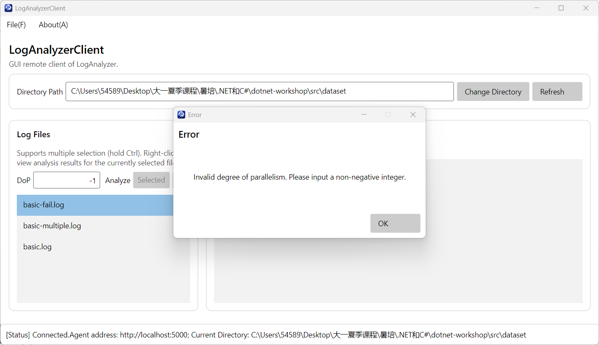

### 5. 未选中文件就点击 Selected

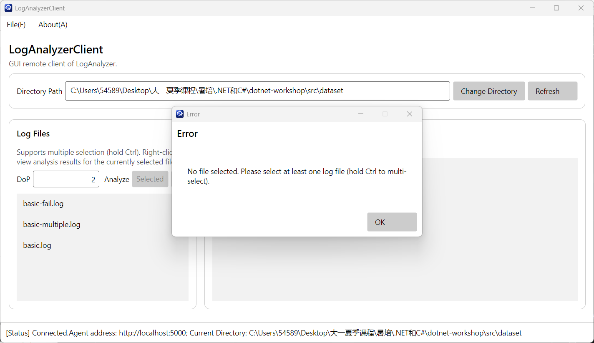

---

## 四、问答题

### (Q4.1)

**GUI 应用与控制台应用的区别：**

1. **交互范式不同**：控制台应用是「线性的一问一答」——程序主动 `Console.ReadLine` 等待输入，流程是预先确定的；GUI 应用是「事件驱动」——用户可以在任意时刻点击任意按钮、输入任意内容，程序必须随时响应，控制流不再线性。本次实现中，每个按钮 / 菜单项都被绑定到一个独立的 `ICommand`，由用户决定何时触发、以何种顺序触发。
2. **关注点分离的要求不同**：控制台应用里输入、逻辑、输出往往混在一个 `Main` 里；GUI 应用要求把**界面（View）**、**状态与逻辑（ViewModel）**、**数据（Model）**分层，即 MVVM。本次中 `MainView.axaml` 只管展示与绑定，`MainViewModel` 持有所有状态与命令逻辑，`Models` 定义纯数据结构，三者通过数据绑定协作。
3. **状态展示方式不同**：控制台靠 `Console.WriteLine` 顺序打印；GUI 靠**数据绑定**——只要 `ObservableProperty` 的值变化，界面自动刷新（如状态栏的 `ConnectStatus`、文件列表 `LogFiles`、结果列表 `ResultEntries`），无需手动「重绘」。
4. **用户输入的不可控性**：控制台输入基本是字符串；GUI 中用户可能在不该空的输入框留空、输入非法字符、在不该点击时点击、未连接就操作等。必须处处做输入校验与异常兜底。

**额外的难点 / 复杂之处：**

1. **必须理解并正确使用 MVVM 与数据绑定**：要搞清 `OneWay` / `OneWayToSource` / `TwoWay` 等绑定模式。例如文件列表用 `SelectedItem="{Binding SelectedLogFile, Mode=OneWayToSource}"`，而多选时 ListBox 无法把「全部选中项」直接绑定到 ViewModel，必须借助 `MainView.axaml.cs` 里的 `LogFileListBox_SelectionChanged` 回调手动维护 `SelectedFiles`——这是 View 与 ViewModel 边界上一个很别扭的地方。
2. **UI 线程模型与线程安全**：UI 控件只能由 UI 线程访问，而异步 gRPC 调用的延续可能在别的线程上。`ObservableCollection` 的变更必须回到 UI 线程，否则会抛异常。Avalonia 的绑定机制帮我们处理了大部分，但理解其原理是额外的心智负担。
3. **异常处理策略完全不同**：控制台里一个未捕获异常最多让程序退出；GUI 里一个未捕获异常会让整个窗口崩溃，体验极差。因此必须用 `WithClientNotNull` 这类统一的兜底，把所有异常转成**消息框**而非崩溃。
4. **调试与反馈链更长**：除了要同时启动 Agent 与 Client 两个程序（上一节的痛点依然存在），GUI 的状态分布在绑定、ViewModel、控件回调等多处，定位「为什么这一项没更新」往往要检查绑定路径、`Mode`、`x:DataType`、属性通知等多个环节。

**对异步 `async` / `await` 的进一步理解：**

通过编写 GUI 客户端，我对异步的理解确实更深了一层。在控制台里，`await` 更多是「写法上的要求」；但在 GUI 里，`await` 有了**肉眼可见的意义**——如果没有 `await` 而是同步阻塞，UI 线程会被网络 I/O 占住，整个窗口会「卡死」（拖不动、按钮无响应）。`await` 让 UI 线程在等待网络响应时返回消息循环去处理用户的其他操作（比如拖动窗口、点击别的按钮），等结果回来再继续。这让我真正体会到「异步是为了不阻塞调用线程」这句话的含义。

**异步带来的额外困扰：**

1. **「异步传染」**：一旦底层是异步的（gRPC 调用），上层调用链就得一路 `async`/`await` 到底，方法签名都要带 `Async` 后缀和 `Task`，这是无法回避的传播。
2. **异常捕获的位置变了**：异步方法的异常不会在调用处直接抛出，而是藏在返回的 `Task` 里，必须 `await` 才能观察到，漏 `await` 会导致异常被「吞掉」，排查很困难。
3. **多选回调与异步命令的时序**：`LogFileListBox_SelectionChanged` 在 UI 线程更新 `SelectedFiles`，而分析命令异步读取它，两者之间没有显式同步——靠的是 UI 单线程模型保证的串行性，理解这一点需要额外的思考。

总的来说，GUI 开发相对控制台，本质上是从「**线性流程**」转向「**事件驱动 + 数据绑定 + 多线程协作**」，复杂度显著上升；而异步编程既是 GUI 不卡死的必需品，也确实带来了一些新的心智负担。

### (Q4.2)

根据TODO框架和guidance.md完成任务××.AI能给出达成任务要求的代码并自行测试验证。有时候AI会有过度、无效兜底的问题，在这次作业中基本没有出现
---


