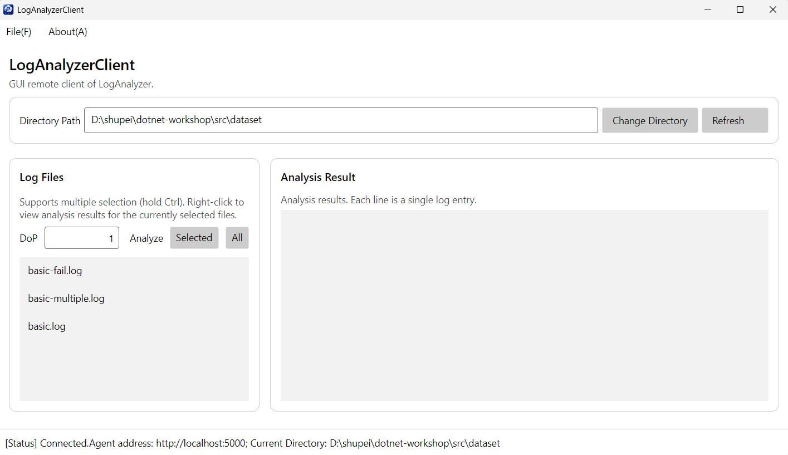
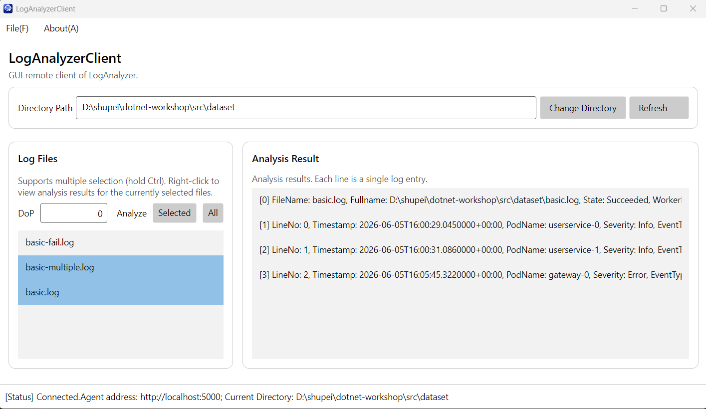
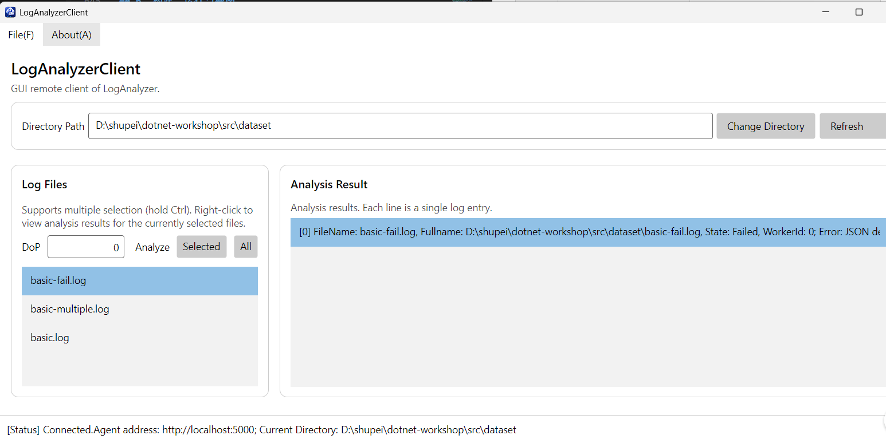
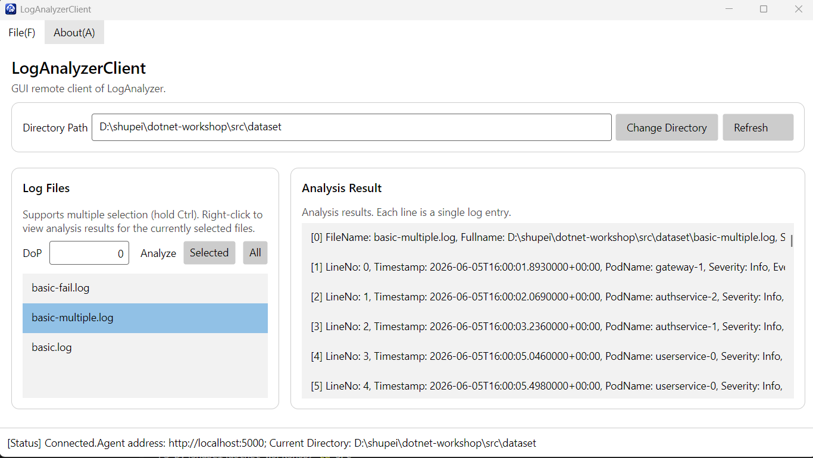
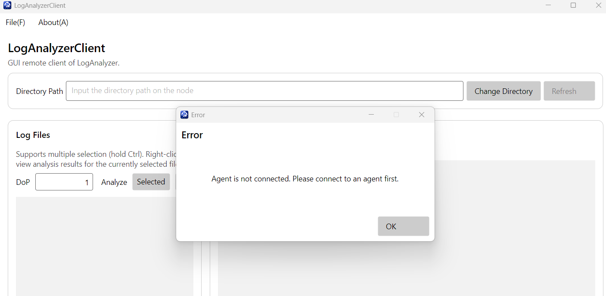
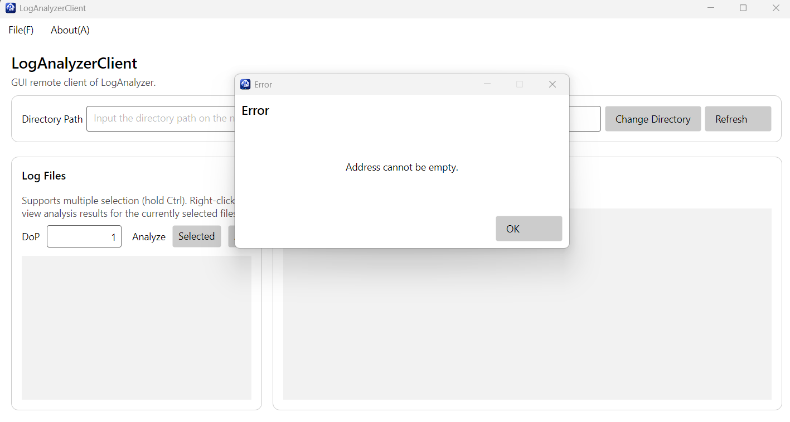
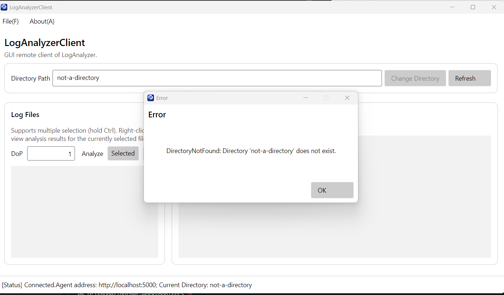
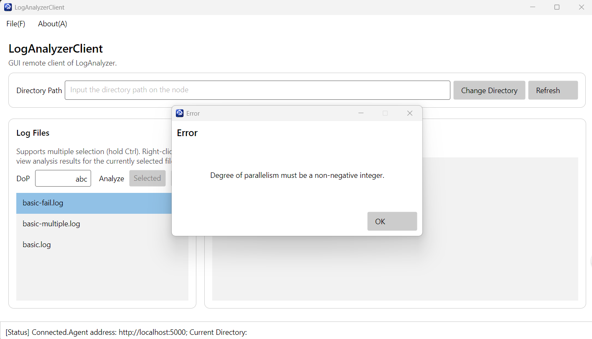
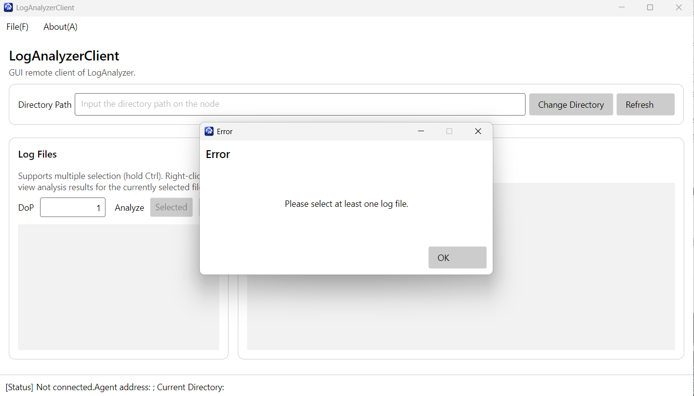

# 04 Avalonia 作业报告

## T4.1 实现说明

我实现了Refresh刷新、多选和全部分析、右键单文件分析、结果流显示、错误弹出消息框等多种功能，主要功能测试如下。

## 完整功能截图

## 鲁棒性测试截图

我测试了未连接、非法地址/目录/DoP、未选文件等错误情况的处理。

## Q4.1：你认为，你在开发 GUI 应用程序，与你在以往开控制台应用程序的区别在哪里？GUI 应用程序的开发存在哪些额外的难点？存在哪些额外的复杂之处？你是否有通过编写 GUI 应用程序对异步 async 和 await 有了更进一步的理解？异步编程是否又给你带来的额外的困扰？说说你的看法。

区别为不再仅仅是输入和输出，还要考虑控件位置、显示、操作等图形化因素。额外的难点和复杂之处在于界面状态和布局管理，如按钮/列表的点击与选中操作、控件之间的合理排布等都需要小心设计。进一步的理解在于UI的实时交互界面必须对操作使用await的异步方法才能保证在等待期间UI线程仍能维护实时页面和响应用户操作。困扰在于多了界面、异步状态和运行环境等多方面设计、操作和维护的难度。

## Q4.2
### Q4.2.b：如果使用了 AI，你给予 AI 的提示词是什么？你对 AI 的使用是询问 AI 一些接口的用法、gRPC 的使用，或是在某处的写法，还是让 AI 帮你写一部分作业代码，又或是让 AI 给你讲解代码框架？AI 的解答是否出现过错误（如果有，是哪些）？你从 AI 那里是否得知了一些关于异步，或是 gRPC 等原本你不知道或是难以理解的知识？

我使用了 AI。提示词大意为“请为我提供一版在原代码基础上通过注释标明用到的gRPC讲义中知识点和用途，并讲解几个todo部分代码的编写思路（如用到的类或语法等）的说明文档”。用途是查找一些接口的用法，给出代码实现思路，讲解代码框架及涉及的知识点等。错误有布局出现按钮重叠或尺寸不合理等。知识有ObservableProperty中的字段名和生成属性名关系、RelayCommand和Binding的理解等。