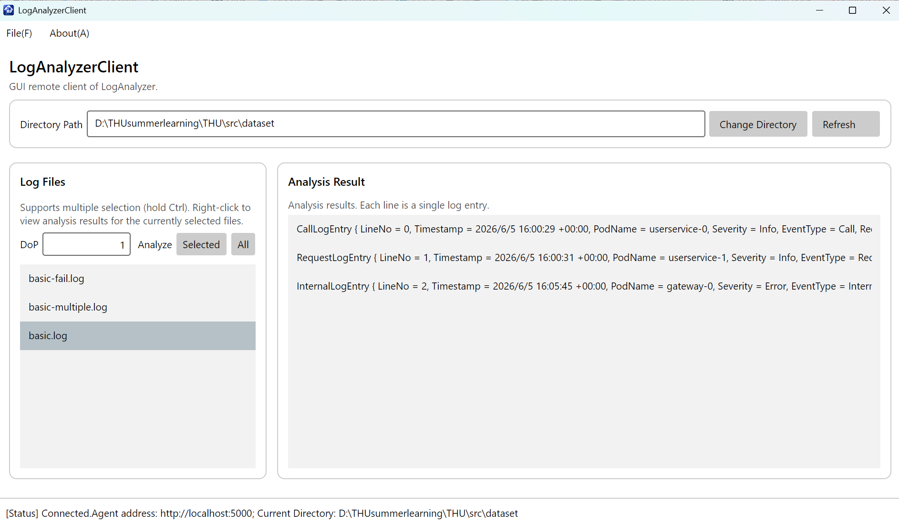
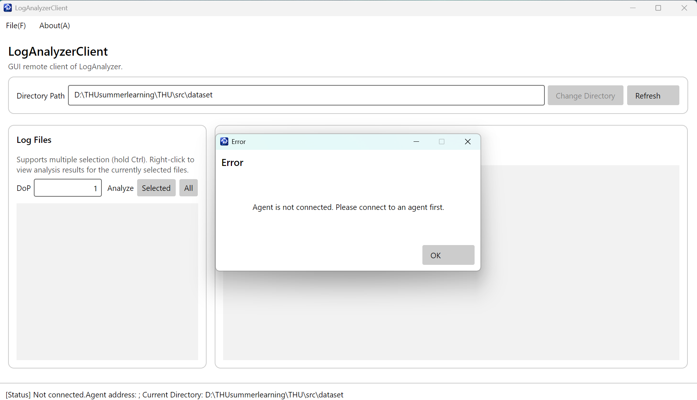
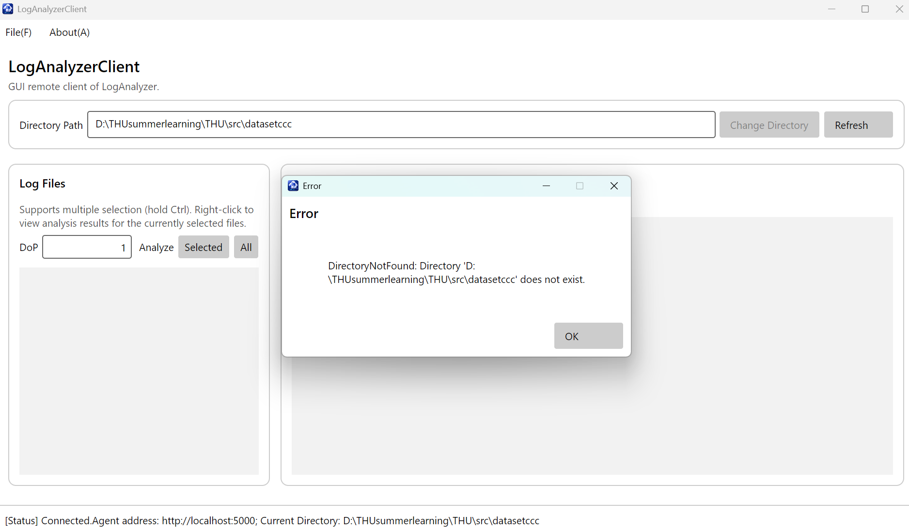

# 04-avalonia 

## 一、 功能实现说明

实现了一个图形化客户端，并通过和后端进行异步通信来实现功能。

1. **查看是否连接**
   - 通过 `ConnectCommand` 调用 `DesktopDialogHelper` 弹窗引导用户输入 Agent 地址与服务器连接。
   - 使用异步方法 `_client.PingAsync()` 校验连接有效性，实时更新底部状态栏（如 `Connected.`、`Connecting...`、`Not connected.`）。

2. **选定分析的目录**
   - **切换目录 (`ChangeDirectoryCommand`)**：发送 `ChangeDirectoryRequest` 并异步等待响应，更新服务端当前工作路径。
   - **刷新文件 (`RefreshCommand`)**：请求服务端日志列表并清空填充至 `ObservableCollection<LogFileItem>`，实现 UI 列表自动同步。

3. **多个文件同时分析**
   - 在 `MainView.axaml.cs` 中启动 `SelectionChanged` 事件，将选中列表绑定回 ViewModel 的 `SelectedFiles`。
   - `AnalyzeSelectedFilesCommand`：读取界面输入的并行度（DoP）并校验合法性，向服务端异步发起并发分析任务。
   - `AnalyzeAllCommand`：针对目录内所有日志文件发起分析操作。

4. **右键**
   - 右键快捷操作
     - `Analyze File`：对单选右键文件发起分析。
     - `View Analysis Results`：发起 `GetAnalysisResult` 服务端流式 gRPC 调用，通过 `await foreach` 逐行异步读取日志条目并显示至右侧 `ResultEntries` 列表展现。

5. **鲁棒性**
   - 封存 `WithClientNotNull` 辅助函数，防止未连接状态下的非法调用。
   - 所有 gRPC 远程调用及输入解析均使用 `try-catch` 捕获异常，并使用统一消息弹窗（`ShowMessageDialogAsync`）告知错误信息，确保 GUI 客户端与服务端后台均不会崩溃。

---

## 二、 功能演示与鲁棒性测试

### 1. 正常功能演示

  

### 2. 鲁棒性与异常处理测试

- **测试 1：未连接服务端时发起操作**
  

- **测试 2：服务端返回错误路径处理**
  

---

## 三、 问答题解答

### Q4.1
区别在于GUI需要前后端的协同，为每一个元素提供其内置的反馈思路，并且对于协同的要求更为重要，需要仔细组织代码以避免屎山。额外难点：需要设计ui界面，同时阻塞带来的崩溃问题更为严重。异步理解：最大价值在于非阻塞，可以通过grpc流式接收再接收数据的同时操作界面。困难：异步下需要妥善处理异常。

### Q4.2.b

提示词：报错信息，并且令ai完成部分代码的复用。