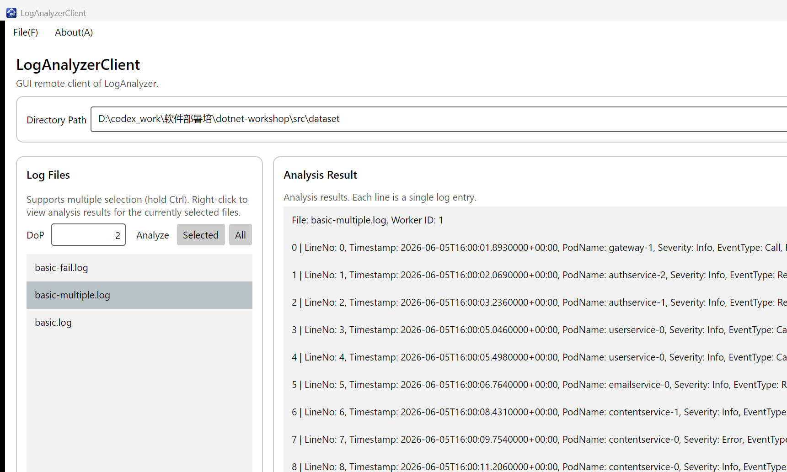
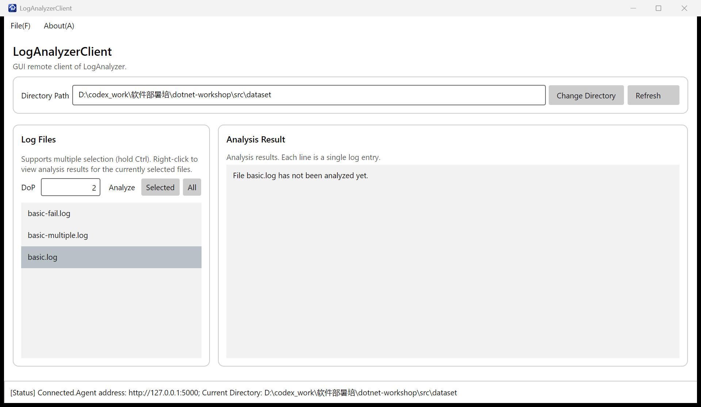
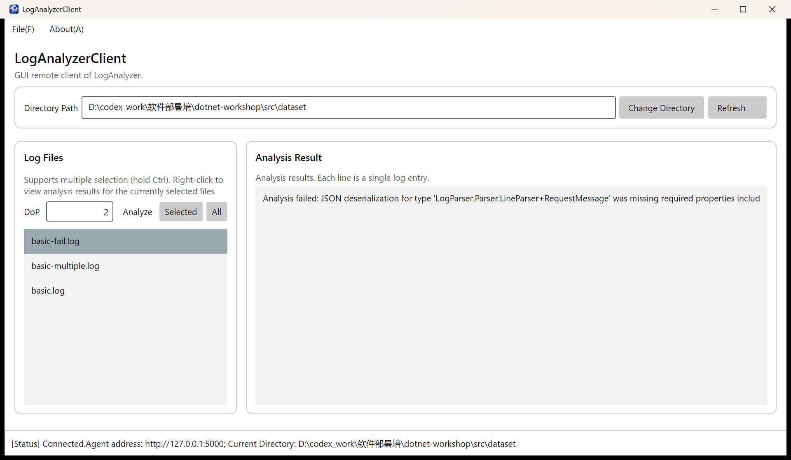
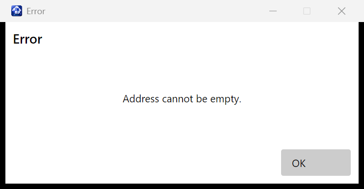
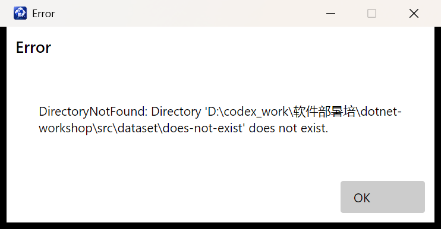
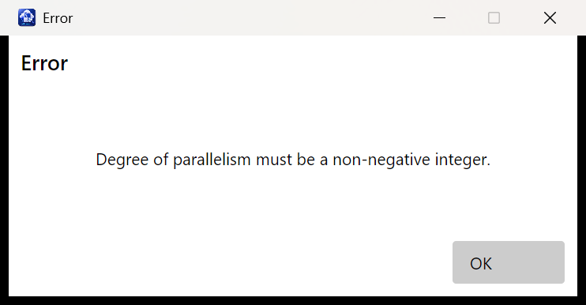

# 04-avalonia 实验报告

## 功能实现

本次作业完成了以下 GUI 客户端功能：

- 使用 `Refresh` RPC 异步刷新远程日志目录中的文件列表，并清理已经失效的选择状态。
- 支持多选日志文件后调用 `AnalyzeFiles`，并对空选择进行本地校验。
- 添加 `All` 按钮，通过 `AnalyzeAll` 分析当前目录内的全部日志文件。
- 支持通过右键菜单分析单个日志文件，以及通过服务端流式 RPC 获取分析结果。
- 将日志条目转换为键值字段并按 `序号 | 字段: 值` 的形式显示。
- 分别显示分析成功、分析失败和尚未分析三种结果状态。
- 对空地址、非法目录、非法 DoP、未连接、空文件选择和 RPC 异常使用消息框提示，避免非法输入导致程序退出。

所有 gRPC 调用均使用异步接口并进行 `await`。连接新 Agent 时，只有候选客户端成功完成 `PingAsync` 后才会替换当前客户端；如果切换失败，已有可用连接仍会保留。

## 功能截图

下图展示了连接 Agent、切换日志目录、刷新文件列表、使用 `All` 分析以及查看成功分析结果后的完整界面。

尚未分析的文件会显示明确的状态信息：

日志解析失败时会显示解析器返回的错误原因：

## 鲁棒性测试

连接地址为空时，客户端在创建 gRPC Client 前进行拦截：

远程目录不存在时，客户端显示 Agent 返回的 `DirectoryNotFound` 状态，文件列表和程序进程保持可用：

DoP 不是非负整数时，客户端进行本地校验，不发送分析请求：

## 构建与测试

- `LogAnalyzerClient.Desktop` 在 Release 配置下构建成功，0 个错误；完整构建会产生 5 个来自 gRPC 自动生成文件中 `pb/pbc/pbr/grpc` 类型名称的既有 `CS8981` 警告，本次修改的客户端代码没有编译警告。
- `test-00-prepare`：1/1 通过。
- `test-01-basic`：16/16 通过。
- `test-02-multithreading`：8/8 通过。
- `test-03-async-grpc`：3/3 通过。
- 使用本地 Agent `http://127.0.0.1:5000` 和 `src/dataset` 完成了连接、目录切换、刷新、Analyze All、单文件分析及流式结果显示的实际操作验证。

## Q4.1

控制台程序通常按照“读取输入、执行、输出结果”的顺序运行，程序在某一步等待时是容易理解的。GUI 程序则由事件驱动，连接、按钮点击、列表选择和右键菜单可能以不同顺序发生，因此需要维护连接状态、当前目录、选择项和结果列表之间的一致性。界面还增加了数据绑定、命令生成、控件选择状态和消息框生命周期等问题，同一个错误不能只写到标准输出，而要转化为用户能看到并能恢复操作的界面状态。

这次作业让我更直观地理解了 `async`/`await` 的作用。gRPC 请求如果同步等待，会占用唯一的 UI 线程，窗口不能重绘也不能响应输入；`await` 会在等待网络结果时把 UI 线程让出来，并在请求完成后继续更新绑定属性。异步也带来了额外复杂度，例如请求失败后的状态恢复、多个命令可能交叉执行，以及异常需要在 `await` 的调用链上统一处理。本次实现通过异步命令、统一的客户端非空检查和消息框异常处理来控制这些问题。

## Q4.2.b

本次作业使用了 AI。主要提示词是：“仔细阅读 `04-avalonia` 和 `00-prepare` 的指导页面，了解写作业和提交作业的要求后，完成 `04-avalonia` 任务并直接完善项目。”

AI 参与了指导文档梳理、代码框架分析、ViewModel 和结果模型实现、Release 构建、测试运行以及 GUI 自动化验证。它不只是查询接口，也编写了本次作业的一部分代码。过程中出现过可验证的错误：最初在属性访问器中使用了变量名 `field`，它在 C# 14 中成为上下文关键字，Release 构建失败后改名并重新构建通过；自动化截图脚本也出现过 PowerShell 变量名和窗口焦点问题，但这些脚本不属于提交代码，修正后才生成报告截图。

通过这次过程，我进一步理解了 gRPC 服务端流需要使用 `await foreach` 异步读取，以及 UI 状态只能在请求成功并完成校验后更新。AI 给出的实现仍然需要依靠编译、现有测试和真实界面操作来判断是否正确，不能只根据生成的代码表面判断。
