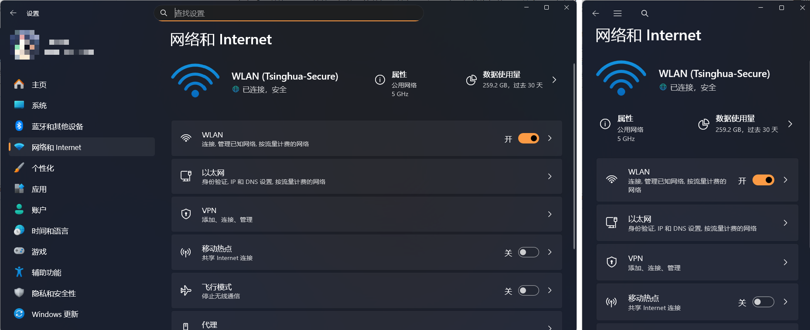

# Guidance for Advanced Functions

## 训练目标

+ 通过同学的想象力和自由发挥，锻炼同学的软件工程综合能力

## 背景介绍

鉴于我们已经完成了一些云服务日志分析系统的基础功能。但注意到，同学们之前是沿着规定好的路径进行编写功能的，同时也是按照给定的要求来编写代码的。这可以让同学们入门相关的技术栈，但不利于锻炼同学的软件工程综合能力。

因此，本章将让同学们充分发挥自己的想象能力、探索能力、自主学习能力，来进行自由发挥，锻炼同学们的综合能力。本章也是整个 workshop 的精华所在。

## 本节任务

本章将分为两个部分——半命题部分和自由部分。同学们将从半命题部分当中选取自己喜欢的功能来完成，并且在自由部分完成自己想要完成的任何功能，并最终写一个项目的介绍。

**注：由于本节进行功能拓展时，可能有部分功能需要打破原来过于简单的接口，导致之前的单元测试不通过，甚至无法编译成功。因此本节不要求同学通过之前给出的单元测试。** 如果出现编译不通过的现象，则同学可以手动修改 `dotnet-workshop.slnx` 文件，将单元测试项目移除出解决方案，包括如下的几个项目：

```xml
<Solution>
  <Project Path="test-00-prepare/test-00-prepare.csproj" />
  <Project Path="test-01-basic/test-01-basic.csproj" />
  <Project Path="test-02-multithreading/test-02-multithreading.csproj" />
  <Project Path="test-03-async-grpc/test-03-async-grpc.csproj" />
  <Project Path="TestUtils/TestUtils.csproj" />
</Solution>
```

### （S5.1）Step 1：半命题部分

同学们将在以下命题中的功能性和美观性中 **各选择至少一个命题** 来实现，多者不限但不会获得额外的分数。

#### （T5.1.a）功能性题目

功能性命题是要同学们为系统增加新的更加完善的功能，需要前后端进行协作配合。同学们将在 Agent 端编写相应的功能逻辑，并且可能要添加额外的 RPC，并在 Client 端做出相应的用户交互接口（只要求实现图形界面客户端，不再要求实现 `LocalCli` 和 `RemoteCli`）。

##### （T5.1.a.a）Parquet 文件格式支持（Medium）

[Parquet](https://parquet.apache.org/) 是一种列式存储格式，在云服务领域十分常用。无论是用户数据，还是运维数据，很多人都选用此格式进行存储。本课题的目标是让我们的云服务日志解析系统支持 Parquet 文件格式，同学们需要参考 [Parquet 格式文档](https://parquet.apache.org/) 自主学习并了解该格式，并利用 .NET 社区的第三方实现（例如 [Parquet.Net](https://www.nuget.org/packages/Parquet.Net)、[ParquetSharp](https://www.nuget.org/packages/ParquetSharp) 或你在 [NuGet Gallery](https://www.nuget.org/) 中找到的其他实现）来完成如下功能：

+ 支持 Parquet 文件的读取和分析：当前我们指支持特定形式规定的 `.log` 文本文件，请你自己设计基于 Parquet 的存储格式，来支持 Parquet 格式日志文件的读取
+ 支持 Parquet 文件的生成：支持将日志分析的结果写入 Parquet 文件中存储，客户端可以向 Agent 指定存储结果的日志文件和存储路径

##### （T5.1.a.b）客户端验证机制（Hard）

当前我们的系统存在很多问。第一个问题是对客户端缺乏验证机制，无论是谁都可以操控 Agent 进行日志分析——这极其容易被攻击；第二个问题是如果多个人同时连入 Agent，这些人同时操作 Agent 会引发很多混乱。

我们将要实现的功能是实现一个 token 机制。在 Agent 启动时，会生成一个随机的字符串，作为 token。客户端所进行的每一项操作，都必须携带合法的 token 才能进行操作，且不同的 token 之间代表不同的用户，不同用户的全部操作均是完全独立的，互不干扰。

我们规定 token 的权限分两种——管理员权限与普通权限。普通权限的 token 可以用于各项日志分析操作，管理员权限的 token 不仅拥有普通权限 token 的全部权限，还可以对其他 token 进行创建、删除、权限的提升与降低，等等。Agent 启动时生成的 token 是管理员权限，以 log 形式输出（从 `_logger` 中输出）。

相应地，图形界面客户端也应当新增管理员窗口。

##### （T5.1.a.c）日志的排序与查询（Medium / Hard）

我们现在对日志分析结果的显示是显示全部的日志。但我们可能还有其他的需求，例如对日志的排序与查询。我们拟实现如下功能：

+ 对日志按某一个键排序显示
+ 支持对日志的条件进行查询：查询具体类型的日志（Call、Request、Internal）、查询特定时间范围的日志、查询由某个服务（如 `gateway`）产生的日志、查询特定日志等级的日志（如只查询 `Warning`）、按 Request ID 查询日志

你需要在图形界面程序中实现对日志的排序功能；在 Agent 提供对日志的不同条件的查询服务，在图形界面程序中显示分析结果时，增加按条件查询结果的窗口。

具体如何实现、实现到什么程度，你可以凭借你的喜好来自定义。

##### （T5.1.a.d）云服务拓扑推断及显示（Medium / Hard）

在云服务的可观测性领域中，有一个常见的需求。即当我们不知道云服务的调用拓扑的时候，使用云服务日志来推断出云服务的调用拓扑。因此，我们的目标是通过云服务日志，来推断云服务的调用拓扑。

我们应当时间的功能是：

+ 在 Agent 端，通过云服务的 Call 类型日志，构建云服务的调用拓扑图，推断出云服务的拓扑结构，并记录每一条边都对应于哪些 Call 日志
+ 在图形化界面客户端，增加一个云服务拓扑显示的功能。当选中一个文件的时候，可以增加一个显示拓扑图的按钮或右键菜单的菜单项，点击后可以从 Agent 处拉取拓扑图的数据，并在图形界面中可视化为拓扑图。单个云服务视为结点，云服务之间存在调用关系视为结点之间的有向边。并且，在前端需要使用一些简单的算法来进行合理的布局，以避免显示混乱。且用户可以选择有向边来从 Agent 端拉取这条有向边对应的日志显示出来。

#### （T5.1.b）美观性题目

##### （T5.1.b.a）日志更优显示（Medium）

当前我们在客户端显示日志时，是以列表框的形式显示。但这并不是非常的好看，因为每一条日志都只是一个字符串，用户阅读起来十分不友好。

因此，本命题应当实现的功能是：

+ 以表格形式显示日志。对于每一个键，都视为表格中的一列。日志中的 Message 部分（例如 Method、Path、Exception Name、Target Service，等等）也视为表格中的一列；
+ 对不同的日志等级进行高亮显示。日志等级是需要用户一眼看出的，因为要定位错误时，对 Warning、Error 等要格外关注。希望可以做出如下效果：对表格中 Severity 这一格，不同的日志需要根据日志等级显示不同的背景色（你可以选择填充整格，或者用椭圆或圆角矩形等包裹住日志等级的文字）：Info 使用蓝色，Warning 使用橙色，Error 使用红色。

##### （T5.1.b.b）控件布局自适应（Medium）

对不同比例的显示设备，人们对同样窗口内控件的布局观感不同。因此很多应用以及网站都会根据用户的显示设备的大小比例对控件进行自适应（移动端和桌面端的差异尤为显著，因此通常有一个工作叫「移动端适配」）。例如 Windows 的设置在不同的窗口宽度下的布局显然不同：



左侧是宽窗口下的布局，右侧是窄窗口下的布局。

现在需要你实现这一功能，对不同的窗口宽度使用不同的布局，来避免窄窗口下原有的布局让用户难以使用。例如你可以让窗口宽度当大于或等于 640 时使用原来的布局，小于 640 时使用你新编写的窄窗口布局。

##### （T5.1.b.c）美化与多主题（Medium / Hard）

目前我们的控件样式是定义在 `LogAnalyzerClient` 项目中的 `Styles/Controls.axaml` 中的，可以看到非常的简陋。本选题需要进行美化与多主题的支持。

+ 对图形界面进行美化，诸如颜色、按动效果、描边、渐变等等。你也可以使用第三方库写好的 UI 控件，如 [Material.Avalonia](https://github.com/AvaloniaCommunity/Material.Avalonia)、[FluentTheme](https://docs.avaloniaui.net/docs/styling/themes#fluent)，或者 [其他的第三方库](https://docs.avaloniaui.net/docs/styling/themes) ，以及你自己找到的其他第三方库
+ 你的界面需要支持多主题切换，用户可以在菜单栏中设置主题，例如白天、夜间、高对比度、天空、海洋、星空，等等，或者你喜欢的其他主题。要求至少支持三种主题。

> [!NOTE]
>
> **任务 5.1（T5.1）**
>
> 请同学选择适当的题目完成。
>

### （S5.2）Step 2：自由部分

在本节，同学们可以自由地想一个自己想要实现的功能来编写，既可以自己想出一个自己喜欢的功能，也可以在半命题部分中没有实现的功能里自己选择一个，当然也可以是基于半命题部分的一个功能进行增强。

此处对实现的功能难度要求并不高，难度与基础功能部分中的 Medium 难度作业相似即可。

> [!NOTE]
>
> **任务 5.2（T5.2）**
>
> 请同学自由探索一个功能完成。

### （S5.3）Step 3：项目介绍

在完成前两个步骤后，请同学写一个项目介绍，里面包括：

+ 程序如何编译运行
+ 你实现了哪些功能？每个功能如何使用？必要时可以附上截图。
+ 你在实现的过程中，有多大程度上使用了 AI？如果使用了，你使用了什么 AI？给了哪些提示词？你认为 AI 给你提供的便利体现在哪些方面？
+ 其他在开发中获取到的经验和心得。

> [!NOTE]
>
> **任务 5.3（T5.3）**
>
> 当你完成你的实现后，请你把项目介绍写在 `docs/05-advanced` 目录中的 `report.md` 的文本文件中。

> [!IMPORTANT]
>
> **关于大模型的使用**
>
> 大模型固然给我们的带来的诸多便利，在未来掌握大模型的使用也是极其重要的技能之一。但不加思考地完全使用大模型生成的文本具有严重的 AI 味道，最大特点在于 **「假大空」、华而不实、文档可读性较低** 。因此，同学需要让自己的项目介绍是可读的，而不是完全依靠大模型写出的堆砌华丽辞藻、缺少重点的文档。当然，如果同学能依靠大模型让自己的文档变得更优质，自然是十分鼓励的。而且，对文档质量的鉴别与修改能力（无论是人写的还是大模型生成的），也是一种十分重要的技能。

关于本节的任务分值等信息，参看 [tasks.md](./tasks.md)。

## 结语

至此，你的开发之旅暂时告一段落，衷心希望你能够从中得到一些收获。

此外，也非常希望你在日后的开发工作中遇到相关的需求不知道怎么写或者 API 怎么调用的时候，也能够回来看一眼本 workshop 当初是如何写的，这也是本 workshop 的目标之一。

最后，祝你爱上代码、开发愉快！

## 拓展阅读

暂无，待补充

## 前进 / 后退

+ 上一篇：[Tasks in Avalonia](../04-avalonia/tasks.md)
+ 下一篇：[Tasks in Advanced Functions](./tasks.md)

