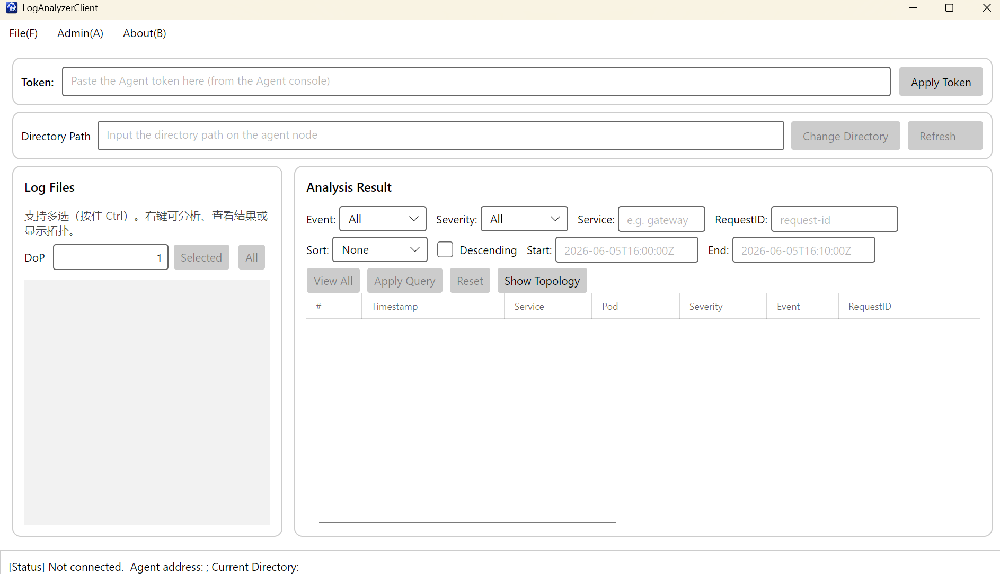

# 项目功能介绍
* 写在最前：我选择的功能性题目是a.b和a.c，美观性题目是b.a，自由发挥选择a.d。
## 1.项目简介
本项目是一个日志解析客户端，在验证用户身份之后，可以对日志文件进行解析并显示。最终由一个常驻的agent(gRPC)服务端和一个客户端交互组成。
### 1.1前后端架构
* `LogAnalyzerClient`是前端，负责用户交互，并且向后端发送请求。
* `LogAnalyzerAgent`是云服务客户端，和前端通过gRPC异步通信，解析日志内容，并生成token验证身份。
### 1.2编译运行步骤
* `LogAnalyzerAgent`和`LogAnalyzerClient`发出请求，调用`LogAnalyzerRpc`的接口，然后在调用`LogAnalyze`，进一步用最底层的`LogParser`进行日志解析。
## 2.功能

### 2.1基础功能——日志解析
* 日志解析：留置读取文件，进行逐行解析（简单工厂和访问者）
* 并行日志分析：多线程解析
* gRPC：传输数据到服务端，在流式返回，尤其注意捕获异常输入
* 图形客户端：特别注意异步，避免阻塞
### 2.2进阶功能
* Token验证：管理员、普通权限不同
* 日志查询：可以按照类型、等级等清晰观看
* 美观显示：表格显示
* 拓补图展示
## 3.AI
* 相较于前几讲，本节ai借助较多，在分析报错的基础上，利用AI帮助设计了代码框架，自己再进行填充修改，同时，哎帮助分析出了一些由于包版本不同导致运行错误的问题，这些问题我似乎自己难以发现原因。
## 4.总结和经验
* 本节使得我对前后端、本地和云端的交互有了更深的理解，之前在硬设比赛大作业中接触过简单的图形化编程，那时候了解到前后端的协调，每一个图形化的按钮都要有i那个管逻辑支撑，本次作业让我理解更深入，同时，关于异步的理解加深了。