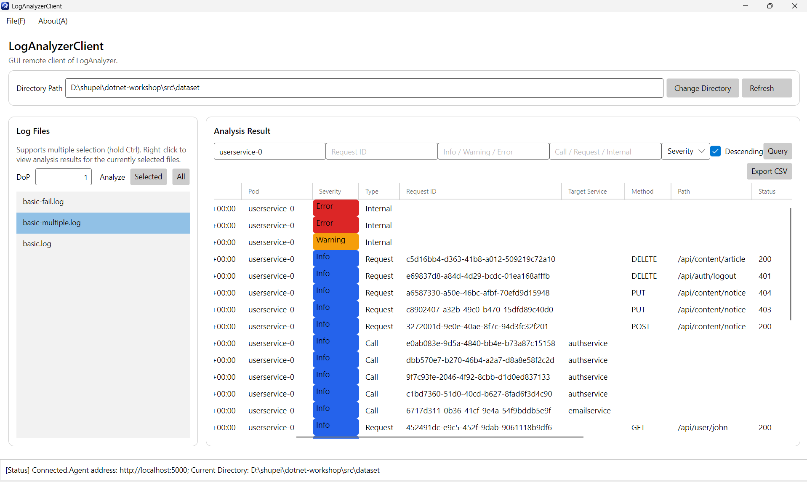
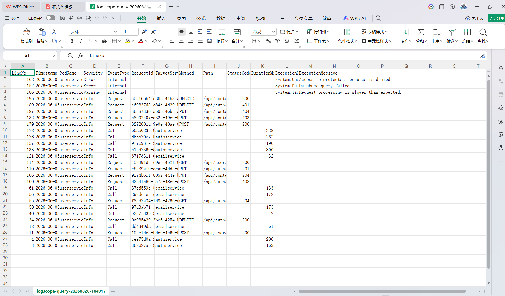

# 项目报告：面向云服务日志的筛选、表格浏览与导出客户端

## 1. 项目简介

本项目基于原日志分析系统扩展而成。项目保留 Agent + gRPC + Avalonia GUI 的架构：Agent 负责保存已分析文件、按条件筛选和排序日志；GUI Client 负责输入条件、以表格显示结果、突出严重等级，并将当前筛选结果导出为 CSV。

本项目完成的功能性命题和美观性命题以及自由功能分别如下：

- 功能性：日志排序与查询；
- 美观性：表格化日志显示与 Info/Warning/Error 高亮；
- 自由功能：导出当前查询结果为 CSV。

## 2. 编译与运行

在仓库 `src` 目录打开两个终端。第一个终端启动 Agent：

```powershell
dotnet run --project .\LogAnalyzerAgent\LogAnalyzerAgent.csproj
```

第二个终端启动 Desktop Client：

```powershell
dotnet run --project .\LogAnalyzerClient\LogAnalyzerClient.Desktop\LogAnalyzerClient.Desktop.csproj
```

在 Client 的 File → Connect 中输入 Agent 的实际地址，然后将日志目录切换到实际数据集绝对路径，如dataset。

## 3. 功能说明与使用方法

### 3.1 Agent 端排序与查询

我新增了 `QueryLogEntries` gRPC 服务。选择已经分析成功的日志文件后，可按 `Severity、PodName、Request ID、时间范围、日志类型` 等查询，并按 `TimeStamp、Severity或RequestId` 升序或降序返回。

使用步骤：选中日志文件 → 设置筛选条件与排序方式 → 点击 Query。条件留空表示不限制该条件。



### 3.2 表格与等级高亮

查询结果使用 DataGrid 展示。公共字段包括 LineNo、Timestamp、PodName、Severity、EventType；不同日志类型的 TargetService、Method、Path、StatusCode、DurationMs、ExceptionName、ExceptionMessage 也分别显示为列。Severity 中 Info 为蓝色、Warning 为橙色、Error 为红色。示意图见3.1。

### 3.3 CSV 导出（自由功能）

点击 Export CSV 后，程序导出当前表格中的筛选结果，而不是全部原始日志。导出完成后显示文件路径和实际导出行数；CSV 对逗号与双引号进行了转义。



## 4. 鲁棒性测试

我测试了未选择文件查询、无匹配条件、空表格导出等异常情况，程序会弹出合理的错误提示，且正常运行。截图略（与前期的鲁棒性涉及类似）。

## 5. AI 使用情况

我使用了ChatGPT AI。使用目的主要有查询接口，提供功能解决思路与部分代码，检查bug等（提示词大意也是这样）。便利是降低了开发的难度、思考、编写和差错的耗时，且通过问答可以巩固相关知识点。

## 6. 开发心得

这类多端大型程序的开发和检查并不容易，在数据处理、端间连接、UI显示等多个部分都曾遇到不小的bug，需要通过反复验证、耐心理解并修改代码，并借助 AI 的合理帮助才容易最终解决。
