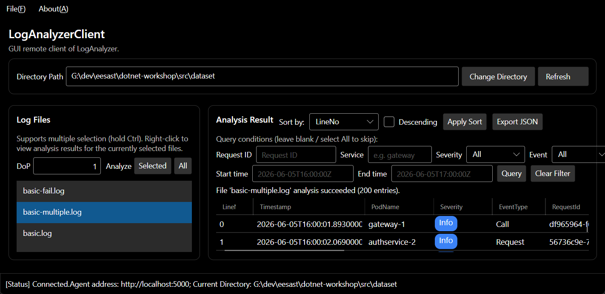
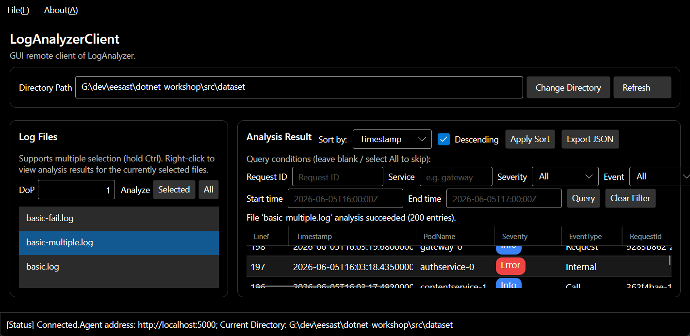
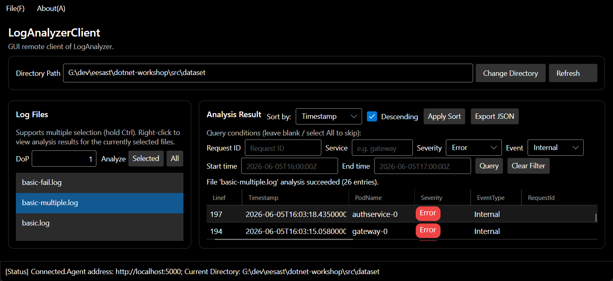
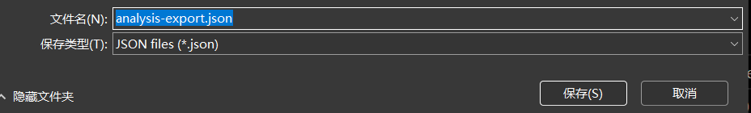
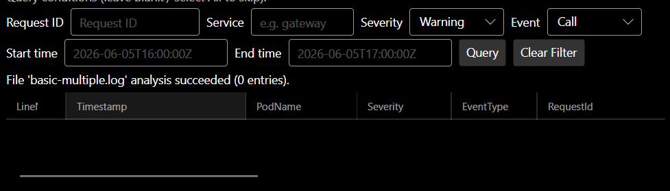
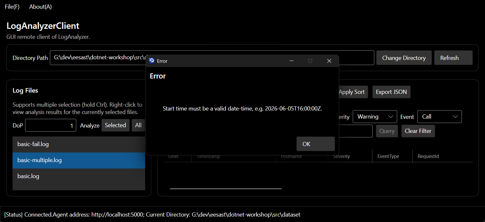

# C05 Advanced 项目介绍

## 项目概述

本项目在 `dotnet-workshop` 前四节的基础上，扩展出一个支持**条件查询、排序、表格化展示、JSON 导出**的云服务日志远程分析系统。系统由三部分组成：

- `LogAnalyzerAgent`：常驻的 gRPC 服务，负责日志目录管理、并行分析与结果查询；
- `LogAnalyzerClient`：Avalonia 图形界面客户端，负责连接 Agent、执行分析与展示结果；
- `LogAnalyzerRpc`：共享的 proto 契约与类型转换层。

## 编译与运行

需要 .NET 10 SDK。在两个终端分别执行：

```powershell
# 终端 1：启动 Agent
cd <仓库根目录>
dotnet run --project src/LogAnalyzerAgent -c Release
```

```powershell
# 终端 2：启动图形界面客户端
cd <仓库根目录>
dotnet run --project src/LogAnalyzerClient\LogAnalyzerClient.Desktop -c Release
```

客户端启动后，通过 `File -> Connect...` 输入 `http://localhost:5000` 连接 Agent；在 Directory Path 中输入 Agent 所在机器上的日志目录（建议使用绝对路径）并点击 Change Directory，即可开始使用。

## 实现的功能与使用说明

### 1. 日志条件查询（T5.1.a.c，Agent 侧）

在 `log_analyzer.proto` 中新增了流式 RPC `QueryAnalysisResult` 与查询条件消息 `LogQueryCriteria`。Agent 在 `AgentSession.QueryAnalysisResult` 中复用已有的分析结果，按以下条件过滤后流式返回：

- 按 `Request ID` 查询（Call / Request 类型日志）；
- 按服务名查询（例如 `gateway`，匹配对应 Pod 名）；
- 按日志等级查询（Info / Warning / Error）；
- 按事件类型查询（Call / Request / Internal）；
- 按时间范围查询（起止时间）。

**使用方式**：先对某个文件执行分析（右键 Analyze File，或选中后 Analyze），再右键 View Analysis Results；在结果区上方的查询栏填写条件（留空或 All 表示不限制），点击 `Query` 即可看到过滤后的结果，`Clear Filter` 恢复完整结果。

### 2. 日志排序（T5.1.a.c，客户端侧）

对当前加载/查询出的结果，客户端本地按所选键排序。

**使用方式**：在结果区上方的 `Sort by` 下拉框选择键（LineNo、Timestamp、Severity、RequestId 等），勾选 `Descending` 可降序，点击 `Apply Sort` 生效。

### 3. 表格显示与等级高亮（T5.1.b.a）

结果区从"每行一个字符串"改为带列头的表格（DataGrid），每种日志字段（LineNo、Timestamp、PodName、Severity、EventType 及各类独有字段）独占一列；Severity 单元格按等级着色：Info 蓝色、Warning 橙色、Error 红色。

**使用方式**：查看任一已分析文件的分析结果即可看到表格；横向滚动查看全部列。

### 4. 导出 JSON（T5.2 自由功能）

把当前表格中显示的日志条目导出为 JSON 文件。

**使用方式**：加载/查询出结果后点击 `Export JSON`，在系统保存对话框中选择路径，导出成功后会提示条目数与保存位置。

## 截图

### Severity 高亮



### 排序



### 条件筛选



### 导出 JSON



### 鲁棒性测试





## AI 使用说明

本次作业使用了 AI 辅助完成。

我给出的主要提示词（包括这次和之前对话中的）大致包括：

- 阅读题目说明，梳理功能性/美观性选题的取舍；
- 要求按"已有代码逻辑 → 缺口 → 结构图 → 讨论 → 实现 → 编译验证"的顺序完成改动，并在实现时说明用到的讲义知识点。
- 要求对 gRPC 等相关知识点结合结构图进行较详细的讲解；

本次作业我认为完成的不是很好，一开始我有些无从下手，想着先让AI大致写一个框架出来再自己去改，但是写完后发现AI写的已经很完善了，基本相当于完全依赖AI生成，而且最后读代码也没能完全理解，学习效果不佳。
