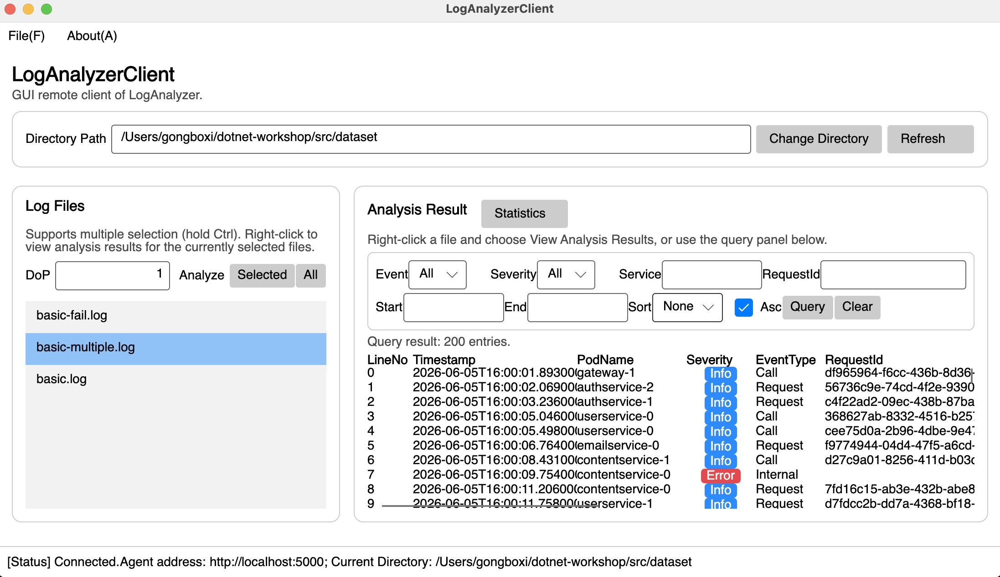
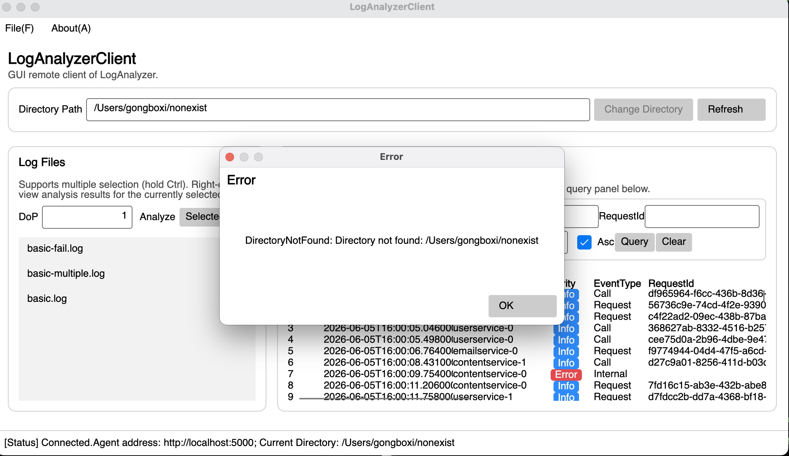

# Report for Advanced Functions

## 如何编译运行

本项目是一个云服务日志分析系统，包含服务端（Agent）与图形界面客户端（LogAnalyzerClient）。在 `src` 目录下：

1. 启动 Agent（gRPC 服务端，监听 `http://localhost:5000`）：

   ```shell
   cd src
   dotnet run --project LogAnalyzerAgent/LogAnalyzerAgent.csproj
   ```

2. 另开一个终端，启动图形界面客户端：

   ```shell
   cd src
   dotnet run --project LogAnalyzerClient/LogAnalyzerClient.Desktop
   ```

3. 在 GUI 窗口菜单 `File → Connect...` 中输入 `http://localhost:5000` 连接 Agent，然后在 `Directory Path` 输入框填入日志目录（如 `src/dataset`）并点击 `Change Directory` 即可开始分析。

> 注：macOS 的 ControlCenter（AirPlay 接收器）会占用 `*:5000`，但 Agent 只绑定 `127.0.0.1:5000`，两者可以共存，不影响使用。

## 实现的功能与使用方式

本节在基础功能之上，实现了三个新功能：一个功能性（日志排序与查询）、一个美观性（表格显示 + 等级高亮）、一个自由功能（日志统计概览）。

### 1. 日志排序与查询（T5.1.a）

在 Agent 端新增了 `QueryLogEntries` RPC，支持对某个文件已解析的日志按条件过滤与排序：

- 过滤条件：事件类型（Call/Request/Internal）、日志等级（Info/Warning/Error）、服务名（如 `gateway`）、Request ID、时间范围（起始/结束时间）。
- 排序：可按 `LineNo`、`Timestamp`、`PodName`、`Severity`、`EventType` 升序或降序排序。

在客户端 `Analysis Result` 面板上方新增了一个查询面板，包含 Event、Severity、Service、RequestId、Start、End、Sort、Asc 等控件，以及 `Query` 和 `Clear` 按钮：

- 在 Log Files 列表右键选择某个文件并 `View Analysis Results`（或先分析该文件），随后在查询面板设置条件，点击 `Query` 即可在下方表格中看到过滤/排序后的结果。
- 点击 `Clear` 清空所有筛选条件。

### 2. 日志表格显示 + 等级高亮（T5.1.b）

将原来单列的日志列表改为表格显示：每个字段作为一列（`LineNo`、`Timestamp`、`PodName`、`Severity`、`EventType`、`RequestId`、`TargetService`、`DurationMs`、`Method`、`Path`、`StatusCode`、`ExceptionName`、`ExceptionMessage`），表格支持横向滚动。

`Severity` 列根据日志等级以不同背景色高亮：`Info` 蓝色、`Warning` 橙色、`Error` 红色，便于快速定位错误。

### 3. 日志统计概览（T5.2，自由功能）

在 Agent 端新增 `GetStatistics` RPC，返回某个文件的日志统计信息（按日志等级、事件类型、服务名的数量分布）。在 `Analysis Result` 面板右上角新增 `Statistics` 按钮，点击后弹出消息框，展示当前选中文件的三类统计。

## 截图

### 完整功能截图



### 鲁棒性测试截图



## 实现过程中对 AI 的使用

我在本节使用了 AI（辅助工具）来完成代码。我给予 AI 的提示词大致是："切换到 05-advanced 分支，实现日志排序与查询、表格显示与等级高亮、日志统计三个功能"。对 AI 的使用主要是：梳理现有代码结构（`AgentSession`、`MainViewModel`、`MainView.axaml`），以及 Protobuf `optional` 字段在 C# 生成代码中的使用方式。

AI 提供的便利主要体现在：快速定位需要改动的文件与位置、给出与既有代码风格一致的骨架、提醒我 `optional enum`/`optional string` 的 `HasXxx` 标志用法。但 AI 的解答也出现过需要人工修正的错误：例如一开始尝试引入 `Avalonia.Controls.DataGrid` 包时版本与主 `Avalonia` 版本不匹配导致还原失败，最终改为用 `Grid` 自绘表格；又如 `DataTrigger` 的 XAML 写法在当前 Avalonia 版本下无法解析，最终改为在模型中直接计算 `SeverityBrush` 属性。这些都需要结合编译错误逐一排查修正。

## 开发心得

1. 前后端配合的功能（查询、统计）需要先在 `.proto` 里定义好接口契约，再分别实现 Agent 端逻辑与客户端界面，协议是两端协作的"单一事实来源"。
2. GUI 的布局与绑定（尤其是表格的列对齐、ComboBox 的双向绑定）远比控制台复杂，一个 XAML 属性写错就会在运行时报错，需要谨慎。
3. 遇到第三方库版本冲突时，"少依赖、自己实现"往往比强行升级更稳妥。
4. 统计、查询这类功能的本质是对 `LogEntry` 列表做 LINQ 过滤/分组/排序，Agent 端逻辑并不复杂，真正的难点在把结果以友好的方式呈现给用户。
